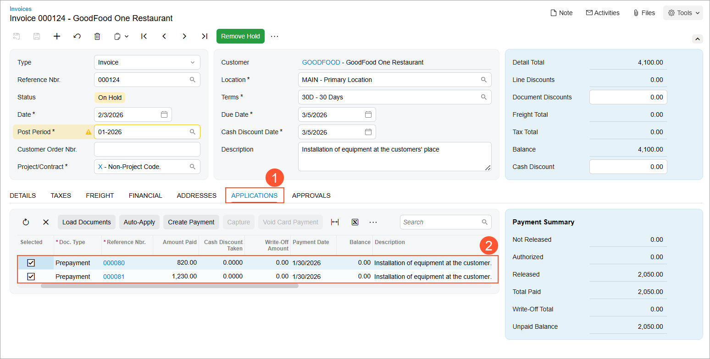

# Service Order Prepayments: Process Activity {#_6a9970be-d11f-4fcd-bbfc-11bb1cd2fbf3 .task}

This activity will walk you through the process of managing prepayments that have been made for a service order, including entering a prepayment while acting as a staff member attending an appointment. You will go through the whole process, starting from the creation of a service order and ending with the release of the invoice for the service order.

**Attention:** This activity is based on the *U100* dataset. If you are using another dataset or if any system settings have been changed in *U100*, these changes can affect the workflow of the activity and the results of the processing. To avoid issues, restore the *U100* dataset to its initial state.

## Story { .section}

Suppose that the GoodFood One Restaurant customer has contacted the service manager of the SweetLife Service and Equipment Sales Center to request installation services and a juicer. You will enter the service order into the system and create and schedule the related appointment. The customer has paid 20% of the service order total in advance when requesting the services and the item, and will prepay an additional 30% at the appointment. You will enter the prepayments at the appropriate times, process the appointment, and generate the billing documents.

## Configuration Overview {#section_tz4_djx_cnb .section}

In the *U100* dataset, which you'll use to complete this lesson, the following setup has been configured. These settings ensure that the environment is ready for performing the activity:

-   The minimum system configuration, which is described in [Company with Branches that Do Not Require Balancing: General Information](../ImplementationGuide/config_Company_with_Branches_No_Balancing_GeneralInfo.md), has been performed.
-   The *SWEETLIFE* company has been created on the [Companies](CS_10_15_00.md) \(CS101500\) form. This company has multiple branches created on the [Branches](CS_10_20_00.md#) \(CS102000\) form, including *SWEETEQUIP \(Service and Equipment Sales Center\)*.
-   On the [Service Management Preferences](FS_10_01_00.md) \(FS100100\) form, the minimum settings have been specified, including specifying the numbering sequences and work calendar, for the service management functionality to be used.
-   On the [Employees](EP_20_30_00.md#) \(EP203000\) form, *EP00000040 \(Maia Davis\)* and *EP00000004 \(Alberto Jimenez\)* have been defined. For *EP00000004 \(Alberto Jimenez\)*, the **Staff Member in Service Management** check box has been selected, so you can assign him to perform services.
-   On the [Users](SM_20_10_10.md) \(SM201010\) form, the *davis* and *jimenez* accounts have been created. For the *davis* user account, in the **Linked Entity** box of the Summary area of the form, the *Maia Davis* employee account has been specified; for the *jimenez* user account, in this box, the *Alberto Jimenez* employee account has been specified.
-   On the [Branch Locations](FS_20_25_00.md#) \(FS202500\) form, the *WEST BRIGHTON* branch location has been defined.
-   On the [User Profile](SM_20_30_10.md#) \(SM203010\) form, for the *davis* user, the *WEST BRIGHTON* branch location has been specified as the default branch location.
-   On the [Service Order Types](FS_20_23_00.md#) \(FS202300\) form, the *INST* service order type has been defined to generate SO invoices to bill customers for provided services. That is, in the **Billing Settings** section of the **General** tab, *SO Invoices* has been selected in the **Generated Billing Documents** box. Also, on the **General** tab \(**General Settings** section\), the **Complete Service Order When Its Appointments Are Completed** and **Close Service Order When Its Appointments Are Closed** check boxes are selected.
-   On the [Customers](AR_30_30_00.md#) \(AR303000\) form, the *GOODFOOD \(GoodFood One Restaurant\)* customer has been defined, and the *AP AP* billing cycle has been selected in the **Service Management** section of the **Billing** tab.
-   On the [Billing Cycles](FS_20_60_00.md#) \(FS206000\) form, the following settings have been specified for the *AP AP* billing cycle:

    -   **Run Billing For**: **Appointments**
    -   **Group Billing Documents By**: **Appointments**
    Based on these billing cycle settings, a separate billing document is generated for each appointment; this document presents the details of each service of the appointment.

-   On the [Cash Accounts](CA_20_20_00.md#) \(CA202000\) form, the *10200EQ \(Equipment Checking\)* cash account is assigned to the *SWEETEQUIP* branch.

## Process Overview { .section}

You will create a service order on the [Service Orders](FS_30_01_00.md#) \(FS300100\) form and add the service to be performed. You will enter the initial prepayment for the service order on the [Payments and Applications](AR_30_20_00.md#) \(AR302000\) form and then create the related appointment on the [Appointments](FS_30_02_00.md#) \(FS300200\) form. You then will process the appointment, including entering the second prepayment on the [Payments and Applications](AR_30_20_00.md#) form. Finally, you will process an invoice on the [Invoices](SO_30_30_00.md#) \(SO303000\) form to bill the customer.

## System Preparation {#section_isv_3sq_ghc .section}

Before you start this activity, do the following:

1.  Launch the Acumatica ERP website, and sign in to a company with the *U100* dataset preloaded; you should sign in as a service manager by using the *davis* username and the *123* password.
2.  In the Date box in the upper-right corner of the Acumatica ERP screen, specify the business date *1/30/2026*. For simplicity, you will use this business date to create and process all documents in this activity.
3.  After signing in, make sure that the *Service Management* feature is enabled on the [Enable/Disable Features](CS_10_00_00.md#) \(CS100000\) form.

## Step 1: Entering a Service Order { .section}

To create a service order for the GoodFood One Restaurant, do the following:

1.  Open the [Service Orders](FS_30_01_00.md#) \(FS300100\) form.
2.  On the form toolbar, click **Add New Record**, and specify the following settings in the Summary area:
    -   **Service Order Type**: *INST*
    -   **Customer**: *GOODFOOD - GoodFood One Restaurant*
3.  On the **Details** tab, click **Add Row** on the table toolbar, and specify the following settings in the added row:
    -   **Line Type**: *Service*
    -   **Inventory ID**: *INSTALL*
4.  Click **Add Row** again on the table toolbar, and specify the following settings in the added row:
    -   **Line Type**: *Inventory Item*
    -   **Inventory ID**: *JUICER20C*
5.  On the form toolbar, click **Save**.

## Step 2: Entering a Prepayment for the Service Order { .section}

To create a prepayment for the service order, do the following:

1.  While you are still viewing the service order you created on the [Service Orders](FS_30_01_00.md#) \(FS300100\) form, on the **Prepayments** tab, click **Create Prepayment** on the table toolbar.

    The [Payments and Applications](AR_30_20_00.md#) \(AR302000\) form opens in a pop-up window.

2.  In the **Cash Account** box of the Summary area, ensure that *10200EQ - Equipment Checking* is selected.
3.  In the **Payment Amount** box, type `820`, which is 20% of the total amount.
4.  On the **Service Orders** tab, notice that the service order you created is assigned to the prepayment.
5.  On the form toolbar, click **Remove Hold**.
6.  On the form toolbar, click **Save** and then **Release**.
7.  Close the window with the form.

    On the [Service Orders](FS_30_01_00.md#) form, to which you return, notice that the prepayment you have created is now listed on the **Prepayments** tab.

## Step 3: Creating an Appointment { .section}

To create an appointment for the service order, do the following:

1.  While you are still viewing the service order on the [Service Orders](FS_30_01_00.md#) \(FS300100\) form, click **Create Appointment** on the form toolbar.

    The system opens the [Appointments](FS_30_02_00.md#) \(FS300200\) form with relevant settings copied from the service order.

2.  On the **Settings** tab, in the **Scheduled Start Date** boxes, specify *2/3/2026* *12:00 PM*
3.  On the **Staff** tab, add *Alberto Jimenez* as a staff member.
4.  On the form toolbar, click **Save**.

## Step 4: Processing the Appointment with the Prepayment { .section}

To process the appointment, do the following on behalf of staff member Alberto Jimenez:

1.  While you are still viewing the appointment you created on the [Appointments](FS_30_02_00.md#) \(FS300200\) form, click **Start** on the form toolbar.
2.  On the **Prepayments** tab, click **Create Prepayment**.

    The [Payments and Applications](AR_30_20_00.md#) \(AR302000\) form opens in a pop-up window.

3.  In the **Cash Account** box, ensure that *10200EQ - Equipment Checking* is selected.
4.  In the **Payment Amount** box, type `1,230.00`, which is 30% of the total amount.
5.  On the **Service Orders** tab, notice that the created service order is assigned to the prepayment.
6.  On the form toolbar, click **Remove Hold**.
7.  On the form toolbar, click **Save** and then **Release**.
8.  Close the window.
9.  On the [Appointments](FS_30_02_00.md#) form, to which you return, in the **Actual Date and Time** section of the **Settings** tab, specify the following settings:
    -   **Actual Start Date**: *2/3/2026* *12:00PM*
    -   **Actual End Date**: *2/3/2026* *1:00PM*
    -   **Finished**: Selected
10. On the form toolbar, click **Complete**.
11. On behalf of the accountant, on the form toolbar, click **Close**.

The completion and closing of the appointment caused the service order to also be completed and closed because of the settings of the *INST* service order type on the [Service Order Types](FS_20_23_00.md#) \(FS202300\) form, as described in the *Configuration Overview* section.

## Step 5: Generating an Invoice { .section}

To generate an invoice, do the following \(while still acting as an accountant\):

**Tip:** You can process appointment billing on the [Run Appointment Billing](FS_50_01_00.md#) \(FS500100\) form. In this activity, we describe an alternative billing method using the [Appointments](FS_30_02_00.md#) \(FS300200\) form.

1.  While you are still viewing the appointment on the [Appointments](FS_30_02_00.md#) form, click **Run Billing** on the form toolbar.
2.  After the processing has successfully completed, the [Invoices](SO_30_30_00.md#) \(SO303000\) form opens in a separate window with the generated invoice.

    **Tip:** You can open an invoice by clicking its reference number on the **Billing Documents** tab.

3.  On the **Applications** tab \(Item 1 below\), notice that both prepayments are listed \(Item 2\).

    

    Also notice that the **Total Paid** and the **Unpaid Balance** amounts are indicated in the right panel of the **Application** tab. Verify that the **Total Paid** is 50% of total appointment billable amount.

4.  On the form toolbar, click **Remove Hold** and then **Release**.

    In the Summary area of the [Invoices](SO_30_30_00.md#) form, review the invoice balance \(**Balance**\) to be paid is 2,050.00.

5.  On the More menu, click **Pay**.

    The system opens the document of the *Payment* type on the [Payments and Applications](AR_30_20_00.md) \(AR302000\) form, with the amount to be paid equal to 2,050.00, which is specified in the **Payment Amount** box in the Summary area of the form.

6.  Click **Remove Hold** and **Release**.

**Parent topic:**[Processing Prepayments for a Service Order](../UserGuide/ServMgmt_Prepayments_for_Service_Order_Mapref.md)

