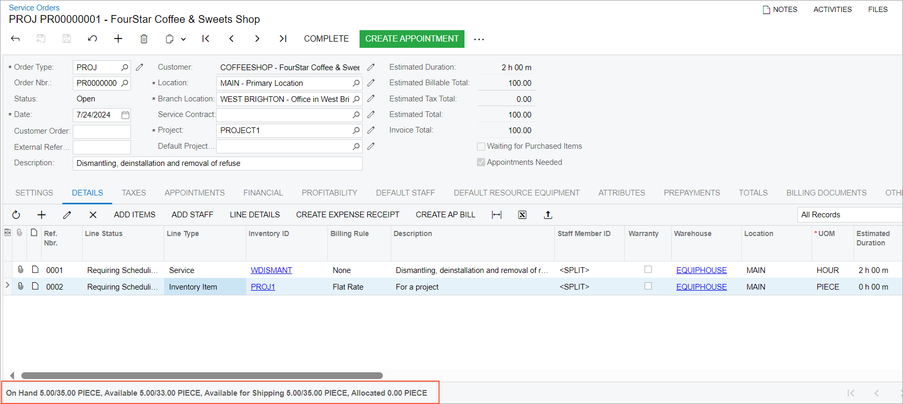

# Availability of Project-Specific Inventory in Service Documents {#_b093475c-4841-4df1-bd92-ec53255cd66f .concept}

**Important:** To manage the project-specific inventory items, the *Project-Specific Inventory* feature must be enabled on the [Enable/Disable Features](CS_10_00_00.md) \(CS100000\) form.

In service documents linked to a project, the system displays project-specific quantities for lines with stock items in the table footer of the **Details** tab on the [Service Orders](FS_30_01_00.md) and [Appointments](FS_30_02_00.md) forms. The following quantities are shown: *On Hand*, *Available*, *Available for Shipping*, and *Allocated* \(as shown in the following screenshot\).

The system displays line item quantities based on the inventory tracking mode set for the selected project in the **Inventory Tracking** box on the Summary tab of the [Projects](PM_30_10_00.md) form. If the project has the *Track by Project Quantity and Cost* or *Track by Project Quantity* inventory tracking mode specified, the quantities are shown as two values separated by a slash, as follows:

-   The first value \(before the slash\) represents the available quantity of stock items in the *Project* cost layer associated with the selected project and project task.
-   The second value \(after the slash\) indicates the quantity of free stock items \(from the *Normal* cost layer\) and project stock items stored in the warehouse location specified in the line.

The system shows one value for each of the availability buckets, if the following is true for the line:

-   The line has a warehouse location that is linked to a project with the *Track by Location* inventory tracking mode. Each quantity is calculated based on the items received to this location for this project and the items received to this location with a non-project code.
-   The line is not linked to any project. That is, this line has the non-project code specified. Each quantity is calculated based on the items received to this location with a non-project code.

For details, see [Project Inventory Tracking: Item Availability Tracking](Projects_Inventory_Tracking_ItemAvailability.md).

**Parent topic:**[Processing Service Documents with Projects](../UserGuide/ServMgmt_Processing_Service_Documents_with_Projects_Mapref.md)

