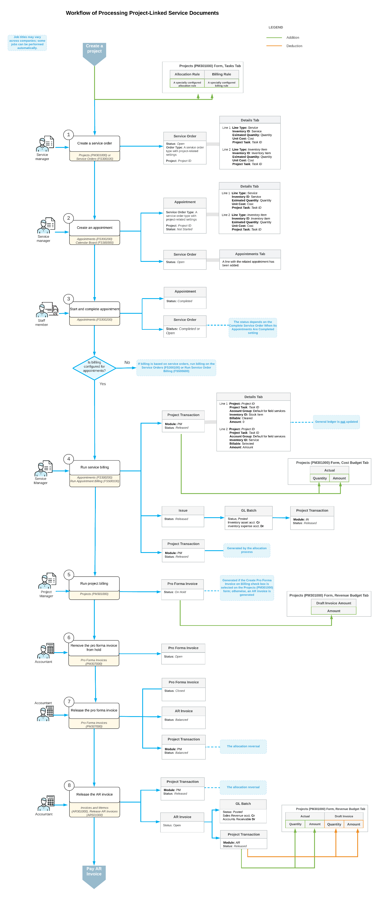

# Integration of Field Services and Projects: General Information {#_902061d8-f298-4672-b8be-888b0c2f0d09 .concept}

In Acumatica ERP, you can utilize the field service functionality when you are working with projects. Within a project, you can create a service document \(a service order or an appointment\) to perform the necessary services. In the service document, you can add lines with stock items and non-stock items \(including services\), associating each detail line with a particular project task. When the service document is billed, the system generates project transactions and updates the project cost budget.

Performing project services through field services ensures that all costs related to the services provided—including labor, materials, and other expenses—are accurately tracked and allocated to the project budget.

## Learning Objectives { .section}

In this chapter, you will learn how to do the following:

-   Configure the integration of the field service functionality with projects
-   Create a project and specify the settings related to field services
-   Create a service order directly from the project
-   Create an appointment
-   Review the project transactions that are generated when you are billing a service document and a project

## Applicable Scenarios { .section}

You may want to integrate field services and project management if you are a project manager who handles projects involving multiple project tasks, each requiring different human resources and timelines to perform services. You can use Acumatica ERP for the management of both projects and field services.

The integration can be performed in the following scenarios:

-   You are currently using Acumatica ERP to manage project management, and you plan to use it for field services as well.
-   You are currently using Acumatica ERP to manage field services, and you plan to use it for project management as well.
-   You are implementing Acumatica ERP, and you plan to use it for the management of projects and field services.

## Workflow of Processing Service Documents Associated with Projects { .section}

The following diagram illustrates the workflow of processing a project with a service order and an appointment. This workflow is based on the assumption that the project has been created in the system with the needed settings for integration with service management.

## Creation of a Project { .section}

You create a project by using the [Projects](PM_30_10_00.md) \(PM301000\) form, as described in the [Project Creation and Processing: General Information](Projects_Process_GeneralInfo.md) topic. During project creation, you need to specify the settings that provide integration with service management as follows:

-   **Tasks** tab: For each task to be performed by using service management, do the following:
    -   In the **Billing Rule** column, specify the billing rule that has been configured to bill project transactions related to field services.
    -   In the **Allocation Rule** column, specify an allocation rule that has steps that have been configured for handling project transactions originating from service documents.
-   **Summary** tab: Optionally, select the **Run Allocation on Release of Project Transactions** check box to cause the system to automatically perform allocation on release of project transactions.
-   **Defaults** tab: In the **Default Sales Account** box, specify the needed sales account. This account is used by the billing rule and will be credited to reflect the revenue earned on release of AR invoices generated for the project.

After the project has been created and the necessary settings have been specified, you can create any number of service orders and appointments to perform services associated with the project tasks.

## Creation of a Service Order {#section_tnc_cyt_pcc .section}

You can create a service order directly from the [Projects](PM_30_10_00.md) \(PM301000\) form by clicking **Create Service Order** on the More menu. In the **Create Service Order/Appointment** dialog box, which opens, you select the project-related service order type in the **Service Order Type** box. In the **Default Project Task** box, you specify the project task to be used by default in the service order. The branch, branch location, description, and project are automatically copied from the project’s settings and populated in the respective boxes. You do not need to fill in the **Service Order Settings** section of the dialog box at this stage; these settings can be specified later on the [Service Orders](FS_30_01_00.md) \(FS300100\) form.

At the bottom of the dialog box, you click **Create and Review**, and the system opens the [Service Orders](FS_30_01_00.md) form. In the Summary area, the **Project** and **Default Project Task** boxes are already filled in. On the **Details** tab, you add lines for the necessary services, as well as any other non-stock items and stock items. The system inserts the default project task in the **Project Task** column for each detail line, but you can change it, if needed.

To create an appointment for the project-related service order, you click one of the following commands on the More menu of the [Service Orders](FS_30_01_00.md) form:

-   **Create Appointment**: The system opens the [Appointments](FS_30_02_00.md) \(FS300200\) form, where you fill in the appointment’s settings. For details, see [Appointment Creation: To Create an Appointment with Staff on the Appointments Form](ServMgmt_Creating_Appointment_Quickly_Process_Activity.md).
-   **Schedule on Calendar**: The system opens the [Calendar Board](FS_30_03_00.md) \(FS300300\), where you can create an appointment while considering staff members' availability, skills, licenses, and service areas. For details, see [Scheduling Appointments: To Create a Skill-Matched Appointment on the Calendar](ServMgmt_Creating_Appointment_on_Calendar_Board_Process_Activity.md).
-   **Schedule on Staff Calendar**: The system opens the [Staff Calendar Board](FS_30_04_00.md) \(FS300400\), where you can create an appointment considering the schedules of the staff members.

Regardless of which form you use to create the appointment, the system inserts the project in the Summary area of the [Appointments](FS_30_02_00.md) form.

## Creation of an Appointment {#section_glc_cyt_pcc .section}

You can create an appointment directly from a project without first creating a service order. When the appointment is created, the system automatically creates the related service order, populating it with the settings and detail lines of the appointment.

To create an appointment from a project, on the More menu of the [Projects](PM_30_10_00.md) \(PM301000\) form, you click **Create Appointment**. In the **Create Service Order/Appointment** dialog box, which opens, you select the project-related service order type. In the **Default Project Task** box, you specify the default project task for the appointment. The system copies other settings—such as the branch, branch location, description, and project—from the project settings and inserts them in the appropriate boxes.

At the bottom of the dialog box, you click **Create and Review**, and the system opens the [Appointments](FS_30_02_00.md) \(FS300200\) form, where you can specify other settings for the appointment. When you save the appointment, the system automatically creates the related service order on the [Service Orders](FS_30_01_00.md) \(FS300100\) form and copies the relevant settings from this appointment.

**Tip:** As an alternative to creating a service document directly from a project, you can create a service order or an appointment directly on the [Service Orders](FS_30_01_00.md) or [Appointments](FS_30_02_00.md) form and associate it with a project by selecting the needed project in the **Project** box in the Summary area of the form.

In the created appointment on the [Appointments](FS_30_02_00.md) form, on the **Details** tab, you add detail lines for the necessary services, as well as any non-stock items and stock items. In each line, you specify the project task \(if it is different from the default project task\). When you save the appointment, all added lines will be automatically included in the service order.

## Transactions Generated During the Billing of a Service Order or an Appointment {#section_b3c_cyt_pcc .section}

Once an appointment has been completed, the billing process can be initiated. Billing can be processed for either appointments or service orders, depending on the settings of the customer's billing cycle.

When billing is completed for a service order or an appointment, the system generates transactions that can be viewed as follows:

-   On the **Billing Documents** tab of both the [Service Orders](FS_30_01_00.md) \(FS300100\) form and the [Appointments](FS_30_02_00.md) form if billing was run for the appointment \(that is, if **Run Billing For** is set to **Appointments** in the billing cycle associated with the customer\)
-   On the **Billing Documents** tab of only the [Service Orders](FS_30_01_00.md) \(FS300200\) form if billing was run for the service order \(that is, if **Run Billing For** is set to **Service Orders** in the billing cycle associated with the customer\)

If a service document contains only non-stock items or services, the system generates and releases a project transaction that is recorded to the account group intended to initially track project transactions originating from service documents. For details, see [Integration of Field Services and Projects: Workflow Setup](ServMgmt_Project_Through_Field_Services_Workflow_Setup_Concept.md).

If a service document contains both non-stock items \(including services\) and stock items, the following records are generated during billing:

1.  An inventory issue transaction.

    The system creates an issue on the [Issues](IN_30_20_00.md) \(IN302000\) form and releases it. On the **Financial** tab of the [Issues](IN_30_20_00.md) form, the reference number of the generated inventory GL transaction is specified in the **Batch Nbr.** box. This GL transaction credits an inventory account \(indicating a reduction in inventory\) and debits the inventory expense account \(COGS - cost of goods sold\) specified in the reason code. This GL transaction recognizes an expense and generates a related project transaction, whose reference number is specified in the **Project Tran. ID** column in the debiting line on the [Journal Transactions](GL_30_10_00.md) \(GL301000\) form.

2.  The project transaction.

    The system creates the project transaction on the [Project Transactions](PM_30_40_00.md) \(PM304000\) form. The **Details** tab contains the lines that the system has copied from the service document. In each line, the state of the **Billable** check box is assigned as follows:

    -   In a line with a stock item, the **Billable** check box is cleared because the system has created an inventory issue transaction for this line and has generated and posted an inventory GL transaction. For the debit expense line in this transaction, another project transaction is also generated.
    -   In a line with a service, the **Billable** check box is selected because it will be billed later through the project billing process.
    Therefore, the total amount in the Summary area does not include the cost of the stock items because the **Amount** column for these lines on the **Details** tab contains *0*.

    This project transaction is recorded to the account group that initially keeps project transactions originating from service documents. However, note that stock items are added with an amount of *0*.

You can view the project transactions associated with a particular project on the [Project Transaction Details](PM_40_10_00.md) \(PM401000\) inquiry form. For details, see [Integration of Field Services and Projects: Related Inquiry Form](ServMgmt_Project_Through_Field_Services_Reports_Inquiries.md).

On the generation and release of the project transaction, the system updates the project's budget lines on the **Cost Budget** tab of the [Projects](PM_30_10_00.md) \(PM301000\) form. The system updates the **Actual Quantity** and **Actual Amount** columns for these cost budget lines.

## Reversal of a Project Transaction Created from a Service Document { .section}

You may need to reverse a project transaction that has been generated during the billing of a service order or an appointment. To do this, click **Reverse Bill** on the More menu of the [Service Orders](FS_30_01_00.md) \(FS300100\) or [Appointments](FS_30_02_00.md) \(FS300200\) form.

When a project transaction is reversed, all settings from the original transaction are copied to the reversed transaction. The system adds *Reverse* to the beginning of the transaction description in the **Description** box in the Summary area of the [Service Orders](FS_30_01_00.md) or [Appointments](FS_30_02_00.md) form.

You can view both the original transaction and the reversed transaction on the **Billing Documents** tab of the [Service Orders](FS_30_01_00.md) or [Appointments](FS_30_02_00.md) form, depending on which form the transaction was generated from \(and then reversed\).

If a service document contains stock items and an inventory issue has been generated during billing, clicking the **Reverse Bill** command will also reverse the issue. That is, the system will generate and post a reversed inventory transaction for this issue, which will debit an inventory asset account.

**Parent topic:**[Integrating Field Services with Projects](../UserGuide/ServMgmt_Project_Through_Field_Services_Mapref.md)

