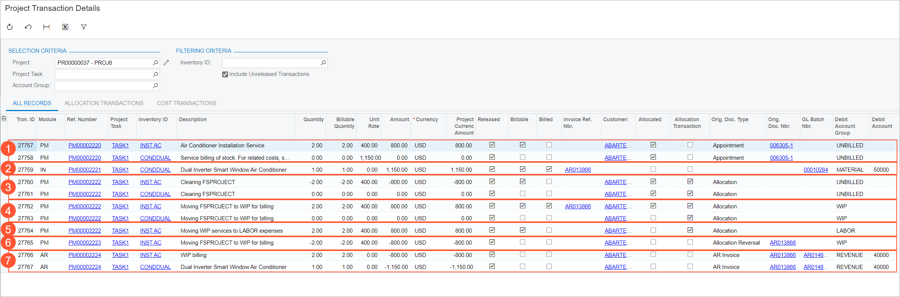

# Integration of Field Services and Projects: Related Inquiry Form {#_2965632b-c130-4c5c-9267-8e2bb1a7c11f .concept}

In the following sections, you can find details about the inquiry form you may want to review to gather information about project transactions originating from field service documents.

**Attention:** If you don’t see a particular report or form that is described, you may have signed in to the system with a user account that doesn’t have access rights to the report or form. Contact your system administrator to obtain access to any needed reports or forms.

## Reviewing the Generated Project Transactions { .section}

On the [Project Transaction Details](PM_40_10_00.md) \(PM401000\) inquiry form, you can specify a project and review the project transactions that the system has generated from service documents. The screenshot below provides an example of this inquiry form, which shows the project transactions created under the following conditions:

-   A service document \(service order or an appointment\) related to a project has been billed.
-   An allocation rule has been applied to the project.
-   The project billing process has been run.

In this example, the inquiry form shows the following project transactions:

1.  Project transactions \(see Item 1 in the screenshot above\) that were created when the billing process was run for a service document and recorded to the account group intended to track transactions originating from service documents.
2.  A project transaction \(Item 2\) that was generated on release of the inventory issue transaction containing stock items, reflecting a material expense that occurred.
3.  Project transactions \(Item 3\) that were generated by the allocation process \(Step 10 in the allocation rule described in [Integration of Field Services and Projects: Workflow Setup](ServMgmt_Project_Through_Field_Services_Workflow_Setup_Concept.md)\). This step reverses the project transactions shown in Item 1, which were recorded to the account group used for tracking project transactions originating from service documents.
4.  Project transactions \(Item 4\) that were generated by the allocation process \(Step 20 in the allocation rule described in [Integration of Field Services and Projects: Workflow Setup](ServMgmt_Project_Through_Field_Services_Workflow_Setup_Concept.md)\). In this step, the system allocates project transactions from the field service default account group to the *Work in Progress \(WIP\)* account group, which is used to store unpaid project costs.
5.  A project transaction \(Item 5\) that was generated by the allocation process \(Step 30 in the allocation rule described in [Integration of Field Services and Projects: Workflow Setup](ServMgmt_Project_Through_Field_Services_Workflow_Setup_Concept.md)\). This step recognizes service-related expenses from service documents.

    As a result of project billing the following transactions appears.

6.  A reversed project transaction \(Item 6\) that was automatically generated when an AR invoice was created upon billing the project transaction that was recorded to the *WIP* account group by the allocation process.
7.  Project transactions that record revenue to the project budget \(Item 7\). These transactions were generated when the related AR invoices were billed.

**Parent topic:**[Integrating Field Services with Projects](../UserGuide/ServMgmt_Project_Through_Field_Services_Mapref.md)

