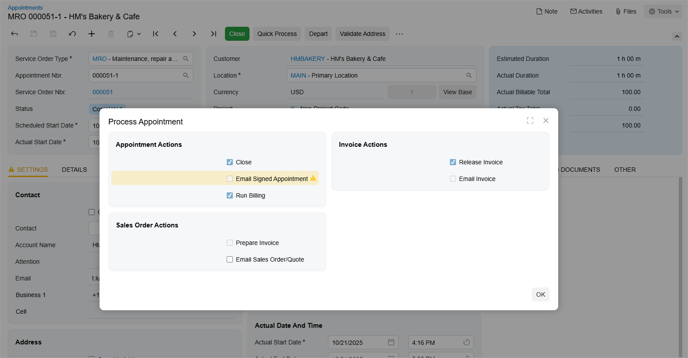

# Quick Billing of Appointments: General Information {#_e6b790dc-23d3-4184-a82d-a124e48f5449 .concept}

In Acumatica ERP, you can initiate the quick processing of an appointment—that is, performing such actions on the appointment as closing an appointment, preparing and releasing billing documents, and emailing the billing documents to the customer—with just one click.

To perform the quick billing process, an appointment should be created based on a service order type for which quick processing has been configured. For details, see [Service Order Types: Quick Processing Settings](../ImplementationGuide/config_Service_Order_Types_Quick_Process_Activity.md).

## Learning Objectives { .section}

In this chapter, you will learn how to do the following:

-   Process an appointment by using the **Quick Process** command
-   Review the generated billing documents

## Applicable Scenarios { .section}

You process an appointment quickly when you are not going to make changes in the billing documents based on what happens in the appointment, and you need to generate billing documents quickly.

## Actions Performed on an Appointment During Quick Processing {#section_g54_4ms_35b .section}

If an appointment is created based on a service order type that supports quick processing, you can click **Quick Process** on the form toolbar of the [Appointments](FS_30_02_00.md#) \(FS300200\) form to process the appointment in a single step. This action opens the **Process Appointment** dialog box \(see below\), which contains check boxes representing the actions that can be performed on the appointment during quick processing.

Note that the service order type settings determine which check boxes appear in the dialog box, their availability, and their default states.

The dialog box may contain the following sections and check boxes:

-   **Appointment Actions** section:
    -   **Close**: Indicates whether the system closes this appointment during quick processing.
    -   **Email Signed Appointment**: Indicates whether during processing, the system sends an email with the [Appointment](FS_64_20_00.md) \(FS642000\) report corresponding to the appointment and the customer's embedded signature. This action is available for the appointment processed in the mobile app only.
    -   **Run Billing**: Indicates whether the system generates a billing document during quick processing of the appointment.
-   **Sales Order Actions** section:

    This section appears if *Sales Orders* is selected in the **Generated Billing Documents** box on the [Service Order Types](FS_20_23_00.md) form \(**General** tab\):

    -   **Prepare Invoice**: Indicates whether the system creates an SO invoice for the generated sales order during quick processing of the appointment.
    -   **Use Sales Order Quick Processing**: Indicates whether when quick processing is run, the system processes the generated sales order by using the quick processing settings specified for the sales order type on the [Order Types](SO_20_10_00.md) \(SO201000\) form.
    -   **Email Sales Order/Quote**: Indicates whether the system emails the sales order to the customer during quick processing.
-   **Invoice Actions** section:

    If *SO Invoices* is selected in the **Generated Billing Documents** box on the [Service Order Types](FS_20_23_00.md) form, the system generates a sales invoice when the service order is billed. This setting causes the **Sales Order Actions** section to be hidden.

    -   **Release Invoice**: Indicates whether the system releases the generated invoice during quick processing.
    -   **Email Invoice**: Indicates whether the system emails the generated invoice to the customer during quick processing.

In the dialog box, you can review the available actions and, if needed, update the check box selections.

## Quick Processing Settings of the Service Order Type {#section_h54_4ms_35b .section}

You can run quick processing for an appointment on the [Appointments](FS_30_02_00.md#) \(FS300200\) form if both of the following set up conditions are met:

-   For the service order type, the **Allow Quick Process** check box is selected on the **General** tab of the [Service Order Types](FS_20_23_00.md) \(FS202300\) form \(**Billing Settings** section\). In this case, on the **Quick Processing** tab, the administrator has specified the default settings for quick processing of a service order of the type.
-   The billing cycle assigned to the customer is set up to generate billing documents for appointments—that is, **Appointments** is selected for **Run Billing For** on the [Billing Cycles](FS_20_60_00.md) \(FS206000\) form for the billing cycle.

**Parent topic:**[Quick Billing of Appointments](../UserGuide/ServMgmt_Appointment_Quick_Processing_Mapref.md)

