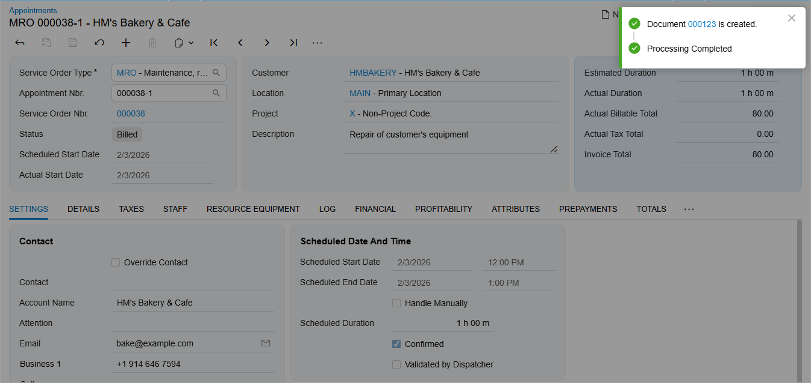

# Quick Billing of Appointments: Process Activity {#_9b2ee3bf-8a1d-489c-9655-86ea572f6514 .task}

This activity will walk you through the process of billing an appointment with just one click if quick processing has been set up for the appointment's order type.

**Attention:** This activity is based on the *U100* dataset. If you are using another dataset or if any system settings have been changed in *U100*, these changes can affect the workflow of the activity and the results of the processing. To avoid issues, restore the *U100* dataset to its initial state.

## Story { .section}

The SweetLife Service and Equipment Sales Center has received a call from HM's Bakery and Cafe, requesting the repair of one of their orange juicers. The service manager \(Maia Davis\) has agreed on the appointment day and time with the customer, and has created and scheduled the appointment in the system.

A staff member, Ricardo Martinez \(*EP00000044\)*, visited the customer, performed the repair service, and completed the appointment. No changes are required for the invoice that will be generated for this appointment.

Acting as the accountant Yona Jones, you will quickly process the appointment to automatically close it and generate the related invoice. Since the customer requested to receive the invoice by email, you will also include the action to send the released invoice to the customer as part of this processing.

## Configuration Overview { .section}

In the *U100* dataset, which you'll use to complete this lesson, the following setup has been configured. These settings ensure that the environment is ready for performing the activity:

-   The minimum system configuration, which is described in [Company with Branches that Do Not Require Balancing: General Information](../ImplementationGuide/config_Company_with_Branches_No_Balancing_GeneralInfo.md), has been performed.
-   The *SWEETLIFE* company has been created on the [Companies](CS_10_15_00.md) \(CS101500\) form. This company has multiple branches created on the [Branches](CS_10_20_00.md#) \(CS102000\) form, including *SWEETEQUIP \(Service and Equipment Sales Center\)*.
-   On the [Service Management Preferences](FS_10_01_00.md) \(FS100100\) form, the minimum settings have been specified, including specifying the numbering sequences and work calendar, for the service management functionality to be used.
-   On the [Users](SM_20_10_10.md) \(SM201010\) form, the *davis* and *martinez* accounts have been created. For the *davis* user account, in the **Linked Entity** box of the Summary area of the form, the *Maia Davis* employee account has been specified; for the *martinez* user account, in the **Linked Entity** box, the *Ricardo Martinez* employee account has been specified.
-   On the [Branch Locations](FS_20_25_00.md#) \(FS202500\) form, the *WEST BRIGHTON* branch location of the *SWEETEQUIP* \(*Service and Equipment Sales Center*\) branch has been created.
-   On the [User Profile](SM_20_30_10.md#) \(SM203010\) form, for the *davis* user, *WEST BRIGHTON* has been specified as the default branch location.
-   On the [Employees](EP_20_30_00.md#) \(EP203000\) form, the *EP00000044 \(Ricardo Martinez\)* employee has been created. On the **General** tab \(**Employee Settings** section\), the **Staff Member in Service Management** check box has been selected.
-   On the [Service Order Types](FS_20_23_00.md#) \(FS202300\) form, the *MRO* service order type has been defined. In the **Billing Settings** section of the **General** tab, *SO Invoices* has been selected in the **Generated Billing Documents** box, and the **Allow Quick Process** check box has been selected. On the **Quick Processing** tab, the following settings have been specified:
    -   **Close** \(**Appointment Actions** section\): Selected
    -   **Run Billing** \(**Appointment Actions** section\): Selected
    -   **Allow Billing** \(**Service Order Actions** section\): Selected
    -   **Run Billing** \(**Service Order Actions** section\): Selected
    -   **Release Invoice** \(**Invoice Actions** section\): Selected
-   On the [Billing Cycles](FS_20_60_00.md#) \(FS206000\) form, the following settings have been specified for the *AP AP* billing cycle:
    -   **Run Billing For**: **Appointments**
    -   **Group Billing Documents By**: **Appointments**
-   On the [Customers](AR_30_30_00.md#) \(AR303000\) form, the *HMBAKERY \(HM's Bakery and Cafe\)* customer has been defined, and the *AP AP* billing cycle has been selected for it in the **Service Management** section of the **Billing** tab.
-   On the [Non-Stock Items](IN_20_20_00.md#) \(IN202000\) form, for the *REPAIR* service item \(that is, non-stock item of the *Service* type\), the *Time* billing rule has been specified on the **Price/Cost** tab.
-   On the [Appointments](FS_30_02_00.md#) \(FS300200\) form, the *000038-1* appointment has been created.

## Process Overview { .section}

On the [Appointments](FS_30_02_00.md#) \(FS300200\) form, you will initiate quick processing of the appointment. You will then review the list of billing documents that the system has generated as a result of quick processing and review the invoice on the [Invoices](SO_30_30_00.md) \(SO303000\) form.

## System Preparation { .section}

Before you start this activity, do the following:

1.  Launch the Acumatica ERP website, and sign in to a company with the *U100* dataset preloaded; you should sign in as an accountant by using the *jones* username and the *123* password.
2.  In the Date box in the upper-right corner of the Acumatica ERP screen, specify the business date *1/30/2026*. For simplicity, you will use this business date to create and process all documents in this activity.
3.  On the Company and Branch Selection menu on the top pane of the Acumatica ERP screen, make sure that the *Service and Equipment Sales Center* branch is selected.
4.  After signing in, make sure that the *Service Manag ement* feature is enabled on the [Enable/Disable Features](CS_10_00_00.md#) \(CS100000\) form.

## Step 1: Quickly Processing the Appointment { .section}

To quickly initiate the billing process for the appointment, do the following:

1.  On the [Appointments](FS_30_02_00.md#) \(FS300200\) form, open the *000038-1* appointment.
2.  In the **Service Order Type** box of the Summary area, notice that *MRO* is selected. Note that quick processing settings have been defined for this service order type, as described in the *Configuration Overview* section of this activity.
3.  On the form toolbar, click **Quick Process**.

    The **Process Appointment** dialog box opens.

4.  In the **Invoice Actions** section of the dialog box, select the **Email Invoice** check box.

    The invoice will be sent to the customer during quick processing.

5.  Click **OK**.

    The system closes the **Process Appointment** dialog box.

6.  After the processing is successfully completed, the status and the generated billing documents appear in the upper-right corner of the form \(see below\).

    

Based on the settings specified for the *MRO* service order type \(and the setting you changed to have the invoice emailed to the customer\), during the quick processing, the system closes the appointment, and creates and releases the related invoice. In this case, the system also sends the invoice to the customer by email because you have selected the **Email Invoice** check box in the **Process Appointment** dialog box.

## Step 2: Reviewing the Created Billing Documents and Sent Email { .section}

Review the generated billing documents and the email sent to the customer as follows:

1.  While you are still viewing the *000038-1* appointment on the [Appointments](FS_30_02_00.md#) \(FS300200\) form, click the **Billing Documents** tab, and notice that an invoice is listed. It has been created during the quick processing.
2.  In the **Reference Nbr.** column, click the link to open the SO invoice.

    The [Invoices](SO_30_30_00.md) \(SO303000\) form opens. Notice that the invoice has the *Open* status.

3.  On the form title bar \(in the top right corner of the form\), click **Activities**. The **Tasks &amp; Activities** dialog box opens.
4.  In the dialog box, notice that the email sent to the customer with the invoice is listed.
5.  Click the link to the email; this brings up the email in a dialog box so that you can review it.

**Parent topic:**[Quick Billing of Appointments](../UserGuide/ServMgmt_Appointment_Quick_Processing_Mapref.md)

