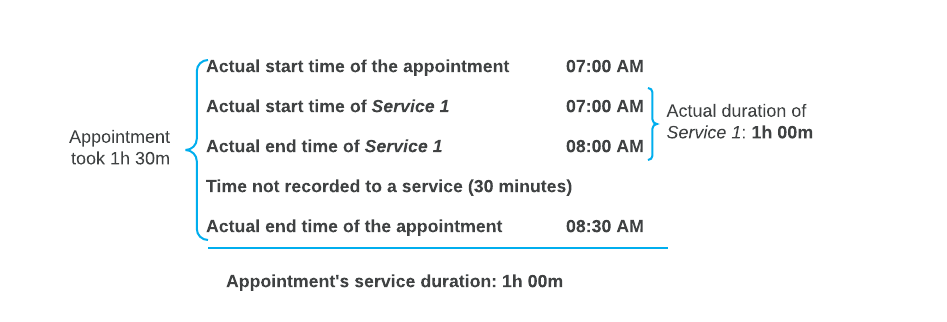
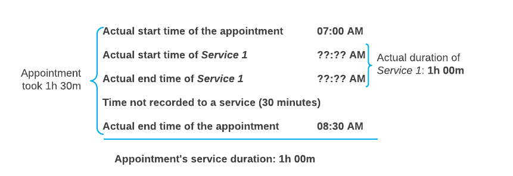
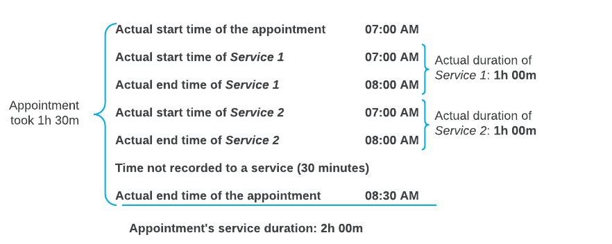

# Staff Time in Appointments: Time Recording and Calculation {#_e5f14fdf-0f12-459d-8d96-a37d1071e37d .concept}

If the *Time Management* feature is enabled on the [Enable/Disable Features](CS_10_00_00.md#) \(CS100000\) form, activities can be created on the [Employee Time Activities](EP_30_70_00.md#) \(EP307000\) form for each employee involved in an appointment when the appointment is completed.

Appointments are created on the [Appointments](FS_30_02_00.md#) \(FS300200\) form, where the applicable times are also recorded. Upon completion of the appointment, each staff member's time can be reported in the employee time activity in any of the following ways:

-   If the staff member works during the entire appointment, the appointment time is recorded.
-   If the staff member works during a part of appointment, the actual staff time is recorded.
-   If the staff member performs only particular services of the appointment, the service time is recorded.

Depending on the nature of appointments and the way a scheduler or service manager assigns staff members to appointments, you may decide to always track employee time in the same way, or you may use different ways of tracking time for different appointments. You assign each of these types of appointments a service order type that has been configured on the [Service Order Types](FS_20_23_00.md) \(FS202300\) form for the type of time recording you will use, as described further in this topic.

## Calculation of the Actual Service Duration { .section}

The system calculates the actual service duration of an appointment as the sum of the duration of the services included in the appointment, and inserts the duration in the **Actual Duration** box of the Summary area of the [Appointments](FS_30_02_00.md#) \(FS300200\) form. The system does not include in the actual service duration the time that has not been recorded to any service.

The following examples show how the system calculates the actual service duration.

**Example 1**

Suppose that you have attended an appointment that lasted an hour and a half, but you have spent only one hour on service delivery. Further suppose that in the system, you specify the start and end times of the service and the start and end times of the appointment. The system calculates the appointment's actual service duration as one hour \(see the following illustration of this calculation\).

**Example 2**

Suppose that you have attended an appointment that lasted an hour and a half, but you have spent only one hour on service delivery. Further suppose that in the system, you specify the actual duration of the service \(one hour; the start and end times of the service are not entered\) and the start and end times of the appointment. In this case, too, the system calculates the appointment's actual service duration as one hour \(see the following illustration of this calculation\).

**Example 3**

Suppose that you have attended an appointment that lasted an hour and a half. You delivered Service 1, and your colleague delivered Service 2 at the same time; each of you spent one hour on service delivery. In the system, you specify the start and end time of each service, as well as the start and end time of the appointment. The system calculates the actual service duration of the appointment as two hours \(the total of the duration of Service 1 and Service 2\), even though the services were performed in the same hour \(see the following illustration of this calculation\).

## Recording of Staff Time for the Entire Appointment { .section}

If a staff member is working during the entire duration of an appointment, to record the working time, you assign the staff member to the appointment but do not associate this employee with any particular service of this appointment. That is, in the row for the staff member on the **Staff** tab of the [Appointments](FS_30_02_00.md#) \(FS300200\) form, you leave the **Detail Ref. Nbr.** and **Inventory ID** columns empty. The system starts recording the employee's time when a staff member clicks **Start** on the form toolbar of the form, and finishes recording the time when a staff member clicks **Complete** on the form toolbar.

To record time in this way, you need to base the appointment on a service order type that is configured as follows on the **Time Behavior** tab of the [Service Order Types](FS_20_23_00.md) \(FS202300\) form:

-   The **Start Logging for Unassigned Staff** check box: Selected

    When an appointment is started, on the **Log** tab, the system creates log lines for staff members that are assigned to the appointment but are not assigned to any service.

-   The **Status to Set for In Process Items** box: *Completed*

    On completion of an appointment, the *Completed* status will be assigned to each detail line.

## Recording of Staff Time for a Part of the Appointment { .section}

If a staff member is working on an appointment only during a specific part of the appointment but not during the entire appointment, to correctly track the staff time, you should assign the applicable staff member to the appointment, but you should not associate the person with any service. That is, on the [Appointments](FS_30_02_00.md#) \(FS300200\) form, you assign the necessary staff members to the appointment by adding rows for them on the **Staff** tab, but you leave the **Detail Ref. Nbr.** and **Inventory ID** columns empty for these staff members.

Once an appointment is started, a staff member should click **Start** on the table toolbar of the **Staff** tab to start tracking the time, and then click **Complete** to finish recording the time. This will add a line on the **Log** tab.

Staff members can also manually add a line on the **Log** tab in which they enter the time when they started to work on the appointment and either the time when they ended or the actual time they worked.

As a result, on the **Log** tab of the form, either of the following sets of columns are filled in for the added line:

-   The **Start Date**, **Start Time**, **End Date**, and **End Time** columns
-   The **Start Date**, **Start Time**, and **Duration** columns

To record time in this way, you need to base the appointment on a service order type that has been configured so that the system does not record the appointment time automatically when an appointment is started and completed. That is, on the **Time Behavior** tab of the [Service Order Types](FS_20_23_00.md) \(FS202300\) form, the following settings should be specified:

-   The **Start Logging for Unassigned Staff** check box: Cleared

    When an appointment is started, the system does not create log lines on the **Log** tab for staff members that are assigned to the appointment but are not assigned to any service. A log line will be added only when a staff member clicks **Start** and then **Complete** on the table toolbar of the **Staff** tab.

-   The **Status to Set for In Process Items** box: *In Process*.

    On completion of an appointment, the *In Process* status will remain on each detail line until you click **Complete** on the table toolbar of the **Details** tab for each line.

## Recording of Staff Time Spent on Services for the Appointment { .section}

To correctly track the time that staff members have spent on performing specific services \(or one service\) of the appointment, you can do either of the following:

-   Assign a staff member to a service on the [Appointments](FS_30_02_00.md#) \(FS300200\) form in either of the following ways:

    -   On the **Details** tab, select the staff member in the **Staff Member ID** column of the detail line, or in the **Add Staff** dialog box, which opens when you click **Add Staff** on the table toolbar.
    -   On the **Staff** tab, select the service reference number in the **Detail Ref. Nbr.** column for the staff member, or choose a service in the **Service Ref. Nbr.** box in the **Add Staff** dialog box, which opens when you click **Add Staff** on the table toolbar.
    The system starts recording the time once a staff member clicks **Start** on the form toolbar of the [Appointments](FS_30_02_00.md#) form, and finishes recording the time when a staff member clicks **Complete** on the form toolbar of the [Appointments](FS_30_02_00.md#) form.

    To record time in this way, you need to base the appointment on a service order type configured as follows on the **Time Behavior** tab of the [Service Order Types](FS_20_23_00.md) \(FS202300\) form:

    -   The **Start Logging for Services and Assigned Staff \(if Any\)** check box: Selected

        When an appointment is started, the system starts the included services and creates log lines for the services and any assigned staff members on the **Log** tab.

    -   The **Status to Set for In Process Items** box: *Completed*

        On completion of an appointment, the *Completed* status will be assigned to each detail line.

-   Associate the staff member with the services they perform, and track the service's time. That is, on the **Details** tab on the [Appointments](FS_30_02_00.md#) form, you assign the needed staff member to the service by specifying the staff member in the **Staff Member ID** column. In this case, once the appointment is started, a staff member selects a line with their staff member ID on the **Staff** tab, and clicks **Start** on the table toolbar to start tracking the time, and then clicks **Complete** to finish recording the time.

    To record time in this way, you need to base the appointment on a service order type that has been configured as follows on the **Time Behavior** tab of the [Service Order Types](FS_20_23_00.md) form:

    -   The **Start Logging for Services and Assigned Staff \(if Any\)** check box: Cleared

        When an appointment is started, the system does not start the included services. The system will create log lines for the services and for any assigned staff members only when a staff member clicks **Start** and then **Complete** on the table toolbar of the **Staff** tab.

    -   The **Status to Set to In Process Items** box: *In Process*

        On completion of an appointment, the *In Process* status will remain on each detail line until you click **Complete** on the table toolbar of the **Details** tab for each line.

-   Add a staff member to an appointment but do not assign a staff member to any appointment's service during the creation of an appointment. In that case, on the [Appointments](FS_30_02_00.md#) form, once an appointment is started, on the **Details** tab, you should select a service line, click **Start** on the table toolbar to start tracking the time, select a staff member in the **Staff Member** box of the **Perform Action** dialog box, click **OK** at the bottom of the dialog box. Then, on the table toolbar, click **Complete** to finish recording the time. You can also add a line on the **Log** tab manually by adding a staff member in the **Staff Member** column, and selecting a service in the **Detail Ref. Nbr.** column.

    To record time in this way, you need to base the appointment on a service order type that has been configured so that the system does not start recording the staff time automatically. That is, on the **Time Behavior** tab of the [Service Order Types](FS_20_23_00.md) form, the settings are the following:

    -   The **Start Logging for Services and Assigned Staff \(if Any\)** check box: Cleared

        When an appointment is started, the system does not start the included services. Log lines for the services and assigned staff members are created only when you click **Start**, specify a staff member, and then click **Complete** on the table toolbar of the **Details** tab.

    -   The **Start Logging for Unassigned Staff** check box: Cleared

        When an appointment is started, the system will not create log lines on the **Log** tab for staff members assigned to the appointment but not assigned to any service.

    -   The **Status to Set to In Process Items**: *In Process*

        On completion of an appointment, the *In Process* status will remain on each detail line until you click **Complete** on the table toolbar of the **Details** tab for each line.

**Parent topic:**[Recording Staff Time in Appointments](../UserGuide/ServMgmt_Managing_Staff_Times_Mapref.md)

