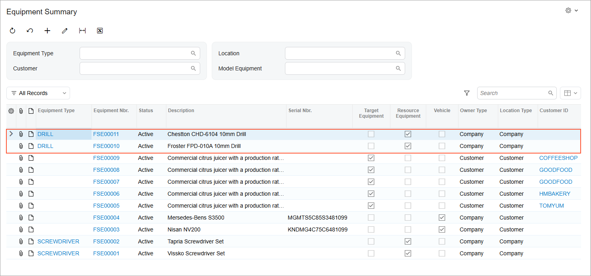

# Resource Equipment: To Create Resource Equipment {#_67771c23-2d9e-45b8-8456-11b227e6375a .task}

In this activity, you will learn how to create a resource equipment record in the system.

**Attention:** This activity is based on the *U100* dataset. If you are using another dataset or if any system settings have been changed in *U100*, these changes can affect the workflow of the activity and the results of the processing. To avoid issues, restore the *U100* dataset to its initial state.

## Story { .section}

Suppose you’re the administrative user at the SweetLife Service and Equipment Sales Center, and you need to add the resource equipment used in appointments to Acumatica ERP.

## Configuration Overview {#section_tz4_djx_cnb .section}

In the *U100* dataset, which you'll use to complete this lesson, the following setup has been configured. These settings ensure that the environment is ready for performing the activity:

-   The minimum system configuration, which is described in [Company with Branches that Do Not Require Balancing: General Information](../ImplementationGuide/config_Company_with_Branches_No_Balancing_GeneralInfo.md), has been performed.
-   The *SWEETLIFE* company has been created on the [Companies](CS_10_15_00.md) \(CS101500\) form. This company has multiple branches created on the [Branches](CS_10_20_00.md#) \(CS102000\) form, including *SWEETEQUIP \(Service and Equipment Sales Center\)*.
-   On the [Service Management Preferences](FS_10_01_00.md) \(FS100100\) form, the minimum settings have been specified, including specifying the numbering sequences and work calendar, for the service management functionality to be used.
-   On the [Numbering Sequences](CS_20_10_10.md) \(CS201010\) form, the *SMEQUIPMN* sequence has been created. It has then been specified in the **Equipment Numbering Sequence** box \(**Numbering Settings** section\) of the [Service Management Preferences](FS_10_01_00.md) \(FS100100\) form.
-   On the [Non-Stock Items](IN_20_20_00.md) \(IN202000\) form, the *REPAIR* non-stock item of the *Service* type has been created.

## Process Overview { .section}

On the [Equipment](FS_20_50_00.md) \(FS205000\) form, you will create two equipment records. You will then make sure that the records are displayed on the [Equipment Summary](FS_40_02_00.md) \(FS400200\) form

## System Preparation {#section_okm_j2y_1hc .section}

Before you start this activity, do the following:

1.  Launch the Acumatica ERP website, and sign in to a company with the *U100* dataset preloaded; you should sign in as a system administrator by using the *gibbs* username and the *123* password.
2.  On the Company and Branch Selection menu in the top pane of the Acumatica ERP screen, select the *Service and Equipment Sales Center* branch.
3.  Make sure that the *Service Management* feature is enabled on the [Enable/Disable Features](CS_10_00_00.md#) \(CS100000\) form.
4.  As a prerequisite activity, be sure that the equipment type has been created as described in [Resource Equipment: To Create an Equipment Type and Assign It to a Service](ServMgmt_Resource_Equipment_Types_Implem_Activity.md).

## Step: Creating a Equipment Record { .section}

To create an equipment record, do the following:

1.  On the [Equipment](FS_20_50_00.md) \(FS205000\) form, add a new record.
2.  In the Summary area of the form, specify the following settings:
    -   **Equipment Type**: *DRILL*
    -   **Status**: *Active*
    -   **Description**: `Froster FPD-010A 10mm Drill`
    -   **Target Equipment**: Cleared
    -   **Resource Equipment**: Selected
3.  Under **Owner Type**, select **Company**.
4.  Under **Location Type**, select **Company**, and select *SWEETEQUIP* in the **Branch** box.
5.  On the form toolbar, click **Save**.
6.  On the form toolbar, click **Add New Record**, and specify the following settings:
    -   **Equipment Type**: *DRILL*
    -   **Status**: *Active*
    -   **Description**: `Chestton CHD-6104 10mm Drill`
    -   **Target Equipment**: Cleared
    -   **Resource Equipment**: Selected
    -   **Owner Type**: **Company**
    -   **Location Type**: **Company**
    -   **Branch**: *SWEETEQUIP*
7.  On the form toolbar, click **Save**.
8.  Open the [Equipment Summary](FS_40_02_00.md) \(FS400200\) form, and make sure that the pieces of equipment you have created are displayed in the table \(as shown below\).

    

**Parent topic:**[Creating and Using Resource Equipment](../UserGuide/ServMgmt_Resource_Equipment_Mapref.md)

