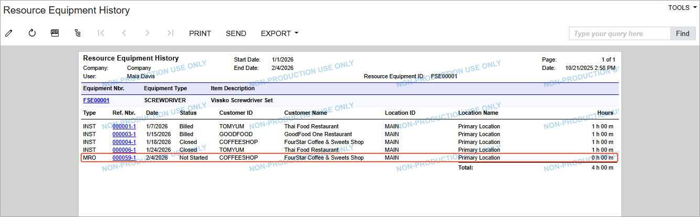
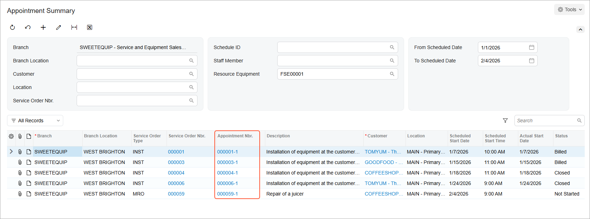

# Resource Equipment: To Add Resource Equipment to an Appointment {#_bff387a8-04f3-4c9c-8e7c-ef8bba79b881 .task}

This activity guides you through the process of assigning to appointments the resource equipment that your company owns and uses to perform services.

**Attention:** This activity is based on the *U100* dataset. If you are using another dataset or if any system settings have been changed in *U100*, these changes can affect the workflow of the activity and the results of the processing. To avoid issues, restore the *U100* dataset to its initial state.

## Story { .section}

The SweetLife Service and Equipment Sales Center owns equipment that is used for repair services and maintains a history of appointments for each item. The service manager \(Maia Davis\) receives a call from the FourStar Coffee &amp; Sweets Shop customer requesting the repair of a juicer on February, 4, 2026.

Acting as the service manager, you will schedule the appointment, taking into account which piece of resource equipment is available for use at that time. You will also review the history of usage of the selected equipment.

## Configuration Overview { .section}

In the *U100* dataset, which you'll use to complete this lesson, the following setup has been configured. These settings ensure that the environment is ready for performing the activity:

-   The minimum system configuration, which is described in [Company with Branches that Do Not Require Balancing: General Information](../ImplementationGuide/config_Company_with_Branches_No_Balancing_GeneralInfo.md), has been performed.
-   The *SWEETLIFE* company has been created on the [Companies](CS_10_15_00.md) \(CS101500\) form. This company has multiple branches created on the [Branches](CS_10_20_00.md#) \(CS102000\) form, including *SWEETEQUIP \(Service and Equipment Sales Center\)*.
-   On the [Service Management Preferences](FS_10_01_00.md) \(FS100100\) form, the minimum settings have been specified, including specifying the numbering sequences and work calendar, for the service management functionality to be used.
-   On the [Users](SM_20_10_10.md) \(SM201010\) form, the *davis* account has been created. For the *davis* user account, in the **Linked Entity** box of the Summary area of the form, the *Maia Davis* employee account has been specified.
-   On the [Branch Locations](FS_20_25_00.md#) \(FS202500\) form, the *WEST BRIGHTON* branch location of the *SWEETEQUIP* \(*Service and Equipment Sales Center*\) branch has been created.
-   On the [User Profile](SM_20_30_10.md#) \(SM203010\) form, for the *davis* user, *WEST BRIGHTON* has been specified as the default branch location.
-   On the [Service Order Types](FS_20_23_00.md#) \(FS202300\) form, the *MRO* service order type has been configured.
-   On the [Equipment Types](FS_20_08_00.md#) \(FS200800\) form, the *SCREWDRIVER* equipment type has been created. This type has been assigned to the *FSE00001 \(Vissko Screwdriver Set\)* equipment on the [Equipment](FS_20_50_00.md#) \(FS205000\) form.
-   On the [Non-Stock Items](IN_20_20_00.md#) \(IN202000\) form, for the *REPAIR* non-stock item, the *Service* type is selected on the **General** tab, and the *SCREWDRIVER* equipment type is assigned on the **Resource Equipment Types** tab.

## Process Overview { .section}

To assign the resource equipment required to perform a service, you will use the [Appointments](FS_30_02_00.md#) \(FS300200\) form. You will create an appointment with the service that requires the equipment and add the necessary resource equipment. Next, you will review the [Resource Equipment History](FS_65_65_00.md#) \(FS656500\) report form to see the appointments where the equipment has been or will be used. Finally, you will view the resource equipment history on the [Appointment Summary](FS_40_01_00.md#) \(FS400100\) form.

## System Preparation {#section_kng_3pz_1hc .section}

Before you start this activity, do the following:

1.  Launch the Acumatica ERP website, and sign in to a company with the *U100* dataset preloaded; you should sign in as a service manager by using the *davis* username and the *123* password.
2.  In the Date box in the upper-right corner of the Acumatica ERP screen, specify the business date *1/30/2026*. For simplicity, you will use this business date to create and process all documents in this activity.
3.  After signing in, make sure that the *Service Management* feature is enabled on the [Enable/Disable Features](CS_10_00_00.md#) \(CS100000\) form.

## Step 1: Creating an Appointment with Resource Equipment Assigned { .section}

To create an appointment that will use the resource equipment, do the following:

1.  On the [Appointments](FS_30_02_00.md#) \(FS300200\) form, click **Add New Record**.
2.  In the Summary area of the form, specify the following settings:
    -   **Service Order Type**: *MRO*
    -   **Customer**: *COFFEESHOP - FourStar Coffee &amp; Sweets Shop*
    -   **Description**: `Repair of a juicer`
3.  On the **Settings** tab, in the **Scheduled Start Date** box, specify *2/4/2026* *9:00 AM*.
4.  On the table toolbar of the **Details** tab, add a row, and specify the following settings:
    -   **Line Type**: *Service*
    -   **Inventory ID**: *REPAIR*
5.  On the **Resource Equipment** tab, add a row, and in the **Equipment ID** column, select *FSE00001 \(Vissko Screwdriver Set\)*.
6.  On the form toolbar, click **Save**.

## Step 2: Reviewing the Usage History of Resource Equipment { .section}

To review the list of appointments where the resource equipment has been or will be used, do the following:

1.  Open the [Resource Equipment History](FS_65_65_00.md#) \(FS656500\) report form.
2.  In the **End Date** box, select *2/4/2026*.
3.  In the **Resource Equipment** box, select *FSE00001*.
4.  On the form toolbar, click **Run Report**.

The report lists all appointments that use the selected resource equipment, including the one you created in the previous step \(see below\).

You can also review the list of appointments for the piece of resource equipment as follows:

1.  Open the [Equipment](FS_20_50_00.md#) \(FS205000\) form.
2.  In the **Equipment Nbr.** box, select *FSE00001*.
3.  On the More menu \(under **Inquiries**\), click **Resource Equipment History**.
4.  On the [Appointment Summary](FS_40_01_00.md#) \(FS400100\) form, which opens with *FSE00001* selected in the **Resource Equipment** box, clear the **Staff Member** box.
5.  In the **To Scheduled Date** box, select *2/4/2026*.

You can view the appointments within the selected time range where the resource equipment has been or will be used to provide services.

**Parent topic:**[Creating and Using Resource Equipment](../UserGuide/ServMgmt_Resource_Equipment_Mapref.md)

