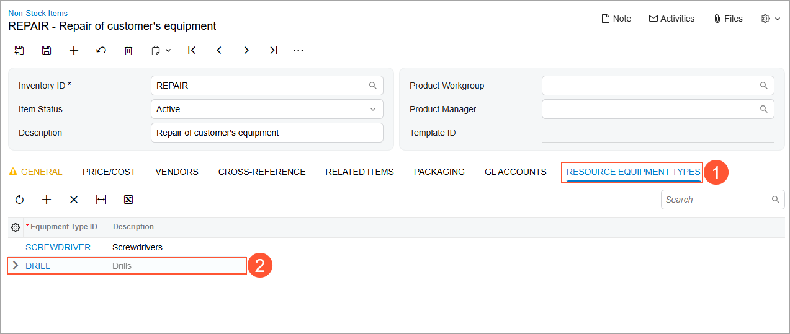

# Resource Equipment: To Create an Equipment Type and Assign It to a Service {#_6a899bd1-b2f1-41d2-9c56-9344bf5779ff .task}

In this activity, you’ll learn how to create equipment types in Acumatica ERP to represent the kinds of equipment your company uses to perform repair services. You’ll also assign an equipment type to a service for reference, indicating the type of equipment typically required to perform that service.

**Attention:** This activity is based on the *U100* dataset. If you are using another dataset or if any system settings have been changed in *U100*, these changes can affect the workflow of the activity and the results of the processing. To avoid issues, restore the *U100* dataset to its initial state.

## Story { .section}

Suppose the SweetLife Service and Equipment Sales Center wants to start tracking its resource equipment—the tools and machines that staff members use to perform services. Acting as the company’s administrative user, you’ll create the necessary equipment type and assign it to a service that requires specialized equipment to be performed.

## Configuration Overview {#section_tz4_djx_cnb .section}

In the *U100* dataset, which you'll use to complete this lesson, the following setup has been configured. These settings ensure that the environment is ready for performing the activity:

-   The minimum system configuration, which is described in [Company with Branches that Do Not Require Balancing: General Information](../ImplementationGuide/config_Company_with_Branches_No_Balancing_GeneralInfo.md), has been performed.
-   The *SWEETLIFE* company has been created on the [Companies](CS_10_15_00.md) \(CS101500\) form. This company has multiple branches created on the [Branches](CS_10_20_00.md#) \(CS102000\) form, including *SWEETEQUIP \(Service and Equipment Sales Center\)*.
-   On the [Service Management Preferences](FS_10_01_00.md) \(FS100100\) form, the minimum settings have been specified, including specifying the numbering sequences and work calendar, for the service management functionality to be used.
-   On the [Numbering Sequences](CS_20_10_10.md) \(CS201010\) form, the *SMEQUIPMN* sequence has been created. It has then been specified in the **Equipment Numbering Sequence** box \(**Numbering Settings** section\) of the [Service Management Preferences](FS_10_01_00.md) \(FS100100\) form.
-   On the [Non-Stock Items](IN_20_20_00.md) \(IN202000\) form, the *REPAIR* non-stock item of the *Service* type has been created.

## Process Overview { .section}

On the [Equipment Types](FS_20_08_00.md) \(FS200800\) form, you will create a new equipment type. Then on the [Non-Stock Items](IN_20_20_00.md) \(IN202000\) form, which you will go to from the [Services](FS_40_08_00.md) \(FS400800\) form, you will specify the new equipment type for the service.

## System Preparation { .section}

Before you start this activity, do the following:

1.  Launch the Acumatica ERP website, and sign in to a company with the *U100* dataset preloaded; you should sign in as a system administrator by using the *gibbs* username and the *123* password.
2.  On the Company and Branch Selection menu in the top pane of the Acumatica ERP screen, select the *Service and Equipment Sales Center* branch.
3.  Make sure that the *Service Management* feature is enabled on the [Enable/Disable Features](CS_10_00_00.md#) \(CS100000\) form.

## Step 1: Creating an Equipment Type { .section}

To create an equipment type, do the following:

1.  Open the [Equipment Types](FS_20_08_00.md) \(FS200800\) form.
2.  In the Summary area of the form, specify the following settings:
    -   **Equipment Type**: `DRILL`
    -   **Description**: `Drills`
    -   **Require Branch Location**: Cleared
3.  On the form toolbar, click **Save**.

    The new equipment type can now be assigned to services, and a particular piece of equipment with this type can be created. This gives you the ability to track equipment that is used for performing services.

## Step 2: Assigning the Equipment Type to a Service { .section}

To assign the equipment type to a service, do the following:

1.  Open the [Services](FS_40_08_00.md) \(FS400800\) form, and click *REPAIR* in the **Inventory ID** column. The [Non-Stock Items](IN_20_20_00.md) \(IN202000\) form opens with this service selected.
2.  On the **Resource Equipment Types** tab \(Item 1 below\), click **Add Row**, and select the *DRILL* equipment type \(Item 2\).

    

    The *DRILL* and *SCREWDRIVER* equipment types have been defined for the *REPAIR* service.

3.  Save your changes, and close the window.

**Parent topic:**[Creating and Using Resource Equipment](../UserGuide/ServMgmt_Resource_Equipment_Mapref.md)

