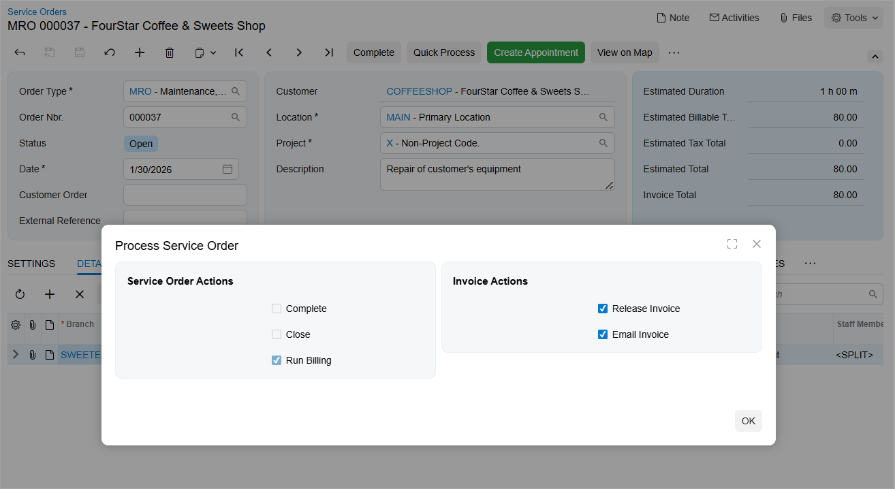
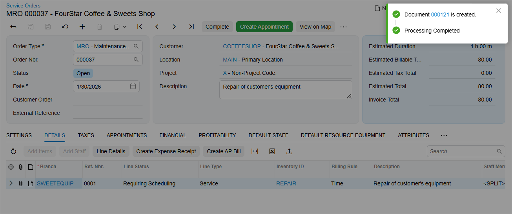
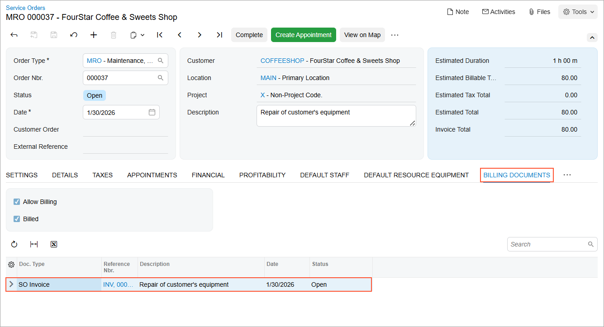

# Quick Billing of a Service Order: Process Activity {#_119503a5-c557-4a4a-b9da-0dc1f57dd695 .task}

This activity will walk you through the creation of a service order whose type allows quick processing, and then through the quick processing of this service order.

**Attention:** This activity is based on the *U100* dataset. If you are using another dataset or if any system settings have been changed in *U100*, these changes can affect the workflow of the activity and the results of the processing. To avoid issues, restore the *U100* dataset to its initial state.

## Story { .section}

Suppose that the SweetLife Service and Equipment Sales Center received a call from the FourStar Coffee &amp; Sweets Shop customer about a needed repair of one of its orange juicers. The customer and the service manager \(Maia Davis\) agreed that billing documents will be generated for the service order before the appointment occurs. The customer also asked to receive the billing document by email.

The service manager has entered the service order and selected a service order type for which quick processing settings have been specified. A user can then invoke one-click quick processing, which initiates the generation of an invoice for the service order.

Acting as an accountant \(Yona Jones\), you will process the service order for the customer.

## Configuration Overview {#section_tz4_djx_cnb .section}

In the *U100* dataset, which you'll use to complete this lesson, the following setup has been configured. These settings ensure that the environment is ready for performing the activity:

-   The minimum system configuration, which is described in [Company with Branches that Do Not Require Balancing: General Information](../ImplementationGuide/config_Company_with_Branches_No_Balancing_GeneralInfo.md), has been performed.
-   The *SWEETLIFE* company has been created on the [Companies](CS_10_15_00.md) \(CS101500\) form. This company has multiple branches created on the [Branches](CS_10_20_00.md#) \(CS102000\) form, including *SWEETEQUIP \(Service and Equipment Sales Center\)*.
-   On the [Service Management Preferences](FS_10_01_00.md) \(FS100100\) form, the minimum settings have been specified, including specifying the numbering sequences and work calendar, for the service management functionality to be used.
-   On the [Users](SM_20_10_10.md) \(SM201010\) form, the *jones* user account has been created. The *EP00000012 - Yona Jones* employee has been associated with the *jones* user account; that is, *Yona Jones* has been selected in the **Linked Entity** box of the Summary area of the [Users](SM_20_10_10.md) form.
-   On the [Service Order Types](FS_20_23_00.md#) \(FS202300\) form, the *MRO* service order type has been defined with the following settings:
    -   On the **General** tab \(**Billing Settings** section\):
        -   **Generated Billing Documents**: *SO Invoice*
        -   **Allow Quick Process**: Selected
        -   **Order Type for Allocation**: *SO - Sales Order*
    -   On the **Quick Processing** tab:
        -   **Run Billing** \(**Appointment Actions** section\): Selected
        -   **Allow Billing** \(**Service Order Actions** section\): Selected

            This check box is read-only and selected for all service order types because the generation of billing documents for the service order is allowed during quick processing.

        -   **Complete** \(**Service Order Actions** section\): Cleared
        -   **Close** \(**Service Order Actions** section\): Cleared
        -   **Run Billing** \(**Service Order Actions** section\): Selected
        -   **Release Invoice** \(**Invoice Actions** section\): Selected
        -   **Email Invoice** \(**Invoice Actions** section\): Cleared
-   On the [Billing Cycles](FS_20_60_00.md#) \(FS206000\) form, the following settings have been specified for the *SO SO* billing cycle:
    -   **Run Billing For**: **Service Orders**
    -   **Group Billing Documents By**: **Service Orders**
-   On the [Customers](AR_30_30_00.md#) \(AR303000\) form, the *COFFEESHOP \(FourStar Coffee &amp; Sweets Shop\)* customer has been defined, and the *SO SO* billing cycle has been selected in the **Service Management** section of the **Billing** tab.
-   On the [Service Orders](FS_30_01_00.md#) \(FS300100\) form, the *000037* service order has been created.

## Process Overview { .section}

To quickly process the existing service order, you will open it on the [Service Orders](FS_30_01_00.md#) \(FS300100\) form and initiate quick processing. You will first change some of the default quick processing settings. You will then review an invoice generated as a result of the quick processing.

## System Preparation { .section}

Before you start this activity, do the following:

1.  Sign in to Acumatica ERP as an accountant in a company that has the *U100* dataset preloaded, using the **jones** username and the *123* password.
2.  In the Date box in the upper-right corner of the Acumatica ERP screen, specify the business date *1/30/2026*. For simplicity, you will use this business date to create and process all documents in this activity.
3.  After signing in, make sure that the *Service Management* feature is enabled on the [Enable/Disable Features](CS_10_00_00.md#) \(CS100000\) form.

## Step 1: Quickly Processing the Service Order { .section}

To quickly process a service order, do the following:

1.  On the [Service Orders](FS_30_01_00.md#) \(FS300100\) form, open the *000037* service order.
2.  In the **Order Type** box of the Summary area, notice that *MRO* is specified.

    Quick processing settings are defined for this service order type, as described in the *Configuration Overview* section of this activity.

3.  On the **Details** tab, notice that the *REPAIR* service is listed.
4.  On the form toolbar, click **Quick Process**.

    The **Process Service Order** dialog box opens.

5.  In the **Invoice Actions** section of the dialog box, select the **Email Invoice** check box \(see below\). You will leave the other default settings, which were specified for the *MRO* service order type.

    

6.  Click **OK**.
7.  After the processing is successfully completed, the status and the generated billing documents appear in the upper-right corner of the form \(see below\).

    

Based on the settings for the *MRO* service order type and your change to email the invoice, quick processing creates and releases the invoice for the service order and emails it to the customer.

## Step 2: Reviewing the Created Documents and Sent Email { .section}

To review the documents that have been generated and the email that has been sent, do the following:

1.  While you are still viewing the *000037* service order on the [Service Orders](FS_30_01_00.md#) \(FS300100\) form, open the **Billing Documents** tab, and notice that the invoice is listed, reflecting that it has been created during the quick processing. \(See below.\)

    

2.  In the **Reference Nbr.** column, click the link to open the invoice.

    The [Invoices](SO_30_30_00.md) \(SO303000\) form opens. Notice that the invoice has the *Open* status.

3.  On the form title bar \(in the top right corner of the form\), click **Activities**. The **Tasks &amp; Activities** dialog box opens.
4.  In the dialog box, notice that the email sent to the customer with the invoice is listed.
5.  Click the link of the email; this brings up the email in a pop-up window so that you can review it.

**Parent topic:**[Quick Billing of Service Orders](../UserGuide/ServMgmt_Service_Order_Quick_Processing_Mapref.md)

