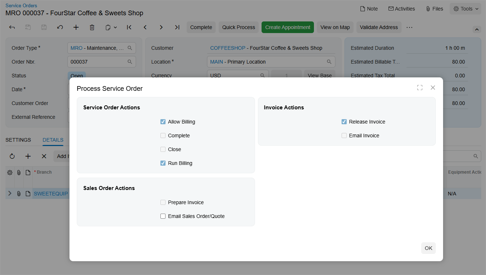

# Quick Billing of Service Orders: General Information {#_1057c3f5-4166-44f7-9324-f8981b15c55e .concept}

In Acumatica ERP, you can process a service order with a single click if it is based on a service order type that has quick processing set up. For details, see [Service Order Types: Quick Processing Settings](../ImplementationGuide/config_Service_Order_Types_Quick_Process_Activity.md).

Quick processing of a service order executes multiple actions in one step, including completing and closing the order and generating the billing documents. Further details about these actions are provided later in this topic.

## Learning Objectives { .section}

In this chapter, you will learn how to do the following:

-   Process a service order by using the **Quick Process** command
-   Review the generated billing documents

## Applicable Scenarios { .section}

You process a service order quickly when you’ve agreed with the customer to generate billing documents—and, if needed, send them by email—before any related appointments take place.

## Actions Performed on a Service Order During Quick Processing {#section_wwh_gjr_35b .section}

If a service order is created based on a service order type that supports quick processing, you can click **Quick Process** on the form toolbar of the [Service Orders](FS_30_01_00.md#) \(FS300100\) form to process the service order in a single step. This action opens the **Process Service Order** dialog box \(see below\), which contains check boxes representing the actions that can be performed on the service order during quick processing.

Note that the service order type settings determine which check boxes appear in the dialog box, their availability, and their default states.

The dialog box may contain the following sections and check boxes:

-   **Service Order Actions** section:
    -   **Allow Billing**: Indicates that billing documents can be generated during quick processing for service orders of this type. This check box is always selected and read-only.
    -   **Complete**: Specifies whether the system completes the service order during quick processing.
    -   **Close**: Specifies whether the system closes the service order during quick processing.
    -   **Run Billing**: Specifies whether the system generates a billing document during quick processing.
-   **Sales Order Actions** section.

    This section appears if *Sales Orders* is selected in the **Generated Billing Documents** box on the [Service Order Types](FS_20_23_00.md) form \(**General** tab\):

    -   **Prepare Invoice**: Specifies whether the system creates an SO invoice for the generated sales order during quick processing. This check box appears if *IN - Invoice* is selected in the **Order Type for Billing** box \(**Billing Settings** section\) on the [Service Order Types](FS_20_23_00.md) form.
    -   **Use Sales Order Quick Processing**: Specifies whether the system uses the quick processing settings defined for the sales order type. This check box appears if **Allow Quick Process** is selected on the **Template** tab of the [Order Types](SO_20_10_00.md) \(SO201000\) form for the order type specified in the **Order Type for Billing** box \(**Billing Settings** section\) on the [Service Order Types](FS_20_23_00.md) form.
    -   **Email Sales Order/Quote**: Specifies whether the system emails the sales order to the customer during quick processing.
-   The **Invoice Actions** section.

    If *SO Invoices* is selected in the **Generated Billing Documents** box on the [Service Order Types](FS_20_23_00.md) form, the system generates a sales invoice when the service order is billed. This setting causes the **Sales Order Actions** section to be hidden.

    -   **Release Invoice**: Specifies whether the system releases the generated invoice during quick processing.
    -   **Email Invoice**: Specifies whether the system emails the generated invoice to the customer during quick processing.

In the dialog box, you can review the available actions and, if needed, update the check box selections.

## Service Order Quick Processing Setup {#section_xwh_gjr_35b .section}

You can run quick processing for a service order on the [Service Orders](FS_30_01_00.md) \(FS300100\) form if both of the following set up conditions are met:

-   For the service order type, the **Allow Quick Process** check box is selected on the **General** tab of the [Service Order Types](FS_20_23_00.md) \(FS202300\) form \(**Billing Settings** section\). In this case, on the **Quick Processing** tab, the administrator has specified the default settings for quick processing of a service order of the type.
-   The billing cycle assigned to the customer is set up to generate billing documents for service orders—that is, **Service Orders** is selected for **Run Billing For** on the [Billing Cycles](FS_20_60_00.md) \(FS206000\) form for the billing cycle.

**Parent topic:**[Quick Billing of Service Orders](../UserGuide/ServMgmt_Service_Order_Quick_Processing_Mapref.md)

