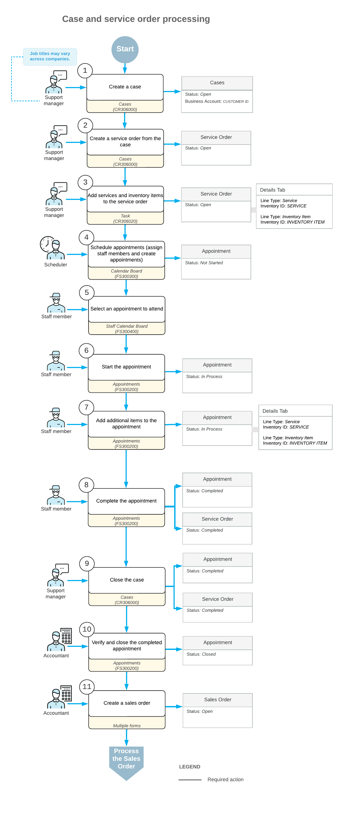

# Case-Related Service Orders: General Information {#_71b1e316-236e-48ba-b1f9-6cac1209b4ee .concept}

A customer case can be processed along with a service order while the services necessary to resolve the case are being performed. For example, suppose that the customer of your company has complained about some product that it purchased from your company. The case is received and entered into the system by a support manager of your company, who also creates a related service order for the repair of the product. Then the service manager and staff members further process the service order, and the support manager continues processing the case to its completion. The accountant then prepares invoices for the customer and processes them in the system.

In this topic, you will read about the steps involved in the processing of the case along with the service order.

## Learning Objectives { .section}

In this chapter, you will learn how to do the following:

-   Create a case whose resolution requires the provision of services
-   Create a service order from a case
-   Process an appointment associated with a case
-   Close a case

## Applicable Scenarios { .section}

You process cases along with service orders if, for example, your company provides support to the customers on the equipment that the company sells. Some support services need to be performed at a customer's location. So a support manager or representative creates a case in the system, for which an appointment is to be scheduled.

## Process Diagram { .section}

In the diagram below, you can see the general workflow of processing a case along with a service order in the system. The sections below describe the steps of this workflow in more detail.

**Tip:** Processes and job titles may be different in your company.

## Entry of a Case {#section_xdd_zxf_lvb .section}

The support manager enters a new case associated with the customer by using the [Cases](CR_30_60_00.md) \(CR306000\) form. In the case, the support manager specifies the business account \(which in this context is a customer or prospective customer\) from which the case has been received, the contact person, and the details of the case; the manager saves the case with the *Open* status.

## Entry of a Service Order {#section_ydd_zxf_lvb .section}

While still viewing the case on the [Cases](CR_30_60_00.md) \(CR306000\) form, the manager clicks the **Create Service Order** command and specifies the service order type \(see Step 2 in the workflow in the *Process Diagram* section\). Then the manager adds the needed services \(Step 3\) to the service order related to this case, which the system has created on the [Service Orders](FS_30_01_00.md) \(FS300100\) form.

**Tip:** A service or services can also be added to the service order from the task created for the case. When the task is saved, the system automatically adds the service to the associated service order. Additionally, services can be added to the appointment linked to the service order, and the system will include them in the service order as well. By default, the **Billable** check box will be selected for all lines added to the service order.

## Creation of Appointments { .section}

After the service order has been created in the system, a scheduler of your company uses the [Calendar Board](FS_30_03_00.md) \(FS300300\) form to schedule the appointments that are needed to perform the services requested by the customer. The scheduler selects a staff member to attend an appointment by taking into consideration the work schedule of the staff member, as well as sorting the displayed staff members by the skills and licenses needed to perform the service and the service area where the services are provided.

The scheduler checks the information on each appointment and enters additional information, such as any inventory items expected to be included with the service to be performed. The system assigns the *Not Started* status to the created appointments.

## Attending of Each Appointment { .section}

The staff member who is assigned to an appointment looks through the upcoming appointments on the [Staff Calendar Board](FS_30_04_00.md) \(FS30000\) form and identifies which appointment to attend. The staff member then goes to the location where the service has to be performed, and starts the appointment on the [Appointments](FS_30_02_00.md) \(FS300200\) form. The appointment is assigned the *In Process* status.

While the services are being performed, the staff member adds any needed information on services \(such as status and quantities\) to the appointment on the [Appointments](FS_30_02_00.md) form; if needed, the staff member adds extra quantities or stock items that were used. When the services are done, the staff member checks the details of the appointment. When everything is correct and complete, the staff member selects the **Finished** check box and completes the appointment, which gives it the *Completed* status.

When all appointments of a particular service order are completed, the system assigns the service order the *Completed* status if on the **General** tab \(**General Settings** section\) of the [Service Order Types](FS_20_23_00.md#) \(FS202300\) form for the service order type, the **Complete Service Order When Its Appointments Are Completed** check box is selected.

## Closing of the Case { .section}

After the services have been completed, the support manager contacts the customer and confirms the resolution of the case. On the [Cases](CR_30_60_00.md) \(CR306000\) form, the support manager closes the case in the system, and the system assigns the *Closed* status to the case.

## Closing of the Appointments and Service Order { .section}

After all appointments are completed, an accountant processes the service order further. On the [Calendar Board](FS_30_03_00.md) form, the accountant opens the completed appointment and verifies quantities and prices.

When all information is verified and the appointments are ready for invoicing, the accountant closes the appointments. The system closes the service order if on the **General** tab \(**General Settings** section\) of the [Service Order Types](FS_20_23_00.md#) \(FS202300\) form for the service order type, the **Close Service Order When Its Appointments Are Closed** check box is selected.

## Processing of Invoices { .section}

The accountant generates a sales order document with the *Open* status by using the [Run Appointment Billing](FS_50_01_00.md) \(FS500100\) form.

The accountant then processes the sales order in the system.

**Parent topic:**[Creating a Service Order Along with a Case](../UserGuide/ServMgmt_Service_Order_from_Case_Mapref.md)

