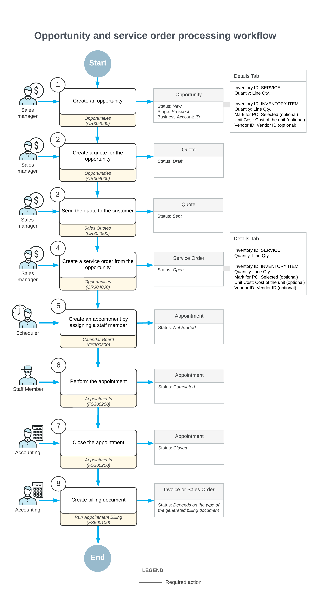

# Opportunity-Related Service Orders: General Information {#_c7882ca9-80f2-4802-b65b-920188c5d996 .concept}

An opportunity on the [Opportunities](CR_30_40_00.md) \(CR304000\) form, represents an actual revenue-generating opportunity with a customer or potential customer. For the opportunity, a quote can be created on the [Sales Quotes](CR_30_45_00.md#) \(CR304500\) form to represent a formal offer made to a particular customer based on the opportunity.

**Important:** The functionality related to sales quotes becomes available in the system if the *Sales Quotes* feature is enabled on the [Enable/Disable Features](CS_10_00_00.md#) \(CS100000\) form.

In this topic, you will read about the steps involved in processing the opportunity with a sales quote along with processing the related service order.

## Learning Objectives { .section}

In this chapter, you will learn how to do the following:

-   Create an opportunity that includes at least one service
-   Create a sales quote associated with the opportunity, and send it to the customer
-   Create a service order from the opportunity
-   Create an opportunity-related appointment for the service order

## Applicable Scenarios { .section}

You process opportunities along with service orders when your company has an opportunity that includes the provision of at least one service, and needs to prepare a sales quote for the customer for review. If the customer agrees to deal with your company—that is, if the opportunity is won—you need to process the service order and appointments along with the opportunity.

## Process Diagram { .section}

The following diagram illustrates the workflow of processing the opportunity and the related documents and entities in the system. The sections below describe the steps of this workflow in more detail.

## Processing of an Opportunity and a Sales Quote {#section_vml_d3f_lvb .section}

The sales manager enters a new opportunity associated with the customer by using the [Opportunities](CR_30_40_00.md) \(CR304000\) form. In the opportunity, the sales manager specifies the business account \(which in this context is a customer or prospective customer\) associated with the opportunity, the contact person, and the details of the opportunity. On the **Details** tab, the sales manager adds lines for the services and inventory items to be provided if the opportunity is won.

The sales manager starts the process of creating a sales quote by clicking **Create Quote** on the form toolbar of the [Opportunities](CR_30_40_00.md) form. Then on [Sales Quotes](CR_30_45_00.md#) \(CR304500\) form, which opens, the sales manager adds all the needed settings and sends it to the customer.

For more information, see [Creating Opportunities](CRM_Sales_Creating_Opportunities_Mapref.md).

## Creation of the Service Order {#section_wml_d3f_lvb .section}

When the customer accepts the offer, the sales manager returns to the [Opportunities](CR_30_40_00.md) \(CR304000\) form and changes the stage of the opportunity to *Won*. The sales manager then creates a service order by clicking **Create Service Order** on the More menu \(under **Services**\). In the **Create Service Order/Appointment** dialog box, which opens, the sales manager specifies the service order type and branch location that will provide services.

The system creates the service order and opens it on the [Service Orders](FS_30_01_00.md) \(FS300100\) form. The sales manager makes sure that all the services that should be performed and inventory items to be purchased are in the service order.

## Creation of Appointments { .section}

After the service order has been created in the system, a scheduler of your company uses the [Calendar Board](FS_30_03_00.md) \(FS300300\) form to schedule the appointments that are needed to perform the services requested by the customer. The scheduler selects a staff member to attend an appointment by taking into consideration the work schedule of the staff member, as well as sorting the displayed staff members by the skills and licenses needed to perform the service and the service area where the services are provided.

The scheduler checks the information on each appointment and enters additional information, such as any inventory items expected to be included with the service to be performed. The system assigns the *Not Started* status to the created appointments.

## Attending of Each Appointment { .section}

The staff member assigned to attend an appointment receives the email with the appointment details, reviews the details, and goes to the customer location at the scheduled time. At the customer location, the staff member finds the appointment on the [Staff Calendar Board](FS_30_04_00.md) \(FS300400\) form, opens the appointment on the [Appointments](FS_30_02_00.md) \(FS300200\) form, and reflects its start in the system. The appointment is assigned the *In Process* status.

When the services have been finished, the staff member checks the details of the appointment. When everything is correct and complete, the staff member selects the **Finished** check box and completes the appointment, which gives it the *Completed* status.

When all appointments of a particular service order are completed, the system assigns the service order the *Completed* status if on the **General** tab \(**General Settings** section\) of the [Service Order Types](FS_20_23_00.md#) \(FS202300\) form for the service order type, the **Complete Service Order When Its Appointments Are Completed** check box is selected.

## Closing of the Appointments and Service Order { .section}

After all appointments are completed, an accountant processes the service order further. On the [Calendar Board](FS_30_03_00.md) \(FS300300\) form, the accountant verifies the completed appointment.

When all information is verified and the appointments are ready for invoicing, the accountant closes the appointments. This action causes the system to close the related service order if on the **General** tab \(**General Settings** section\) of the [Service Order Types](FS_20_23_00.md#) \(FS202300\) form for the service order type, the **Close Service Order When Its Appointments Are Closed** check box is selected.

## Processing of Invoices { .section}

The accountant generates a billing document \(an AR invoice, SO invoice or sales order depending on the service order type settings\) by using the [Run Appointment Billing](FS_50_01_00.md) \(FS500100\) form.

**Parent topic:**[Creating a Service Order from an Opportunity](../UserGuide/ServMgmt_Service_Order_from_Opportunity_Mapref.md)

