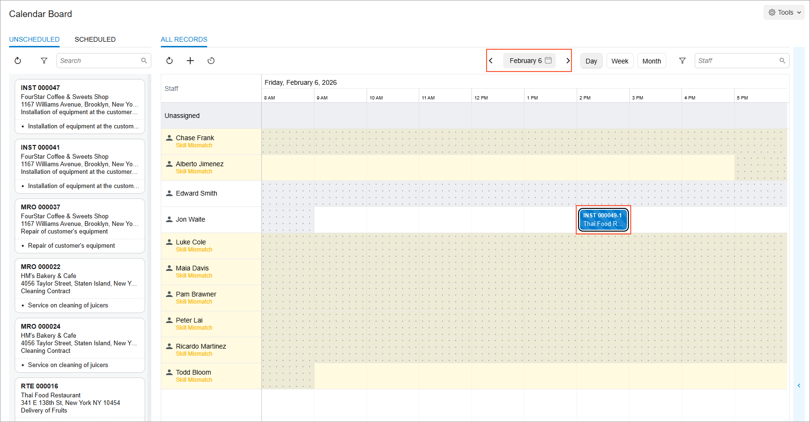

# Opportunity-Related Service Orders: Process Activity {#_b6916f61-524b-4f75-be4b-cb19811a2f03 .task}

This activity will walk you through the process of creating a service order from an opportunity with a quote that the customer has agreed to.

**Attention:** This activity is based on the *U100* dataset. If you are using another dataset or if any system settings have been changed in *U100*, these changes can affect the workflow of the activity and the results of the processing. To avoid issues, restore the *U100* dataset to its initial state.

## Story { .section}

Suppose that the Thai Food Restaurant customer has called and requested a proposal for some products of the SweetLife Service and Equipment Sales Center, along with installation services for the products. The service manager \(Maia Davis\) has received the opportunity and needs to enter it into the system. She then needs to prepare a sales quote and send it to the customer for review.

Further suppose that after reviewing the proposal, the customer decides to procure the company for the services and products, making the opportunity won. The service manager then needs to prepare a service order based on the opportunity, and schedule an appointment for a staff member. You will act as the service manager in performing all of these actions.

## Configuration Overview { .section}

In the *U100* dataset, which you'll use to complete this lesson, the following setup has been configured. These settings ensure that the environment is ready for performing the activity:

-   The minimum system configuration, which is described in [Company with Branches that Do Not Require Balancing: General Information](../ImplementationGuide/config_Company_with_Branches_No_Balancing_GeneralInfo.md), has been performed.
-   The *SWEETLIFE* company has been created on the [Companies](CS_10_15_00.md) \(CS101500\) form. This company has multiple branches created on the [Branches](CS_10_20_00.md#) \(CS102000\) form, including *SWEETEQUIP \(Service and Equipment Sales Center\)*.
-   On the [Service Management Preferences](FS_10_01_00.md) \(FS100100\) form, the minimum settings have been specified, including specifying the numbering sequences and work calendar, for the service management functionality to be used.
-   On the [Enable/Disable Features](CS_10_00_00.md#) \(CS100000\) form, the following features have been enabled:
    -   *Inventory and Order Management*, which provides support for the sales order functionality
    -   *Sales Quotes* \(under *Customer Management*\), which provides support for the functionality of sales quotes for opportunities
-   On the [Employees](EP_20_30_00.md#) \(EP203000\) form, *EP00000040 \(Maia Davis\)* and *EP00000003 \(Jon Waite\)* have been defined. For *EP00000003 \(Jon Waite\)*, the **Staff Member in Service Management** check box has been selected and the *REPAIRING* skill has been added.
-   On the [Users](SM_20_10_10.md) \(SM201010\) form, the *davis* and *waite* accounts have been created. For the *davis* user account, in the **Linked Entity** box of the Summary area of the form, the *Maia Davis* employee account has been specified; for the *waite* user account, in this box, the *Jon Waite* employee account has been specified.
-   On the [Staff Schedule Rules](FS_20_20_01.md) \(FS202001\) form, a work schedule rule has been defined for the *EP00000003 \(Jon Waite\)* employee, and the work schedule has been generated for this employee on the [Generate Staff Schedules](FS_50_04_00.md) \(FS500400\) form.
-   On the [Branch Locations](FS_20_25_00.md#) \(FS202500\) form, the *WEST BRIGHTON* branch location has been defined.
-   On the [User Profile](SM_20_30_10.md#) \(SM203010\) form, for the *davis* user, the *WEST BRIGHTON* branch location has been specified as the default branch location.
-   On the [Service Order Types](FS_20_23_00.md#) \(FS202300\) form, the *INST* service order type has been defined to generate SO invoices to bill customers for provided services. That is, in the **Billing Settings** section of the **General** tab, *SO Invoices* has been selected in the **Generated Billing Documents** box.
-   On the [Billing Cycles](FS_20_60_00.md) \(FS206000\) form, the *AP SO* billing cycle has been defined to generate invoices and group them by appointment \(that is, in the Summary area, the **Appointments** option button is selected under both **Run Billing For** and **Group Billing Documents By**\).
-   On the [Customers](AR_30_30_00.md#) \(AR303000\) form, the *TOMYUM \(Thai Food Restaurant\)* customer has been defined. The *AP SO* billing cycle has been selected for this customer in the **Service Management** section of the **Billing** tab.
-   On the [Non-Stock Items](IN_20_20_00.md) \(IN202000\) form, the *INSTALL* non-stock item of the *Service* type has been created.

## Process Overview { .section}

In this activity, you will create a new opportunity on the [Opportunities](CR_30_40_00.md#) \(CR304000\) form and add the applicable service to be performed and stock item to be sold to this opportunity. You will then create a sales quote for the customer and send it to the customer. Finally, you will create a service order based on the opportunity and schedule an appointment.

## System Preparation {#section_xjy_vpq_ghc .section}

Before you start this activity, do the following:

1.  Launch the Acumatica ERP website, and sign in to a company with the *U100* dataset preloaded; you should sign in as a service manager by using the *davis* username and the *123* password.
2.  In the Date box in the upper-right corner of the Acumatica ERP screen, specify the business date *1/30/2026*. For simplicity, you will use this business date to create and process all documents in this activity.
3.  After signing in, make sure that the *Service Management* feature is enabled on the [Enable/Disable Features](CS_10_00_00.md#) \(CS100000\) form.

## Step 1: Creating an Opportunity { .section}

To create an opportunity, do the following:

1.  Open the [Opportunities](CR_30_40_00.md#) \(CR304000\) form.
2.  On the form toolbar, click **Add New Record**, and in the Summary area, specify the following settings:
    -   **Opportunity Class**: *SERVICE*
    -   **Description**: `Sale of a juicer and installation service`
    -   **Business Account**: *TOMYUM - Thai Food Restaurant*
3.  On the form toolbar, click **Save**.
4.  On the table toolbar of the **Details** tab, click **Add Row**.
5.  In the row, specify the following settings:
    -   **Inventory ID**: *INSTALL*
    -   **Quantity**: `1`
6.  Add another row with the *JUICER15* inventory item and a quantity of `1`.
7.  On the form toolbar, click **Open**. In the **Details** dialog box, which is opened, click **OK**. The opportunity is created.

## Step 2: Sending a Quote to the Customer { .section}

To create a sales quote and send it to the customer, do the following:

1.  While you are still viewing the opportunity on the [Opportunities](CR_30_40_00.md#) \(CR304000\) form, on the More menu, click **Create Quote**.
2.  In the **Create Quote** dialog box, which opens, review the default settings and click **Create and Review**.

    The [Sales Quotes](CR_30_45_00.md#) \(CR304500\) form opens with the created quote.

3.  On the More menu \(under **Processing**\), click **Send**.

## Step 3: Creating a Service Order from the Opportunity { .section}

Suppose that the customer has accepted the sales quote that was sent. To create a service order, do the following:

1.  Go back to the opportunity that you created on the [Opportunities](CR_30_40_00.md#) \(CR304000\) form.
2.  In the **Stage** box, select *Won*, and save the opportunity.
3.  On the More menu \(under **Services**\), click **Create Service Order**.
4.  In the **Create Service Order/Appointment** dialog box, which opens, select *INST - Installation Services* in the **Service Order Type** box, and click **Create and Review**.

    The [Service Orders](FS_30_01_00.md#) \(FS300100\) form opens with the details from the opportunity automatically filled in. Notice that the service order includes both the service and the inventory item copied from the related opportunity \(on the **Details** tab\). The service order is now ready for processing.

5.  In the **Source Info** section of the **Settings** tab, verify that *Opportunities* is specified in the **Document Type** box and that the reference number of the related opportunity has been inserted in the **Reference Nbr.** box.

Now you can process the service order by scheduling an appointment.

## Step 4: Creating an Appointment { .section}

To create an appointment, do the following:

1.  While you are still viewing the service order on the [Service Orders](FS_30_01_00.md#) \(FS300100\) form, on the form toolbar, click **Create Appointment**.

    The [Appointments](FS_30_02_00.md) \(FS300200\) form opens.

2.  On the **Settings** tab, in the **Scheduled Start Date** group of boxes, select *2/6/2026* *2:00 PM*.
3.  On the form toolbar, click **Save**.
4.  Open the [Calendar Board](FS_30_03_00.md#) \(FS300300\) form .
5.  In the Date box of the calendar toolbar, select *2/6/2026*.

    In the topmost Unassigned row of the calendar, you can see an appointment created for the *TOMYUM - Thai Food Restaurant* customer. This appointment is not yet assigned to a staff member.

6.  Drag the appointment tile to *Jon Waite*'s row in the 2:00 PM slot. Jon Waite is the only staff member available at that time with the required skills.

    The appointment is now scheduled, and the staff member has been assigned to it \(see below\).

**Parent topic:**[Creating a Service Order from an Opportunity](../UserGuide/ServMgmt_Service_Order_from_Opportunity_Mapref.md)

