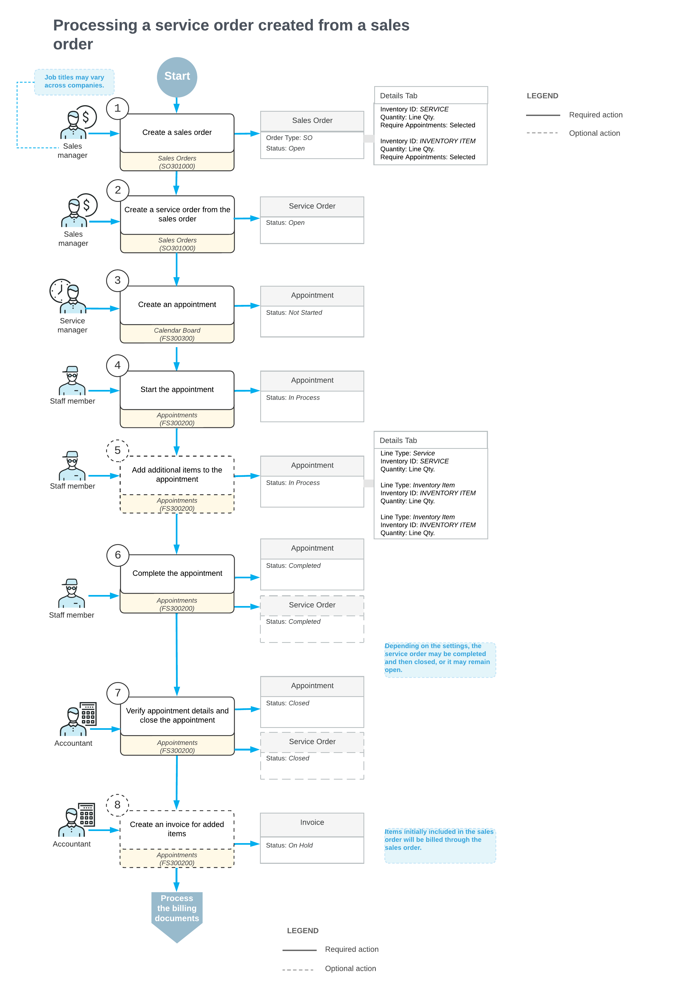

# Sales Order-Related Service Orders: General Information {#_467124ec-e5af-4522-9d32-eda32f43db7f .concept}

A sales order can include both services and stock items that your company provides to a customer. You typically start with a sales order when the customer’s request is primarily for products, and any related services— such as installation or setup— are part of that sale. This sales order can then be linked to a service order for managing and tracking the service work.

For example, suppose a customer orders several products along with installation services. The sales manager enters the order in the system, and the service manager then creates a related service order, assigns qualified employees to the tasks, and oversees service completion. Finally, the accountant prepares and processes the invoices in the system.

**Important:** Users can create a service order from a sales order only if integration with field services is enabled for the sales order type selected in the sales order. That is, the **Enable Field Services Integration** check box has to be selected for the order type on the **General** tab of the [Order Types](SO_20_10_00.md) \(SO201000\) form.

In this topic, you will read about the steps involved in processing a sales order along with the service order.

## Learning Objectives { .section}

In this chapter, you will learn how to do the following:

-   Create a service order from a sales order
-   Schedule an appointment on the calendar board
-   Process the appointment
-   Generate an invoice for an item added during an appointment

## Applicable Scenarios { .section}

You start with a sales order when the customer’s request originates as a product sale that includes related services.

## Process Diagram { .section}

In the diagram below, you can see the general workflow of processing a sales order along with a service order in the system. The sections below describe the steps of this workflow in more detail.

**Tip:** Processes and job titles may be different in your company.

## Creating a Sales Order { .section}

When a sales manager receives a customer order that includes service provision, the manager enters the sales order with the *Open* status on the [Sales Orders](SO_30_10_00.md) \(SO301000\) form. In the sales order, the manager specifies the customer who placed the order, adds the stock items to be sold and shipped, and includes the services to be performed.

On the **Details** tab of the form, for each line that includes the inventory item or a service to be provided, the manager selects the **Require Appointment** check box to ensure the line is included in the related service order.

After saving the sales order, the manager clicks **Create Service Order** on the More menu. In the **Create Service Order** dialog box, which opens, the manager specifies the service order type and clicks **OK**. The system then opens the corresponding service order on the [Service Orders](FS_30_01_00.md) \(FS300100\) form, where the manager verifies the details copied from the sales order.

On the **Details** tab of the [Service Orders](FS_30_01_00.md) form, the **Prepaid Item** check box is selected and the **Billable** check box is cleared for each line, indicating that billing will be handled through the sales order. The sales manager then saves the service order.

## Creating Service Appointments { .section}

Once the sales order and the corresponding service order have been created in the system, the service manager can create an appointment using any available method—for example, directly on the [Calendar Board](FS_30_03_00.md) \(FS300300\) form. The system assigns the *Not Started* status to newly created appointments.

During appointment scheduling, the service manager can assign a staff member to the appointment, taking into account their skills, the licenses required to perform the services, and the service area where the work will be carried out. Note that this functionality must be configured on the[Service Management Preferences](FS_10_01_00.md) \(FS100100\) form.

## Performing the Service Appointment { .section}

The staff member assigned to an appointment travels to the customer’s location to perform the required service and starts the appointment on the [Appointments](FS_30_02_00.md) \(FS300200\) form. The appointment is assigned the *In Process* status.

While performing the services, the staff member records any relevant information—such as notes or photos—directly on the appointment form. If additional quantities or stock items are needed, the staff member adds new lines for these items on the **Details** tab.

When the services are done, the staff member checks the details of the appointment. When everything is correct and complete, the staff member selects the **Finished** check box and completes the appointment, which gives it the *Completed* status.

When all appointments associated with a service order are completed, the system assigns the *Completed* status to the service order. Note that this occurs only if, on the **General** tab \(the **General Settings** section\) of the [Service Order Types](FS_20_23_00.md#) \(FS202300\) form for the service order type, the **Complete Service Order When Its Appointments Are Completed** check box is selected.

## Closing Appointments and Service Orders { .section}

After an appointment is completed, the accountant opens it to verify the quantities and prices. Once all information has been reviewed and confirmed, the accountant closes the appointment.

If, on the **General** tab \(**General Settings** section\) of the [Service Order Types](FS_20_23_00.md#) \(FS202300\) form for the service order type, the **Close Service Order When Its Appointments Are Closed** check box is selected, the system automatically closes the related service order. The appointment and the service order are then assigned the *Closed* status.

## Generating Billing Documents { .section}

The accountant generates a new billing document for any additional stock items used during the appointment. This can be done either on the [Run Appointment Billing](FS_50_01_00.md) \(FS500100\) form or by clicking **Run Billing** on the [Appointments](FS_30_02_00.md) \(FS300200\) form.

The accountant then processes both billing documents in the system—the one generated from the original sales order and the one created for the additional items used during the appointment.

**Parent topic:**[Creating a Service Order from a Sales Order](../UserGuide/ServMgmt_Service_Order_from_Sales_Order_Mapref.md)

