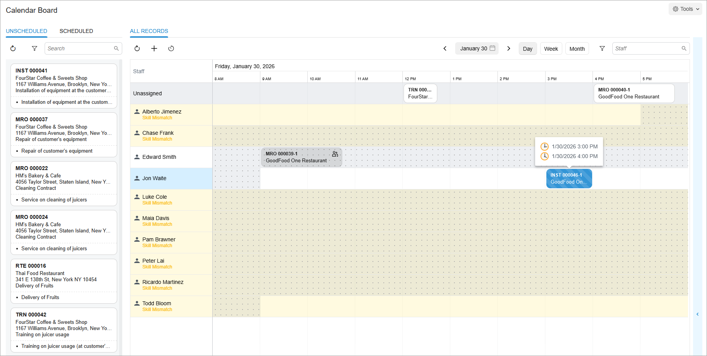
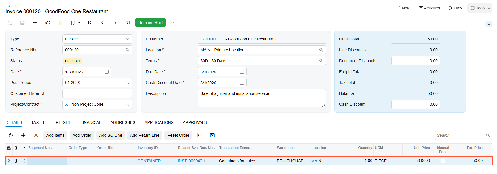

# Sales Order-Related Service Orders: Process Activity {#_6249c514-7f7e-4846-8dac-6cab355bd522 .task}

This activity will walk you through the process of creating a service order from a sales order and then processing these orders. You will also learn how to add a stock item to a service order that has lines for services or stock items inherited from the sales order, and how this service order will be billed.

**Attention:** This activity is based on the *U100* dataset. If you are using another dataset or if any system settings have been changed in *U100*, these changes can affect the workflow of the activity and the results of the processing. To avoid issues, restore the *U100* dataset to its initial state.

## Story { .section}

Suppose that SweetLife Service and Equipment Sales Center has sold the GoodFood One Restaurant customer a juicer in combination with installation and repair services. The service manager \(Maia Davis\) needs to create a sales order for the juicer and the services, and then schedule the appointment to deliver the services.

Further suppose that during the appointment, the customer decides to buy an additional stock item \(a plastic container for juice\). The assigned staff member needs to add this item to the service order. The accountant will generate a separate invoice for the extra item because it was not included in the original sales order. You will perform these actions, acting as the service manager, staff member, and accountant.

## Configuration Overview { .section}

In the *U100* dataset, which you'll use to complete this lesson, the following setup has been configured. These settings ensure that the environment is ready for performing the activity:

-   The minimum system configuration, which is described in [Company with Branches that Do Not Require Balancing: General Information](../ImplementationGuide/config_Company_with_Branches_No_Balancing_GeneralInfo.md), has been performed.
-   The *SWEETLIFE* company has been created on the [Companies](CS_10_15_00.md) \(CS101500\) form. This company has multiple branches created on the [Branches](CS_10_20_00.md#) \(CS102000\) form, including *SWEETEQUIP \(Service and Equipment Sales Center\)*.
-   On the [Service Management Preferences](FS_10_01_00.md) \(FS100100\) form, the minimum settings have been specified, including specifying the numbering sequences and work calendar, for the service management functionality to be used.
-   On the [Enable/Disable Features](CS_10_00_00.md#) \(CS100000\) form, the following features have been enabled:
    -   *Inventory and Order Management*, which provides support for the sales order functionality
    -   *Inventory*, which provides the ability to create sales and purchase orders with stock items
-   On the [Employees](EP_20_30_00.md#) \(EP203000\) form, the *EP00000040 \(Maia Davis\)* and *EP00000003 \(Jon Waite\)* employee accounts have been defined. For the *Jon Waite* account, the **Staff Member in Service Management** check box has been selected for *EP00000003 \(Jon Waite\)*, so you can assign this employee to perform services.
-   On the [Users](SM_20_10_10.md) \(SM201010\) form, the *davis* and *waite* accounts have been created. For the *davis* user account, in the **Linked Entity** box of the Summary area of the form, the *Maia Davis* employee account has been specified; for the *waite* user account, in this box, the *Jon Waite* employee account has been specified.
-   On the [Staff Schedule Rules](FS_20_20_01.md) \(FS202001\) form, a work schedule rule has been defined for the *EP00000003 \(Jon Waite\)* employee, and the work schedule has been generated for this employee on the [Generate Staff Schedules](FS_50_04_00.md) \(FS500400\) form.
-   On the [Branch Locations](FS_20_25_00.md#) \(FS202500\) form, the *WEST BRIGHTON* branch location has been configured.
-   On the [User Profile](SM_20_30_10.md#) \(SM203010\) form, for the *davis* user, the *WEST BRIGHTON* branch location has been specified as the default branch location.
-   On the [Billing Cycles](FS_20_60_00.md#) \(FS206000\) form, the following settings have been specified for the *AP AP* billing cycle:

    -   **Run Billing For**: **Appointments**
    -   **Group Billing Documents By**: **Appointments**
    Based on these billing cycle settings, a separate billing document is generated for each appointment; this document presents the details of each service of the appointment.

-   On the [Customers](AR_30_30_00.md#) \(AR303000\) form, the *GOODFOOD \(GoodFood One Restaurant\)* customer has been defined, and the *AP AP* billing cycle has been selected in the **Service Management** section of the **Billing** tab.
-   On the [Order Types](SO_20_10_00.md#) \(SO201000\) form, for the *SO* and *IN* sales order types, the **Enable Field Services Integration** check box has been selected.
-   On the [Service Order Types](FS_20_23_00.md#) \(FS202300\) form, the *INST* service order type has been configured to generate SO invoices to bill customers for provided services. That is, in the **Billing Settings** section of the **General** tab, *SO Invoices* has been selected in the **Generated Billing Documents** box. Also, on the **General** tab \(**General Settings** section\), the **Complete Service Order When Its Appointments Are Completed** and **Close Service Order When Its Appointments Are Closed** check boxes are selected.
-   On the [Non-Stock Items](IN_20_20_00.md#) \(IN202000\) form, for the *INSTALL* non-stock item, the *Service* type is selected.

## Process Overview { .section}

To create a service order from a sales order, you will first create a sales order on the [Sales Orders](SO_30_10_00.md#) \(SO301000\) form with the stock item to be sold and the service to be provided, and you will create a related service order from this form. You will then schedule the appointment to perform the needed service and complete the appointment. Finally, after an item has been added during the appointment, you will generate an invoice for it from the [Appointments](FS_30_02_00.md#) \(FS300200\) form.

## System Preparation { .section}

Before you begin performing the steps of this activity, do the following:

1.  Launch the Acumatica ERP website, and sign in to a company with the *U100* dataset preloaded; you should sign in as a service manager by using the *davis* username and the *123* password.
2.  In the company to which you are signed in, ensure that the *Service Management* feature has been enabled on the [Enable/Disable Features](CS_10_00_00.md#) \(CS100000\) form.
3.  In the Date box in the upper-right corner of the Acumatica ERP screen, specify the business date *1/30/2026*. For simplicity, you will use this business date to create and process all documents in this activity.
4.  On the [Service Management Preferences](FS_10_01_00.md) \(FS100100\) form, select *Warn* in the **Skills** box \(**Appointment Validation Settings** section\), and save it.

## Step 1: Creating a Service Order from the Sales Order { .section}

To create the needed sales order and service order, do the following:

1.  Open the [Sales Orders](SO_30_10_00.md#) \(SO301000\) form.
2.  Create a new sales order with the following settings in the Summary area:
    -   **Order Type**: *SO*
    -   **Customer**: *GOODFOOD - GoodFood One Restaurant*
    -   **Description**: `Sale of a juicer and installation service`
3.  On the **Details** tab, add a row with the following settings:
    -   **Inventory ID**: *INSTALL*
    -   **Require Appointment**: Selected
    -   **Warehouse**: *EQUIPHOUSE*
    -   **Quantity**: `1.00`
4.  Add one more row with the following settings:
    -   **Inventory ID**: *JUICER15*
    -   **Require Appointment**: Selected
    -   **Quantity**: `1.00`
5.  On the form toolbar, click **Save**.
6.  On the More menu \(under **Services**\), click **Create Service Order**.
7.  In the **Create Service Order** dialog box, which opens, make sure *INST - Installation Services* is selected in the **Service Order Type** box, and click **OK**.

    The [Service Orders](FS_30_01_00.md#) \(FS300100\) form opens with the settings copied from the sales order filled in. Notice that the service order has the service and the stock item that have been copied from the related sales order \(on the **Details** tab\); the service order is ready to be processed. Also notice on this tab that the **Billable** check box is cleared and read-only for each line because the line has been copied from the sales order and will be billed through the original sales order.

8.  Save the service order.
9.  In the **Source Info** section of the **Settings** tab, verify that *SO Order* is specified in the **Document Type** box and the order type and the reference number of the related sales order have been inserted in the **Reference Nbr.** box.

## Step 2: Scheduling an Appointment on the Calendar Board { .section}

To schedule an appointment, do the following:

1.  Open the [Calendar Board](FS_30_03_00.md#) \(FS300300\) form.
2.  On the **Unscheduled** tab, find the service order you've just created—the one of the *INST* order type for the *GOODFOOD - GoodFood One Restaurant* customer.
3.  Drag the appointment tile to the *Jon Waite* row so that the start time of the appointment is 3 PM. You’ll see that *Skill Mismatch* warnings appear next to the staff members who lack the required skill to perform the appointment’s service, and these staff members are highlighted in yellow \(see below\). You can still assign the appointment to any staff member because this is only a warning, not a restriction. However, in this instruction, you’ll assign the appointment to a qualified staff member without any warning.

## Step 3: Attending the Appointment { .section}

Do the following on behalf of Jon Waite:

1.  Click the appointment reference number on the calendar. The quick view panel opens.
2.  Click the appointment reference number in the quick view panel.

    The [Appointments](FS_30_02_00.md#) \(FS300200\) form opens.

3.  On the form toolbar of the [Appointments](FS_30_02_00.md#) \(FS300200\) form, click **Start**.
4.  On the **Details** tab, click **Add Row**, and specify the following settings in the row:

    -   **Line Type**: *Inventory Item*
    -   **Inventory ID**: *CONTAINER*
    -   **Estimated Quantity**: `1.00`
    Notice that the **Billable** check box is selected for the newly added item, which indicates that the item is billable. Because it has not been included in the original sales order, a separate invoice will be generated for that item.

5.  On the form toolbar, click **Save**.
6.  On the **Settings** tab \(**Actual Date and Time** section\), specify the actual starting and actual ending times to be the same as the scheduled ones; select the **Finished** check box. \(You perform this instruction and the next one on behalf of the staff member.\)
7.  On the form toolbar, click **Complete**.
8.  On behalf of the accountant, on the form toolbar, click **Close**.

The completion and closing of the appointment caused the service order to also be completed and closed because of the settings of the *INST* service order type on the [Service Order Types](FS_20_23_00.md#) \(FS202300\) form, as described in the *Configuration Overview* section.

## Step 4: Generating an Invoice for Additional Items { .section}

To generate an invoice for the item included in the appointment, do the following \(acting as an accountant\):

1.  While you are still viewing the appointment on the [Appointments](FS_30_02_00.md#) \(FS300200\) form, click **Run Billing** on the form toolbar.

    The system opens the [Invoices](SO_30_30_00.md) \(SO303000\) form with the generated invoice.

2.  Verify that only the stock item added during the appointment has been added to the invoice, as the following screenshot shows.

    

As a result, two invoices will be released: the first one for the requested service and item specified in the original sales order, and the second one for the additional item that was included in the appointment.

**Parent topic:**[Creating a Service Order from a Sales Order](../UserGuide/ServMgmt_Service_Order_from_Sales_Order_Mapref.md)

