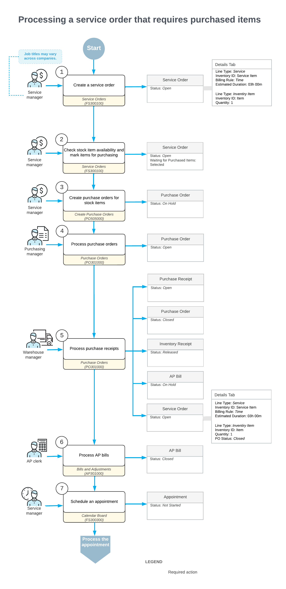

# Service Orders with Items to Be Purchased: General Information {#_21bef0ef-46d5-491b-a527-51ffc47d4e96 .concept}

A purchase order can be created from a service order when the required stock items are not available in any of your company’s warehouses, or when certain services or non-stock items are provided by a vendor.

This topic describes the steps involved in processing a service order together with one or more related purchase orders.

**Tip:** In this topic, we focus on the purchasing of stock items for a service order. However, the same process applies when purchasing services or non-stock items from a vendor to include in a service order, for example, when a vendor provides specialized labor or materials at their own location.

## Learning Objectives { .section}

In this chapter, you will learn how to do the following:

-   Create a service order with an item to be purchased
-   Create a purchase order for an item in a service order
-   Process a purchase order linked to a service order

## Applicable Scenarios { .section}

You create a service order and then generate a purchase order from it when your company needs to use stock items during an appointment but must first purchase those items from a vendor because they are not available in any warehouse.

## Process Diagram { .section}

In the diagram below, you can see the entire workflow of processing a service order and the related purchase order. The sections below describe the steps of this workflow in more detail.

**Tip:** Processes and job titles may be different in your company.

## Creating a Service Order { .section}

When a service manager receives a customer request for services, the manager creates a service order with the *Open* status on the [Service Orders](FS_30_01_00.md) \(FS300100\) form. In the service order, the manager specifies details such as the customer who submitted the request, the branch and branch location, the services to be performed, and any stock items that need to be purchased for the job.

As part of this step, the service manager checks the availability of the required stock items in the warehouse by selecting the warehouse and an inventory item in the corresponding columns on the **Details** tab. For any items not available in the warehouse, the manager selects the check box in the **Mark for PO** column. When at least one item is marked for purchase, the system automatically selects the **Waiting for Purchased Items** check box in the Summary area of the form, indicating that the service order includes items to be received.

## Creating Purchase Orders { .section}

After confirming that all necessary items are marked for purchase from the appropriate vendors, the service manager clicks **Create Purchase Orders** on the More menu of the [Service Orders](FS_30_01_00.md) \(FS300100\) form. This actions opens the [Create Purchase Orders](PO_50_50_00.md) \(PO505000\) form, where the manager reviews the vendors and vendor locations for the items and creates the required purchase orders.

The system creates purchase orders of the *Normal* type with the *On Hold* status on the [Purchase Orders](PO_30_10_00.md) \(PO301000\) form. The service manager can then monitor the reference number and statuses of the related purchase orders in the **PO Nbr.** and **PO Status** columns on the [Service Orders](FS_30_01_00.md) or [Service Order Details](FS_40_10_00.md) \(FS401000\) form.

**Tip:** The system creates one purchase order for all items associated with the same vendor and vendor location, and separate purchase orders for items with different vendors or locations.

## Processing Purchase Orders { .section}

On the [Purchase Orders](PO_30_10_00.md) \(PO301000\) form, the purchase manager processes the purchase orders, as described in [Purchases of Stock Items: General Information](OrderMgmt_Standard_Inventory_Purchase_GeneralInfo.md). The system assigns the *Open* status to each purchase order.

**Tip:** Each time the status of the purchase order changes on the [Purchase Orders](PO_30_10_00.md) form, the updated status is automatically reflected in the **PO Status** column on **Details** tab of the [Service Orders](FS_30_01_00.md) \(FS300100\) form.

When the purchased stock items are received, the receiving clerk creates and processes a purchase receipt on the [Purchase Receipts](PO_30_20_00.md) \(PO302000\) form. Once purchase receipts have been released for all items in a purchase order, the system changes the purchase order status to *Closed* and generates a corresponding inventory receipt with the *Released* status. The receiving clerk can view this receipt on the [Receipts](IN_30_10_00.md) \(IN301000\) form. At this point, the stock items are available to be added to appointments.

The system also creates a bill with the *On Hold* status. An accountant now can process the bills related to the purchase orders on the [Bills and Adjustments](AP_30_10_00.md) \(AP301000\) form.

## Creating Service Appointments { .section}

After the purchase order has been processed, the service manager schedules the necessary appointments to perform the customer’s requested services.

When assigning staff members to appointments, the service manager considers their work schedules, as well as skills, licenses, and the service area. On the [Appointments](FS_30_02_00.md) \(FS300200\) form, the service manager reviews each appointment and records additional information, such as the resource equipment used to perform the services. Each appointment is assigned the *Not Started* status when created.

**Tip:** An appointment can be created earlier in the process. The items that need to be purchased will also be included in the appointment. The **Mark for PO**, **PO Nbr.** and **PO Status** columns on the **Details** tab of the [Appointments](FS_30_02_00.md) form display details on the related purchase.

The subsequent processing workflow of the service order and its appointments follows the same steps as the general workflow for standard service orders.

**Parent topic:**[Processing Service Orders with Items to Be Purchased](../UserGuide/ServMgmt_Service_Order_with_Items_to_be_Purchased_Mapref.md)

