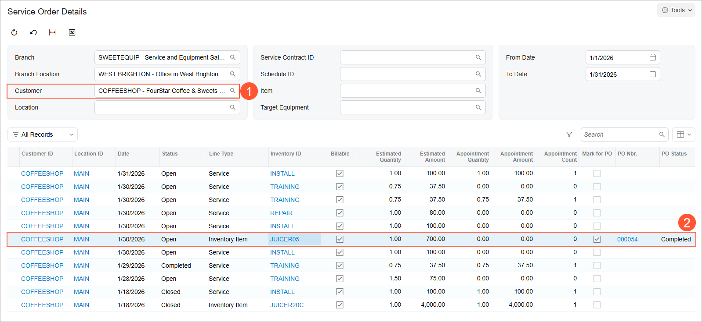

# Service Orders with Items to Be Purchased: Process Activity {#_22bbe775-8f8b-4e78-bc92-d3f4692db340 .task}

This activity will walk you through the creation of a service order for which a stock item must be purchased from a vendor. You will also learn how to process the purchase order and service order \(up to but not including the creation of appointments\).

**Attention:** This activity is based on the *U100* dataset. If you are using another dataset or if any system settings have been changed in *U100*, these changes can affect the workflow of the activity and the results of the processing. To avoid issues, restore the *U100* dataset to its initial state.

## Story { .section}

Suppose that the SweetLife Service and Equipment Sales Center has announced that it will begin selling a new juicer, *JUICER05*. The FourStar Coffee &amp; Sweets Shop customer would like to order this juicer along with training services.

Because this juicer is not yet in stock, the SweetLife Service and Equipment Sales Center needs to first purchase the juicer from the *SQUEEZO* vendor. When the juicer is received, an appointment to perform the services can be created. Acting as the service manager \(Maia Davis\), you will create the service order, create the purchase order, and process the purchase order.

## Configuration Overview {#section_tz4_djx_cnb .section}

In the *U100* dataset, which you'll use to complete this lesson, the following setup has been configured. These settings ensure that the environment is ready for performing the activity:

-   The minimum system configuration, which is described in [Company with Branches that Do Not Require Balancing: General Information](../ImplementationGuide/config_Company_with_Branches_No_Balancing_GeneralInfo.md), has been performed.
-   The *SWEETLIFE* company has been created on the [Companies](CS_10_15_00.md) \(CS101500\) form. This company has multiple branches created on the [Branches](CS_10_20_00.md#) \(CS102000\) form, including *SWEETEQUIP \(Service and Equipment Sales Center\)*.
-   On the [Service Management Preferences](FS_10_01_00.md) \(FS100100\) form, the minimum settings have been specified, including specifying the numbering sequences and work calendar, for the service management functionality to be used.
-   On the [Enable/Disable Features](CS_10_00_00.md#) \(CS100000\) form, the *Inventory and Order Management* feature, which provides support for the sales order functionality, has been enabled.
-   On the [Employees](EP_20_30_00.md#) \(EP203000\) form, the *EP00000040 \(Maia Davis\)* employee account has been defined.
-   On the [Users](SM_20_10_10.md) \(SM201010\) form, the *davis* account has been created. For the *davis* user account, in the **Linked Entity** box of the Summary area of the form, the *Maia Davis* employee account has been specified.
-   On the [Branch Locations](FS_20_25_00.md#) \(FS202500\) form, the *WEST BRIGHTON* branch location has been configured.
-   On the [User Profile](SM_20_30_10.md#) \(SM203010\) form, for the *davis* user, the *WEST BRIGHTON* branch location has been specified as the default branch location.
-   On the [Service Order Types](FS_20_23_00.md#) \(FS202300\) form, the *INST* service order type has been configured to generate SO invoices to bill customers for provided services. That is, in the **Billing Settings** section of the **General** tab, *SO Invoices* has been selected in the **Generated Billing Documents** box.
-   On the [Billing Cycles](FS_20_60_00.md#) \(FS206000\) form, the following settings have been specified for the *AP AP* billing cycle:

    -   **Run Billing For**: **Appointments**
    -   **Group Billing Documents By**: **Appointments**
    Based on these billing cycle settings, a separate billing document is generated for each appointment; this document presents the details of each service of the appointment.

-   On the [Customers](AR_30_30_00.md#) \(AR303000\) form, the *GOODFOOD \(GoodFood One Restaurant\)* customer has been defined, and the *AP AP* billing cycle has been selected in the **Service Management** section of the **Billing** tab.
-   On the [Non-Stock Items](IN_20_20_00.md#) \(IN202000\) form, for the *INSTALL* non-stock item, the *Service* type has been selected.
-   On the [Stock Items](IN_20_25_00.md) \(IN202500\) form, the *JUICER05* item has been defined, and the *Finished Good* type has been selected for this stock item.
-   On the [Vendors](AP_30_30_00.md) \(AP303000\) form, the *SQUEEZO* vendor has been defined.

## Process Overview { .section}

To process a service order with items to be purchased, on the [Service Orders](FS_30_01_00.md#) \(FS300100\) form, you will create this service order and specify each item that has to be purchased. You will then create a purchase order and process it in the system.

## System Preparation {#section_bqk_spq_ghc .section}

Before you start this activity, do the following:

1.  Launch the Acumatica ERP website, and sign in to a company with the *U100* dataset preloaded; you should sign in as a service manager by using the *davis* username and the *123* password.
2.  In the Date box in the upper-right corner of the Acumatica ERP screen, specify the business date *1/30/2026*. For simplicity, you will use this business date to create and process all documents in this activity.
3.  After signing in, make sure that the *Service Management* feature is enabled on the [Enable/Disable Features](CS_10_00_00.md#) \(CS100000\) form.

## Step 1: Creating a Service Order with an Item to Be Purchased { .section}

To create a service order whose items need to be purchased from a vendor, do the following:

1.  On the [Service Orders](FS_30_01_00.md#) \(FS300100\) form, create a service order, and specify the following settings in the Summary area:
    -   **Order Type**: *INST*
    -   **Customer ID**: *COFFEESHOP - FourStar Coffee &amp; Sweets Shop*
2.  On the **Details** tab, click **Add Row** on the table toolbar, and select the following settings in the row:
    -   **Line Type**: *Service*
    -   **Inventory ID**: *INSTALL*
3.  Click **Add Row** to add another row, and select the following settings in the row:
    -   **Line Type**: *Inventory Item*
    -   **Inventory ID**: *JUICER05*

        In the table footer, notice that the juicer is not available at the warehouse.

4.  On the form toolbar, click **Save**.
5.  On the **Details** tab, select the **Mark for PO** check box for *JUICER05*.

    A purchase order for this inventory item can now be created from the service order.

6.  In the **Vendor ID** column of the row, select *SQUEEZO*.

    This vendor will supply the item designated for purchase.

7.  On the form toolbar, click **Save**.

## Step 2: Creating a Purchase Order { .section}

To create a purchase order, do the following:

1.  While you are still viewing the service order on the [Service Orders](FS_30_01_00.md#) \(FS300100\) form, on the More menu \(under **Replenishment**\), click **Create Purchase Order**.

    The [Create Purchase Orders](PO_50_50_00.md#) \(PO505000\) form opens with the service order type and service order number selected, and the table shows one row with the item to be purchased.

2.  For the row in the table, verify the vendor in the **Vendor** column.
3.  Select the unlabeled check box in the row of the inventory item, and click **Process** on the form toolbar.

    After the processing has successfully completed, the [Purchase Orders](PO_30_10_00.md#) \(PO301000\) form opens with the purchase order you have created.

## Step 3: Processing the Purchase Order { .section}

To process the purchase order, do the following:

1.  On the form toolbar of the [Purchase Orders](PO_30_10_00.md#) \(PO301000\) form, for the purchase order that you created in the previous step, click **Remove Hold**.
2.  On the form toolbar, click **Enter PO Receipt**.

    The [Purchase Receipts](PO_30_20_00.md#) \(PO302000\) form opens, displaying a new receipt with settings copied from the purchase order.

3.  On the form toolbar, click **Save**.

    The receipt has been created for the purchased item.

4.  On the form toolbar, click **Release**.

    The receipt has been released, indicating that the ordered inventory item is now available in the warehouse.

## Step 4: Reviewing the Service Order with the Purchased Item { .section}

To review the service order, do the following:

1.  Open the [Service Order Details](FS_40_10_00.md#) \(FS401000\) form, and in the **Customer** box, select *COFFEESHOP \(FourStar Coffee &amp; Sweets Shop\)* \(Item 1 below\).

    In the list, find a service order with the item that has been purchased \(*JUICER05* in the **Inventory ID** column\). In the **PO Status** column, notice that the status of the purchase order is *Completed* \(Item 2\). This indicates that the stock item has been received at the warehouse.

    

2.  In the **Order Nbr.** box, click the link to the service order you created with the purchased item.

    The [Service Orders](FS_30_01_00.md#) \(FS300100\) form opens with the service order.

3.  On the **Details** tab, select the row with the *JUICER05* stock item, and on the table toolbar, click the **Line Details** button.

    In the **Line Details** dialog box, which has been opened, notice that the **Allocated** check box is selected for the inventory item, indicating that the purchased item is reserved for the service order.

**Parent topic:**[Processing Service Orders with Items to Be Purchased](../UserGuide/ServMgmt_Service_Order_with_Items_to_be_Purchased_Mapref.md)

