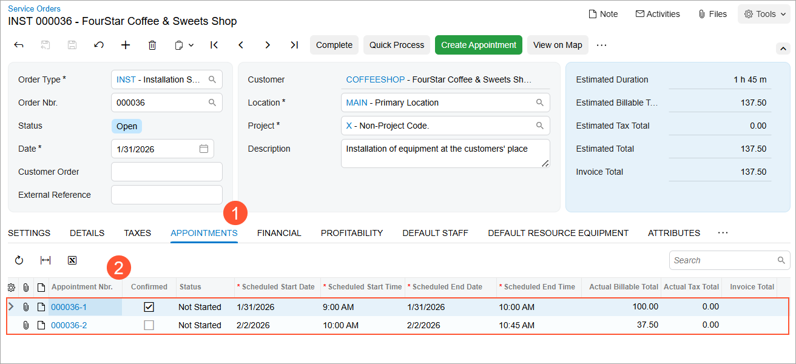

# Service Orders with Additional Services and Appointments: Process Activity {#_19f26123-fe47-488d-88cd-fea32d67f358 .task}

In this activity, you will learn how to add an appointment and a service to an existing service order.

**Attention:** This activity is based on the *U100* dataset. If you are using another dataset or if any system settings have been changed in *U100*, these changes can affect the workflow of the activity and the results of the processing. To avoid issues, restore the *U100* dataset to its initial state.

## Story { .section}

Suppose that the FourStar Coffee &amp; Sweets Shop customer contacts the SweetLife Service and Equipment Sales Center to request a training service in addition to the juicer installation service previously ordered. The service manager has already created a service order that includes the installation service.

Acting as the service manager \(Maia Davis\), you'll open the existing service order, add the new training service, and create an additional appointment to provide it.

## Configuration Overview { .section}

In the *U100* dataset, which you'll use to complete this lesson, the following setup has been configured. These settings ensure that the environment is ready for performing the activity:

-   The minimum system configuration, which is described in [Company with Branches that Do Not Require Balancing: General Information](../ImplementationGuide/config_Company_with_Branches_No_Balancing_GeneralInfo.md), has been performed.
-   The *SWEETLIFE* company has been created on the [Companies](CS_10_15_00.md) \(CS101500\) form. This company has multiple branches created on the [Branches](CS_10_20_00.md#) \(CS102000\) form, including *SWEETEQUIP \(Service and Equipment Sales Center\)*.
-   On the [Service Management Preferences](FS_10_01_00.md) \(FS100100\) form, the minimum settings have been specified, including specifying the numbering sequences and work calendar, for the service management functionality to be used.
-   On the [Users](SM_20_10_10.md) \(SM201010\) form, the *davis* and *smith* user accounts have been created. The *EP00000040 - Maia Davis* employee has been associated with the *davis* user account; that is, *Maia Davis* has been selected in the **Linked Entity** box of the Summary area of the form. The *EP00000043 - Edward Smith* employee has been associated with the *smith* user account; that is, *Edward Smith* has been selected in the **Linked Entity** box of the Summary area of the form.
-   On the [Branch Locations](FS_20_25_00.md#) \(FS202500\) form, the *WEST BRIGHTON* branch location of the *SWEETEQUIP* \(*Service and Equipment Sales Center*\) branch has been created.
-   On the [User Profile](SM_20_30_10.md#) \(SM203010\) form, for the *davis* user, *WEST BRIGHTON* has been specified as the default branch location.
-   On the [Employees](EP_20_30_00.md#) \(EP203000\) form, on the **General** tab \(**Employee Settings** section\), the **Staff Member in Service Management** check box has been selected for *EP00000043 \(Edward Smith\)*, so you can assign this employee to perform services. Also, for this employee, the *INSTALLING* skill has been added on the **Skills** tab.
-   On the [Service Order Types](FS_20_23_00.md#) \(FS202300\) form, the *INST* service order type has been defined.
-   On the [Customers](AR_30_30_00.md#) \(AR303000\) form, the *COFFEESHOP \(FourStar Coffee &amp; Sweets Shop\)* customer has been created.
-   On the [Non-Stock Items](IN_20_20_00.md#) \(IN202000\) form, the following services \(that is, non-stock items of the *Service* type\) have been defined:
    -   *TRAINING*: On the **Price/Cost** tab, the *Time* billing rule is selected.
    -   *INSTALL*: On the **Price/Cost** tab, the *Flat Rate* billing rule is selected.
-   On the [Service Orders](FS_30_01_00.md) \(FS300100\) form, the service order with the *000036* reference number has been created.

## Process Overview { .section}

On the [Service Orders](FS_30_01_00.md) \(FS300100\) form, you'll open an existing service order and add an additional service on the **Details** tab. Then, from the same form, you'll create a new appointment for the added service.

## System Preparation {#section_vpf_g2y_1hc .section}

Before you start this activity, do the following:

1.  Launch the Acumatica ERP website, and sign in to a company with the *U100* dataset preloaded; you should sign in as a service manager by using the *davis* username and the *123* password.
2.  In the Date box in the upper-right corner of the Acumatica ERP screen, specify the business date *1/30/2026*. For simplicity, you will use this business date to create and process all documents in this activity.
3.  After signing in, make sure that the *Service Management* feature is enabled on the [Enable/Disable Features](CS_10_00_00.md#) \(CS100000\) form.

## Step 1: Adding an Additional Service to an Existing Service Order { .section}

To add another service to the service order that already exists in the system, do the following:

1.  On the [Service Orders](FS_30_01_00.md) \(FS300100\) form, in the Summary area, select *INST* order type, and then select *000036* in the **Order Nbr.** box.
2.  On the **Details** tab, notice that the *INSTALL* service has already been added to the service order, and it has the *Scheduled* status.
3.  Click **Add Row** on the table toolbar, and in the new row, do the following:
    -   In the **Line Type** column, select *Service*.
    -   In the **Inventory ID** column, select *TRAINING*.
4.  On the form toolbar, click **Save**.

## Step 2: Adding a Staff Member with the Required Skills { .section}

First, review the skills of the staff member already assigned to the service order. While viewing the *000036* service order on the [Service Orders](FS_30_01_00.md) \(FS300100\) form, do the following:

1.  On the **Default Staff** tab, notice that *EP00000043 - Edward Smith* has been assigned to perform the installation service.
2.  On the table toolbar, click **Add Staff**.

    The **Add Staff** dialog box opens. On the **Skills** tab, the skills required to perform the services for the appointment \(*INSTALLING* and *TRAINING*\) are selected.

    The **Staff** table on the right displays only those staff members who possess all the selected skills.

3.  On the **Skills** tab, clear the check box in the row with the *INSTALLING* skill ID.
4.  On the **Licenses** tab, clear the check box in the row with the *INST REP* license type ID.

    Notice that *EP00000043 \(Edward Smith\)* remains listed in the table on the right. This indicates that he has the required skill and license to provide the training service. Leave the check box selected in his row, and click **Add** at the bottom of the dialog box.

*EP00000043 \(Edward Smith\)* will perform both services \(installation and training\) included in the service order.

## Step 3: Adding an Extra Appointment to the Service Order { .section}

In this step, you will add a second appointment to the service order that was created earlier. This appointment is intended for delivering the *TRAINING* service.

To create another appointment for the existing service order, do the following:

1.  While you are still viewing the *000036* service order on the [Service Orders](FS_30_01_00.md) \(FS300100\) form, on the **Details** tab, click the row with the *TRAINING* service, which has the *Requiring Scheduling* line status.
2.  On the form toolbar, click **Create Appointment**. The [Appointments](FS_30_02_00.md) \(FS300200\) form opens.

    On the **Details** tab of the [Appointments](FS_30_02_00.md) form, make sure that the *TRAINING* service is added.

3.  On the **Settings** tab, in the **Scheduled Start Date** box, specify *02/02/2026* *10:00 AM*.
4.  On the **Staff** tab, make sure that *EP00000043 \(Edward Smith\)* is assigned to the appointment.
5.  On the form toolbar, click **Save**.
6.  Return to the [Service Orders](FS_30_01_00.md) \(FS300100\) form, and click the **Appointments** tab \(see Item 1 below\).

    Notice that two appointments \(Item 2\) are now listed for the service order.

    

**Parent topic:**[Adding Services to Existing Service Orders](../UserGuide/ServMgmt_Processing_Service_Orders_with_Multiple_Appointments_Mapref.md)

