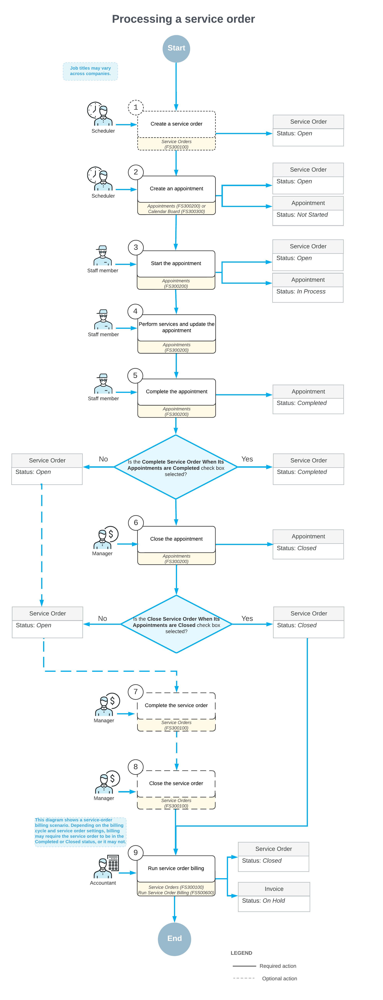

# Service Orders with a Single Appointment: General Information {#_269ae777-4a28-43b2-ad3e-ec42ca2ad6f9 .concept}

A service order, created on the [Service Orders](FS_30_01_00.md) \(FS300100\) form, contains information about the services planned for a customer and any related appointments. In Acumatica ERP, you can create service orders, schedule appointments, and process billing for each service order.

## Learning Objectives { .section}

In this chapter, you will learn how to do the following:

-   Create a service order based on a customer’s service request
-   Schedule an appointment and assign a staff member to perform the service
-   Start and complete the appointment
-   Close the appointment and process billing for the service order

## Applicable Scenarios { .section}

You create and process a service order with an appointment if your company sells services and has customers that request services from time to time.

## Workflow of Service Order Processing { .section}

If the customer’s billing cycle specifies that billing documents should be generated for service orders instead of appointments, processing a service order with a single appointment involves the following steps: \(which are shown in the diagram of the next section\):

1.  Creating a service order: The service manager receives the order and enters key details on the [Service Orders](FS_30_01_00.md) \(FS300100\) form, including customer information, scheduled start and end dates and times, services to be performed, and any other relevant information..
2.  Creating an appointment: The service manager creates an appointment by using the following commands on the More menu of the [Service Orders](FS_30_01_00.md) form.
    -   **Create Appointment**: Opens the [Appointments](FS_30_02_00.md) \(FS300200\) form, where the service manager reviews and verifies the information copied from the service order before saving the appointment.
    -   **Schedule on Calendar**: Opens the [Calendar Board](FS_30_03_00.md) \(FS300300\) form, where the service manager assigns an appointment according to staff members' skills and availability.
    -   **Schedule on Staff Calendar**: Opens the [Staff Calendar Board](FS_30_04_00.md) form, where the service manager assigns an appointment based on the availability of the selected staff member.
3.  Starting the appointment: A staff member starts the appointment by clicking **Start** on the [Appointments](FS_30_02_00.md) form.
4.  Performing services and updating the appointment: A staff member performs the required services and records the time spent.
5.  Completing the appointment: A staff member completes the appointment by clicking **Complete** on the [Appointments](FS_30_02_00.md) form.
6.  Closing an appointment \(Optoinal\): An accountant reviews the information entered for the completed appointment, including quantities and prices, and closes the verified appointment on the [Appointments](FS_30_02_00.md) form.
7.  Billing an appointment: If the customer's billing cycle is set up to run billing from appointments, the accountant runs the appointment billing process on the [Appointments](FS_30_02_00.md) form. The system generates a billing document of the type specified in the service order type settings.

    **Tip:** Only closed appointments can be billed, if the **Bill Only Closed Appointments** check box is selected for the appointment's service order type.

8.  Billing a service order: If the customer's billing cycle is set up to run billing from service orders, the accountant runs the billing process in the service order on the [Service Orders](FS_30_01_00.md) form. The system generates a billing document of the type specified in the service order type settings. For details, see [Billing Cycles: General Information](../ImplementationGuide/config_ServMgmt_Billing_Cycle_GeneralInfo.md).
9.  Completing the service order \(optional\): After all appointments related to the service order have been completed, the service manager completes the service order in the system by clicking **Complete** on the form toolbar of the [Service Orders](FS_30_01_00.md) form.

    **Tip:** If the **Complete Service Order When Its Appointments Are Completed** check box is selected on the **General** tab of the [Service Order Types](FS_20_23_00.md) \(FS202300\) form, the service order is automatically completed and is assigned the *Completed* status when all related appointments have been completed.

    If any additional service has to be performed or another appointment has to take place, the service manager can reopen the service order by clicking **Reopen** on the More menu of the [Service Orders](FS_30_01_00.md#) form. The service order can again be completed after all work is done.

10. Closing the service order \(optional\): After all accounting information has been verified, the accountant closes the service order. Billing documents can be generated only after the service order has been closed.

    **Tip:** If the **Close Service Orders When Its Appointments Are Closed** check box is selected on the [Service Order Types](FS_20_23_00.md) form, the service order is automatically closed and is assigned the *Closed* status when all related appointments have been closed.

    If any additional changes should be made in the service order, the service manager can unclose the service order by clicking **Unclose** on the More menu of the [Service Orders](FS_30_01_00.md#) form. This causes the service order to be assigned the *Completed* status, and information in the service order can be edited.

## Billing Documents { .section}

**Tip:** In the context of Acumatica ERP's service management functionality, a *billing document* refers to a document or transaction that is generated when the billing process is executed for a service document. Depending on the settings of the service order type, it can be a sales order, sales invoice, AR invoice or project transaction.

When a service order is billed on the [Service Orders](FS_30_01_00.md#) or the [Run Service Order Billing](FS_50_06_00.md) \(FS500600\) form, the system creates a billing document of the type specified in the **Generated Billing Documents** box on the **General** tab of the [Service Order Types](FS_20_23_00.md) \(FS202300\) form for the service order's order type:

-   *AR Documents*: The system generates an AR invoice, which can be viewed on the [Invoices and Memos](AR_30_10_00.md) \(AR301000\) form, for the service order or appointment of this service order type. If the service order or appointment has a negative balance, the system generates a credit memo. If the **Create a Bill Document in AP for Negative Balances** check box \(which is available if you select this option button\) is selected, for a service order or appointment with a negative balance, the system instead creates an accounts payable bill on the [Bills and Adjustments](AP_30_10_00.md) \(AP301000\) form.
-   *Sales Orders*: The system generates a sales order, which can be viewed on the [Sales Orders](SO_30_10_00.md) \(SO301000\) form, for the service order or appointment of this service order type. If needed, you can create any shipments for the sales order and add freight costs; you then generate the sales invoice for the sales order. If quick processing is enabled for a service order type, the system automatically generates the invoice along with the sales order.

    You can select this option only if the *Inventory and Order Management* feature is enabled on the [Enable/Disable Features](CS_10_00_00.md#) \(CS100000\) form.

-   *SO Invoices*: The system generates a sales invoice, which can be viewed on the [Invoices](SO_30_30_00.md) \(SO303000\) form, for the service order or appointment of this service order type.

    You can select this option only if the *Advanced SO Invoices* feature is enabled on the [Enable/Disable Features](CS_10_00_00.md#) form.

-   *Project Transactions*: The system generates a project transaction, which can be viewed on the [Project Transactions](PM_30_40_00.md) \(PM304000\) form, for the service order or appointment of this service order type. The service order and appointment must be linked to a project, which must be specified in the **Project** box in the Summary area of the corresponding service form. If the service order or appointment of this service order type contains stock items, the related issue is also generated and can be viewed on the [Issues](IN_30_20_00.md) \(IN302000\) form.

    You can select this option only if the *Projects* feature is enabled on the [Enable/Disable Features](CS_10_00_00.md#) form and the *Regular* option is selected in the **Behavior** box of this form for the service order type.

-   *None*: No document is generated for a service orders or appointment of this service order type, and the other settings of the **Billing Settings** section do not appear on the form.

## Process Diagram { .section}

The typical workflow of service order processing is shown in the following diagram.

**Parent topic:**[Processing Service Orders with a Single Appointment](../UserGuide/ServMgmt_Processing_Service_Orders_Mapref.md)

