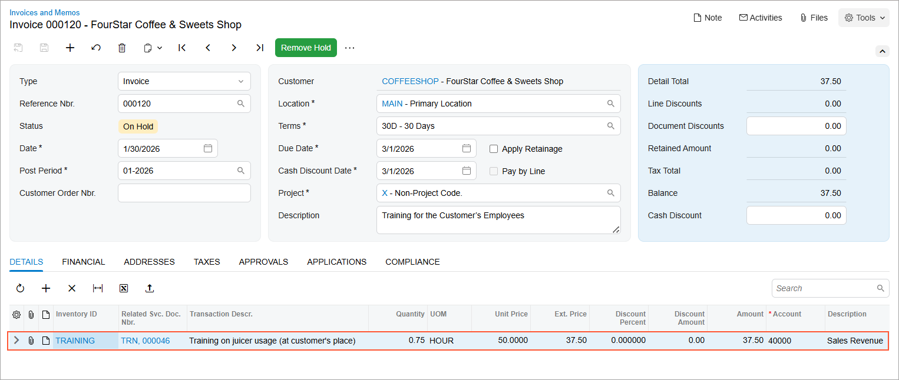

# Service Orders with a Single Appointment: Process Activity {#_134b0c71-2e0b-4270-9b4e-53c8c958ce81 .task}

The following activity will walk you through the process of creating and processing a service order with one appointment.

**Attention:** This activity is based on the *U100* dataset. If you are using another dataset or if any system settings have been changed in *U100*, these changes can affect the workflow of the activity and the results of the processing. To avoid issues, restore the *U100* dataset to its initial state.

## Story { .section}

Suppose that the SweetLife Service and Equipment Sales Center receives an order to provide a training service to one of its customers, FourStar Coffee &amp; Sweets Shop.

The service manager, Maia Davis, must enter the service order in the system, assign a staff member, and schedule an appointment to deliver the service. The assigned staff member will then perform the service at the customer's location and complete the appointment in the system. \(At this stage of learning, the assignment will be made without considering employee qualifications, working hours, or service areas.\)

Finally, the accountant will review the appointment, close it, and generate an AR invoice to bill the customer. In this activity, you'll perform these steps while acting as the service manager, the staff member, and the accountant.

## Configuration Overview { .section}

In the *U100* dataset, which you'll use to complete this lesson, the following setup has been configured. These settings ensure that the environment is ready for performing the activity:

-   The minimum system configuration, which is described in [Company with Branches that Do Not Require Balancing: General Information](../ImplementationGuide/config_Company_with_Branches_No_Balancing_GeneralInfo.md), has been performed.
-   The *SWEETLIFE* company has been created on the [Companies](CS_10_15_00.md) \(CS101500\) form. This company has multiple branches created on the [Branches](CS_10_20_00.md#) \(CS102000\) form, including *SWEETEQUIP \(Service and Equipment Sales Center\)*.
-   On the [Service Management Preferences](FS_10_01_00.md) \(FS100100\) form, the minimum settings have been specified, including specifying the numbering sequences and work calendar, for the service management functionality to be used.
-   On the [Users](SM_20_10_10.md) \(SM201010\) form, the *davis* and *frank* user accounts have been created. The *EP00000040 - Maia Davis* employee has been associated with the *davis* user account; that is, *Maia Davis* has been selected in the **Linked Entity** box of the Summary area of the form. The *EP00000042 - Chase Frank* employee has been associated with the *frank* user account; that is, *Chase Frank* has been selected in the **Linked Entity** box on the form.
-   On the [Branch Locations](FS_20_25_00.md#) \(FS202500\) form, the *WEST BRIGHTON* branch location of the *SWEETEQUIP* \(*Service and Equipment Sales Center*\) branch has been created.
-   On the [User Profile](SM_20_30_10.md#) \(SM203010\) form, for the *davis* user, *WEST BRIGHTON* has been specified as the default branch location.
-   On the [Service Order Types](FS_20_23_00.md#) \(FS202300\) form, the *TRN* service order type has been defined. For the type, in the **Billing Settings** section of the **General** tab, **AR Documents** has been selected in the **Generated Billing Documents** box, and the **Bill Only Closed Appointments** check box has been selected.
-   On the [Employees](EP_20_30_00.md#) \(EP203000\) form, on the **General** tab \(**Employee Settings** section\), the **Staff Member in Service Management** check box has been selected for *EP00000042 \(Chase Frank\)*, so that you can assign this employee to perform services.
-   On the [Billing Cycles](FS_20_60_00.md#) \(FS206000\) form, the following settings have been specified for the *SO SO* billing cycle:
    -   **Run Billing For**: **Service Orders**
    -   **Group Billing Documents By**: **Service Orders**
-   On the [Customers](AR_30_30_00.md#) \(AR303000\) form, the *COFFEESHOP - FourStar Coffee &amp; Sweets Shop\)* customer has been created, and the *SO SO* billing cycle has been selected in the **Service Management** section of the **Billing** tab.
-   On the [Non-Stock Items](IN_20_20_00.md#) \(IN202000\) form, the *TRAINING* service \(that is, a non-stock item of the *Service* type\) has been defined. For the *TRAINING* service, on the **Price/Cost** tab, the *Time* billing rule has been selected.

## Process Overview {#section_pvw_bnq_zgc .section}

To process a service order with a single appointment, you’ll first act as the service manager \(Maia Davis\) to create a service order on the [Service Orders](FS_30_01_00.md#) \(FS300100\) form, add the required service, and create the related appointment on the [Appointments](FS_30_02_00.md#) \(FS300200\) form. You’ll then assign a staff member to the appointment.

Next, acting as that staff member, you’ll start and complete the appointment.

Finally, acting as the accountant, you’ll review and close the appointment and then run billing for the service order on the [Service Orders](FS_30_01_00.md#) \(FS300100\) form.

## System Preparation {#section_dhm_h2y_1hc .section}

Before you start this activity, do the following:

1.  Launch the Acumatica ERP website, and sign in to a company with the *U100* dataset preloaded; you should sign in as a service manager by using the *davis* username and the *123* password.
2.  In the Date box in the upper-right corner of the Acumatica ERP screen, specify the business date *1/30/2026*. For simplicity, you will use this business date to create and process all documents in this activity.
3.  After signing in, make sure that the *Service Management* feature is enabled on the [Enable/Disable Features](CS_10_00_00.md#) \(CS100000\) form.

## Step 1: Entering a Service Order { .section}

When you create a service order, you enter general information about the requested service, such as the customer name, promised date, and service details. In this step, you'll create a service order for a customer who has requested a training service. You'll select the *TRN* order type and specify the *TRAINING* service.

To create a service order, do the following:

1.  On the [Service Orders](FS_30_01_00.md#) \(FS300100\) form, click **Add New Record**.
2.  In the Summary area, specify the following settings:
    -   **Order Type**: *TRN*
    -   **Customer**: *COFFEESHOP - FourStar Coffee &amp; Sweets Shop*
    -   **Description**: `Training for the Customer’s Employees`
3.  On the table toolbar of the **Details** tab, click **Add Row**, and specify the following settings in the row:
    -   **Line Type**: *Service*
    -   **Inventory ID**: *TRAINING*
4.  Click **Add Row** again, and in the **Line Type** column, select *Comment*.
5.  Enter the following comment in the **Description** column: `Training for four of the customer’s employees is required now that the juicer has been installed.`
6.  On the form toolbar, click **Save**.

## Step 2: Scheduling an Appointment and Assigning a Staff Member { .section}

In this step, you’ll create an appointment to represent the staff member’s visit to the customer’s location. You’ll specify the scheduled start date and time and assign a staff member to the appointment.

To create an appointment, do the following:

1.  While you are still viewing the service order on the [Service Orders](FS_30_01_00.md#) \(FS300100\) form, on the form toolbar, click **Create Appointment**.

    The system opens the [Appointments](FS_30_02_00.md#) \(FS300200\) form with the relevant settings copied from the service order.

2.  On the **Settings** tab, in the **Scheduled Start Date** group of boxes, review that 1/30/2026 is selected and specify *11:00 AM*.
3.  On the **Staff** tab, assign a staff member to perform the service as follows:
    1.  On the table toolbar, click **Add Row**.
    2.  In the **Staff Member** column, select *EP00000042 \(Chase Frank\)*.
4.  On the form toolbar, click **Save**.

## Step 3: Processing the Appointment { .section}

In this step, acting on behalf of the assigned staff member, you’ll start the appointment, record the actual start date and time, and then complete the appointment.

To process the appointment from start to completion, do the following:

1.  On the form toolbar of the [Appointments](FS_30_02_00.md#) \(FS300200\) form, click **Start**.

    You start the appointment to indicate that the appointment is being attended.

2.  On the **Settings** tab, in the **Actual Date and Time** section, specify the following settings:
    -   **Actual Start Date**: 1/30/2026 *11:00 AM*
    -   **Actual End Date**: 1/30/2026 *12:00 PM*
    -   **Finished**: Selected

        You select this check box to indicate that the work has been finished during the appointment and that no follow-up appointment is necessary.

3.  On the form toolbar, click **Complete**.

    You complete an appointment as a staff member to indicate that the work on the appointment has been done.

## Step 4: Generating an AR Invoice { .section}

You can generate a billing document once an appointment is completed or closed, depending on the settings of the service order type. In this lesson, once the appointment is assigned the *Closed* status, you can bill the customer for the service provided. You'll generate an AR invoice because this document type is specified for the *TRN* service order type.

To generate an AR invoice on behalf of an accountant, do the following:

1.  While you are still viewing the appointment on the [Appointments](FS_30_02_00.md#) \(FS300200\) form, on the form toolbar, click **Close**.

    You close the appointment to indicate that all information entered into the system about the appointment has been verified and is correct. The appointment is assigned the *Closed* status. Now you can generate the billing document for the related service order, as the customer’s billing cycle specifies that billing should be executed at the service order level.

2.  Open the service order by clicking its number in the **Service Order Nbr.** box in the Summary area of the [Appointments](FS_30_02_00.md#) form. The [Service Orders](FS_30_01_00.md#) \(FS300100\) form opens in a separate window.
3.  On the form toolbar of the [Service Orders](FS_30_01_00.md#) form, click **Run Billing**.

    The system opens the [Invoices and Memos](AR_30_10_00.md#) \(AR301000\) form with the generated invoice, as shown below.

4.  Verify the details of the invoice and make sure that they are correct. \(In a production environment, the invoice could now be processed.\)

**Parent topic:**[Processing Service Orders with a Single Appointment](../UserGuide/ServMgmt_Processing_Service_Orders_Mapref.md)

