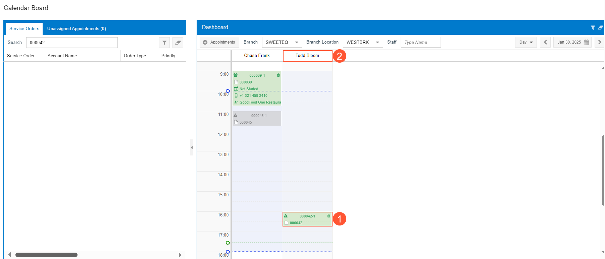

# Service Orders: To Assign a Staff Member by Using the Calendar Board {#_d20219f2-e845-424a-8a94-09a485f195aa .task}

The following activity will walk you through the process of scheduling an appointment for the service order. You will assign a service order to an employee who is available on the scheduled date with consideration given to the employee's skills and licenses. To perform this assignment, you will use the **Service Orders** tab on the [Calendar Board](FS_30_03_00.md) \(FS300300\) form.

**Important:** This activity is based on the Acumatica ERP Classic UI.

**Attention:** This activity is based on the *U100* dataset. If you are using another dataset or if any system settings have been changed in *U100*, these changes can affect the workflow of the activity and the results of the processing. To avoid issues, restore the *U100* dataset to its initial state.

## Story { .section}

Suppose that the *COFFEESHOP - FourStar Coffee &amp; Sweets Shop* customer has contacted the SweetLife Service and Equipment Sales Center and requested the training service. The service order has been entered in the system.

Acting as the service manager \(Maia Davis\), you now need to assign a staff member to perform the service included in the service order. While performing this assignment, you need to consider the staff member's available working hours, skills, and licenses.

## Configuration Overview { .section}

In the *U100* dataset, which you'll use to complete this lesson, the following setup has been configured. These settings ensure that the environment is ready for performing the activity:

-   The minimum system configuration, which is described in [Company with Branches that Do Not Require Balancing: General Information](../ImplementationGuide/config_Company_with_Branches_No_Balancing_GeneralInfo.md), has been performed.
-   The *SWEETLIFE* company has been created on the [Companies](CS_10_15_00.md) \(CS101500\) form. This company has multiple branches created on the [Branches](CS_10_20_00.md#) \(CS102000\) form, including *SWEETEQUIP \(Service and Equipment Sales Center\)*.
-   On the [Service Management Preferences](FS_10_01_00.md) \(FS100100\) form, the minimum settings have been specified, including specifying the numbering sequences and work calendar, for the service management functionality to be used.
-   On the [Users](SM_20_10_10.md) \(SM201010\) form, the *davis* and *frank* user accounts have been created. The *EP00000040 - Maia Davis* employee has been associated with the *davis* user account; that is, *Maia Davis* has been selected in the **Linked Entity** box of the Summary area of the form. The *EP00000042 - Chase Frank* employee has been associated with the *frank* user account; that is, *Chase Frank* has been selected in the **Linked Entity** box of the Summary area of the form.
-   On the [Branch Locations](FS_20_25_00.md#) \(FS202500\) form, the *WEST BRIGHTON* branch location of the *SWEETEQUIP* \(*Service and Equipment Sales Center*\) branch has been created.
-   On the [User Profile](SM_20_30_10.md#) \(SM203010\) form, for the *davis* user, *WEST BRIGHTON* has been specified as the default branch location.
-   On the [Skills](FS_20_06_00.md#) \(FS200600\) form, the *INSTALLING* skill has been created.
-   On the [License Types](FS_20_09_00.md#) \(FS200900\) form, the *INST&amp;REP* license type has been created.
-   On the [Licenses](FS_20_10_00.md) \(FS201000\) form, the *FSL00001* license has been created. This license has the *TRAINING* license type and was created for the *EP00000002 - Todd Bloom* employee.
-   On the [Employees](EP_20_30_00.md#) \(EP203000\) form, the *EP00000002 - Todd Bloom* employee has been created. On the **General** tab \(**Employee Settings** section\), the **Staff Member in Service Management** check box has been selected. The *TRAINING* skill has been listed on the **Skills** tab, and license *FSL00001* of the *TRAINING* type has been listed on the **Licenses** tab.
-   On the [Staff Schedule Rules](FS_20_20_01.md) \(FS202001\) form, a work schedule rule has been defined for the *EP00000002 - Todd Bloom* employee, and the work schedule has been generated for this employee on the [Generate Staff Schedules](FS_50_04_00.md) \(FS500400\) form.
-   On the [Non-Stock Items](IN_20_20_00.md) \(IN202000\) form, the *INSTALL* service \(that is, an item of the *Service* type\) has been created. For this service, *INSTALLING* has been listed on the **Service Skills** tab, and *INST&amp;REP* has been listed on the **Service License Types** tab.
-   On the [Service Orders](FS_30_01_00.md) \(FS300100\) form, the service order with the *000042* reference number has been created.

## Process Overview { .section}

You will start by opening the service order by using the [Service Orders](FS_30_01_00.md) \(FS300100\) form and then open the [Calendar Board](FS_30_03_00.md) \(FS300300\) form. Then you will create an appointment and assign it to a staff member while considering staff member's available working hours and skills.

## System Preparation {#section_pp3_mxy_1hc .section}

Before you start this activity, do the following:

1.  Sign in to Acumatica ERP to a company with the *U100* dataset preloaded as a service manager by using the *davis* username and the *123* password.
2.  In the Date box in the upper-right corner of the top pane, specify *1/30/2026*. For simplicity, you'll create and process all documents in this activity by using this business date.
3.  After signing in, make sure that the *Service Management* feature is enabled on the [Enable/Disable Features](CS_10_00_00.md#) \(CS100000\) form.

## Step: Creating and Assigning an Appointment { .section}

To create an appointment for the service order and assign it to the staff member on the calendar board, do the following:

1.  On the [Service Orders](FS_30_01_00.md) \(FS300100\) form, open the service order with the *000042* reference number. Notice that the *TRAINING* service is listed on the **Details** tab.
2.  On the More menu, click **Schedule on Calendar**.

    The [Calendar Board](FS_30_03_00.md) \(FS300300\) form opens. The left part of the form contains two tabs—**Service Orders** and **Unassigned Appointments \(n\)**. \(*n* is replaced with the quantity of unassigned appointments for the currently selected date.\)

3.  On the **Service Orders** tab, ensure that the *000042* service order is listed.
4.  Right-click the service order, and then click **Filter Staff**. The list of staff members on the dashboard is filtered to match the skills and licenses of the services in the service order.
5.  Drag the *000042* service order from the **Service Orders** tab to the Todd Bloom's time interval to be started at *4:00 PM*. The appointment \(Item 1 in the following screenshot\) is now assigned to Todd Bloom \(Item 2\). Note that you can change the time of the appointment by dragging the appointment box.

    

6.  Click the *000042-1* appointment link in the calendar. The [Appointments](FS_30_02_00.md) \(FS300200\) form is opened with the details of the appointment. On the **Staff** tab, confirm that Todd Bloom is assigned to the appointment.

**Parent topic:**[Assigning Staff Members to Service Orders on the Calendar Board](../UserGuide/ServMgmt_Assigning_Staff_to_ServOrders_and_Appointments_Mapref.md)

