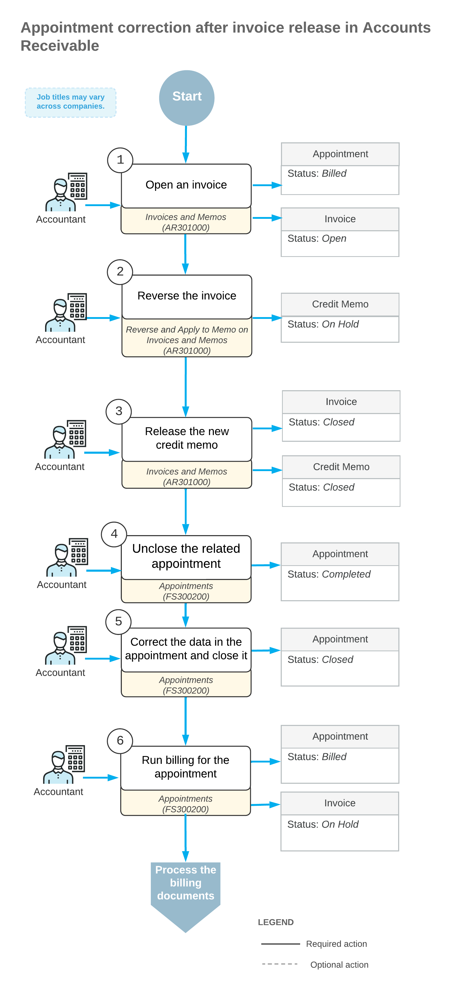

# Appointment Billing Correction: General Information {#_024bdf90-6670-4e89-bfe9-1b1d5e5acc37 .concept}

In Acumatica ERP, if you need to correct information in an already-released invoice that originated from an appointment, you reverse the invoice, correct the appointment, and generate a new invoice. The correction of the appointment can involve adding or deleting detail lines, editing items in the detail lines, or editing the prices.

**Important:** The process of correcting billing documents originating from appointments can differ depending on the type of the billing document. The [Appointment Billing Correction: Other Document Types](ServMgmt_Correction_of_Appointment.md) outlines the processes of billing correction when different billing documents are involved.

## Learning Objectives { .section}

In this chapter, you will learn how to reverse an invoice originating from an appointment, make corrections in the appointment, and generate another invoice for it.

## Applicable Scenarios { .section}

You correct an appointment and prepare a new invoice for a customer in the following cases:

-   When corrections to an invoice may be needed
-   When corrections to an appointment may be needed

## Workflow of Appointment Billing Correction { .section}

In the diagram below, you can see the general workflow of correcting an invoice that has been generated and released for an appointment. This diagram focuses on the process when the billing document is an accounts receivable invoice.

**Tip:** Processes and job titles may be different in your company.

## Correction of an Accounts Receivable Invoice Originating from an Appointment { .section}

To correct an appointment billing, if an accounts receivable invoice was used for the billing and it has the *Open* status \(that is, it has been released\), an accountant must first reverse this invoice. On the **Billing Documents** tab of the [Appointments](FS_30_02_00.md) \(FS300200\) form, the accountant finds and clicks the reference number of the invoice. The system opens the invoice on the [Invoices and Memos](AR_30_10_00.md) \(AR301000\) form in a pop-up window.

On the More menu \(under **Corrections**\) of the [Invoices and Memos](AR_30_10_00.md) form, the accountant clicks **Reverse and Apply to Memo**. The system creates a document of the *Credit Memo* type and opens it on the current form. The accountant releases the credit memo, which causes the credit memo and the original invoice to be assigned the *Closed* status, and closes the form. On the **Billing Documents** tab of the [Appointments](FS_30_02_00.md) form, the system adds a row with the *AR Credit Memo* document with its reference number.

On the [Appointments](FS_30_02_00.md) form, on the More menu \(under **Corrections**\), the accountant clicks **Unclose** to unclose the appointment. The accountant then makes the needed corrections to the appointment. After that, they can process the appointment billing once again.

## Correction of a Sales Invoice Originating from an Appointment { .section}

**Important:** The ability to reverse a sales invoice is available only if the *Service Management* and *Advanced SO Invoices* features are enabled on the [Enable/Disable Features](CS_10_00_00.md) \(CS100000\) form.

If there is an open sales invoice that has to be corrected and this invoice originates from an appointment, the accountant must first reverse the invoice, unclose the related appointment, and make the needed corrections to the appointment. Then they can generate the new invoice with the corrected information. The accountant finds the reference number of the invoice on the **Billing Documents** tab of the [Appointments](FS_30_02_00.md) \(FS300200\) form. On this tab, the accountant clicks the reference number of the sales invoice. The system opens the invoice on the [Invoices](SO_30_30_00.md) \(SO303000\) form in a pop-up window.

In the invoice, on the [Invoices](SO_30_30_00.md) form, an accountant clicks **Reverse Service Invoice** on the More menu \(under **Corrections**\). The system creates a new document of the *Credit Memo* type and opens it on the current form. The accountant releases the credit memo and closes the [Invoices](SO_30_30_00.md) form. The credit memo is assigned the *Closed* status, and the original invoice is assigned the *Canceled* status. The system adds a row with the *SO Credit Memo* document and its reference number on the **Billing Documents** tab of the [Appointments](FS_30_02_00.md) form.

On the [Appointments](FS_30_02_00.md) form, the accountant clicks **Unclose** on the More menu \(under **Corrections**\) and makes the needed corrections. After that, they can process the appointment billing once again.

**Parent topic:**[Correcting Appointment Billing](../UserGuide/Services_Correction_of_Appointment_Mapref.md)

