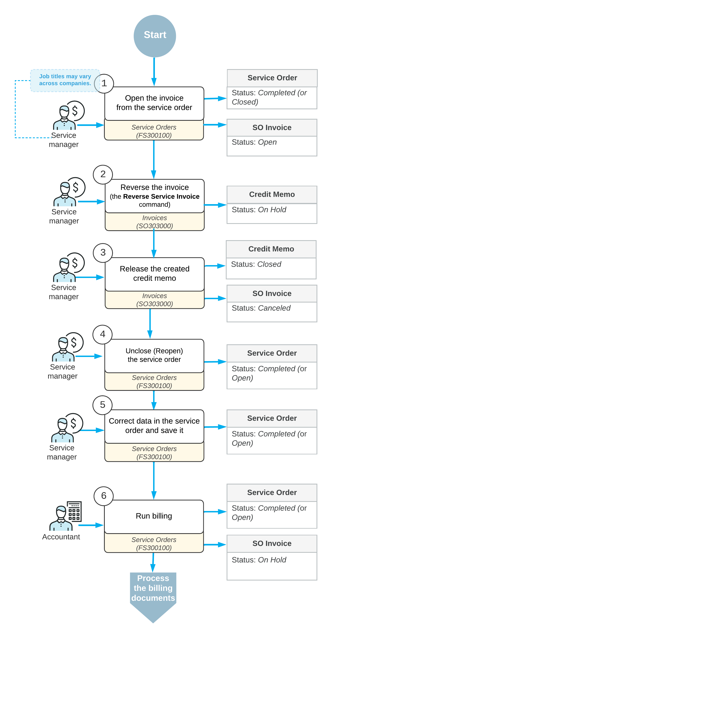

# Service Order Billing Correction: General Information {#_83ba3d3c-786f-449c-a1d2-4448318fd423 .concept}

In Acumatica ERP, if you need to correct information in an already-released sales invoice that originated from a service order, you can reverse the invoice, correct the service order, and generate a new invoice.

**Tip:** This topic focuses primarily on the correction process when the billing document is an SO invoice; the process of correcting billing documents originating from appointments can differ depending on the type of the billing document. The [Service Order Billing Correction: Billing Document Types](Services_Correction_of_Service_Order_Different_Billing_Documents.md) outlines the processes of billing correction when different billing documents are involved.

## Learning Objectives { .section}

In this chapter, you will learn how to reverse a sales invoice originating from a service order, make corrections in the service order, and generate another invoice for it.

## Applicable Scenarios { .section}

You reverse an invoice and correct a service order in the following cases:

-   When corrections to an invoice may be needed
-   When some details specified in the service order need to be corrected or new details need to be added

## Workflow of Service Order Billing Correction { .section}

In the diagram below, you can see the general workflow of correcting a service order and regenerating a sales invoice.

**Tip:** Processes and job titles may be different in your company.

**Tip:** The ability to reverse a sales invoice created from a service order, as described in this topic, is available only if the *Service Management* and *Advanced SO Invoices* features are enabled on the [Enable/Disable Features](CS_10_00_00.md) \(CS100000\) form.

## Correction of an SO Invoice Originating from a Service Order { .section}

To correct a sales invoice originating from a service order if the invoice has already been released, you need to reverse the invoice, unclose and correct the service order, and then generate a new invoice for it.

To reverse the invoice, on the [Invoices](SO_30_30_00.md) \(SO303000\) form, you click the **Reverse Service Invoice** command on the More menu \(under **Corrections**\). The system creates a new document of the *Credit Memo* type and the *On Hold* status. In the Summary area of the credit memo, the **Date**, **Post Period**, and **Description** boxes are available for editing. The other boxes of the Summary area are filled in with the settings of the original invoice and are unavailable for editing. On the **Details** tab, all lines of the original sales invoice have been automatically added. On the table toolbar of this tab, the **Add** and **Delete** buttons are unavailable, so that no detail lines can be added or deleted. In the **Related Svc. Doc. Nbr.** column, the reference number of the related service order is specified.

**Tip:** The ability to reverse a sales invoice is available only if the *Service Management* and *Advanced SO Invoices* features are enabled on the [Enable/Disable Features](CS_10_00_00.md) \(CS100000\) form.

You release the credit memo, which causes the original invoice to be assigned the *Canceled* status. The associated service order can then be corrected and billed again. On the [Service Orders](FS_30_01_00.md) \(FS300100\) form, you do one of the following on the More menu under **Corrections**:

-   If the service order’s status is *Closed*, click **Unclose**.
-   If the service order’s status is *Completed*, click **Reopen**.

Then you can make the needed corrections to the service order and save it. Finally, you process the service order billing once again.

**Parent topic:**[Correcting Service Order Billing](../UserGuide/Services_Correction_of_Service_Order_Mapref.md)

