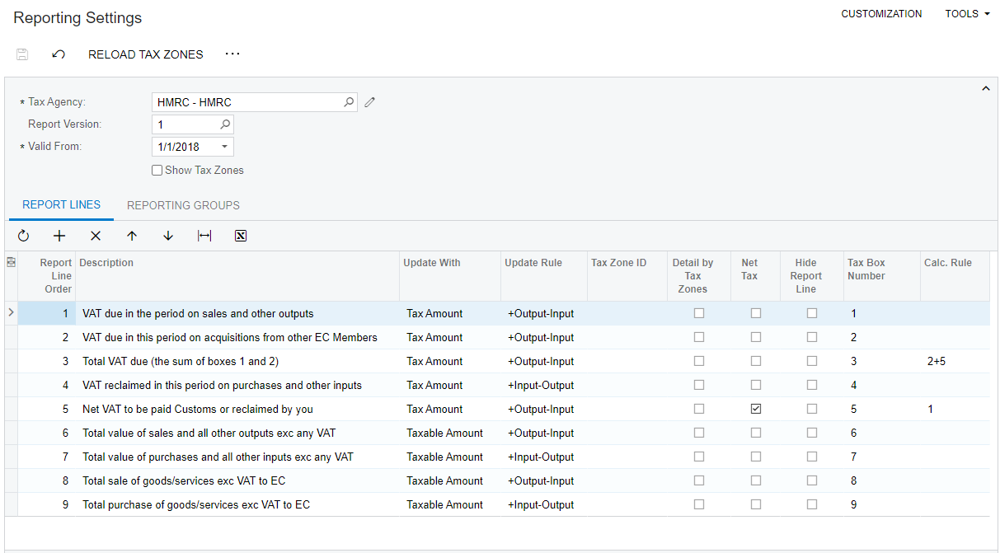
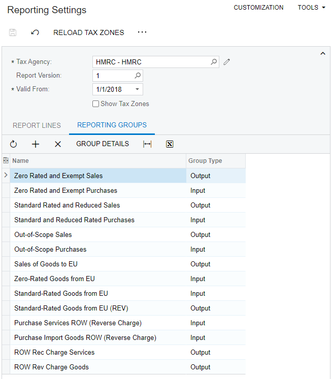

# Configuring Support for Making Tax Digital \(MTD\) {#_ead5746d-beb4-4e47-afb6-9a778c36ac7f .concept}

Making Tax Digital \(MTD\) for VAT came into effect on April 1, 2019 in the United Kingdom and is supported by Acumatica ERP. This chapter describes the system configuration to enable you to transfer VAT return information to His Majesty's Revenue and Customs \(HMRC\).

The following tasks should be completed before you start configuring MTD support in your system:

-   The tax agency for filing VAT return information to HMRC has been set up on the [Vendors](AP_30_30_00.md) \(AP303000\) form. For details, see [Tax Agency: General Information](../ImplementationGuide/TaxAgency_GeneralInfo.md).
-   The tax report has been created on the [Reporting Settings](TX_20_51_00.md) \(TX205100\) form. For details, see [Tax Report Configuration: General Information](../ImplementationGuide/TaxReport_GeneralInfo.md).
-   An account on the HMRC website has been registered. You will use these account settings to create the connection between Acumatica ERP and HMRC.

The following table lists the tax boxes submitted to HMRC.

|Tax Box Number|Description|
|--------------|-----------|
|1|Box 1 - VAT on Sales|
|2|Box 2 - VAT on Purchases, T10|
|3|Box 3 - Total VAT \(including T10 input VAT\)|
|4|Box 4 - VAT on Purchases|
|5|Box 5 - Net VAT to be paid or reclaimed|
|6|Box 6 - Total taxable value of Sales \(including box 8\)|
|7|Box 7 - Total taxable value of Purchases \(including box 9\)|
|8|Box 8 - Total taxable value of Sales, EC|
|9|Box 9 - Total taxable value of Purchases, EC|

To set up the system for MTD support, you first enable the *UK Localization* feature on the [Enable/Disable Features](CS_10_00_00.md) \(CS100000\) form. On the [External Applications](SM_30_10_00.md) \(SM301000\) form, you create a connection to HMRC. You then specify the tax registration ID and the MTD external application of the company or the branch on the [Companies](CS_10_15_00.md) \(CS101500\) or [Branches](CS_10_20_00.md) \(CS102000\) form, respectively. Finally, on the [Reporting Settings](TX_20_51_00.md) \(TX205100\) form, you assign the appropriate tax box numbers to the lines of the tax report. These steps are described later in this topic.

## To Enable the Needed Feature {#section_uxp_fjv_vxb .section}

To enable the *UK Localization* feature, do the following:

1.  Open the [Enable/Disable Features](CS_10_00_00.md) \(CS100000\) form.
2.  On the form toolbar, click **Modify**.
3.  In the list of features, select the **UK Localization** check box.
4.  On the form toolbar, click **Enable** to enable the feature.

## To Create the Connection to HMRC {#section_wxp_fjv_vxb .section}

To create a connection to HMRC, do the following:

1.  Open the [External Applications](SM_30_10_00.md) \(SM301000\) form.
2.  Click **Add New Record** on the form toolbar, and specify the following settings in the **Application** section:
    -   **Type**: *HMRC Making Tax Digital*.
    -   **Application Name**: The name of the application, for example `HMRC`.
3.  On the form toolbar, click **Sign In**. The system displays the **HMRS Tax Platform** dialog box.
4.  Click **Sign in to Government Gateway** in this dialog box and enter the credentials for your HMRC account.

## To Specify the Company or Branch Settings {#section_yxp_fjv_vxb .section}

To specify the tax registration ID and the connection to HMRC for a company or branch, do the following:

1.  Open the [Companies](CS_10_15_00.md) \(CS101500\) form.
2.  In the **Company ID** box of the Summary area, select the company for which you are configuring the MTD support.

    **Tip:** The selected company should have *GB - United Kingdom of Great Britain and Northern Ireland* selected in the **Country** box \(in the **Main Address** section\) of the **Company Details** tab.

3.  On the **Company Details** tab, in the **Tax Registration ID** box in the **Tax Registration Info** section, type the company's tax registration ID. This value must be nine digits long and contain no letters.
4.  In the **MTD External Applications** box, select the connection to HMRC that you set up on the [External Applications](SM_30_10_00.md) \(SM301000\) form.

    **Attention:** An external application can be selected in this box only once in the instance, on either the [Companies](CS_10_15_00.md) or [Branches](CS_10_20_00.md) form. The lookup table that opens when you click the magnifying button in the **MTD External Application** box shows only external applications that have not been yet selected for a company or a branch.

5.  On the form toolbar, click **Save** to save the company configuration.

If the *Multibranch Support* feature has been enabled on the [Enable/Disable Features](CS_10_00_00.md) \(CS100000\) form, and the **File Taxes by Branches** check box has been selected on the **Company Details** tab of the [Companies](CS_10_15_00.md) form \(**Tax Registration Info** section\) for the company, you should specify the tax registration number for each company branch for which you are configuring MTD support. Do the following:

1.  Open the [Branches](CS_10_20_00.md) \(CS102000\) form.
2.  In the **Branch ID** box, select the branch.

    **Tip:** The selected branch should have *GB - United Kingdom of Great Britain and Northern Ireland* selected in the **Country** box \(in the **Main Address** section\) of the **Branch Details** tab.

3.  On the **Branch Details** tab, in the **Tax Registration ID** box in the **Tax Registration Info** section, type the branch's tax registration ID.
4.  In the **MTD External Application** box, select the connection to HMRC that you set up on the [External Applications](SM_30_10_00.md) form.

    **Attention:** An external application can be selected in this box only once in the instance, on either the [Companies](CS_10_15_00.md) or [Branches](CS_10_20_00.md) form. The lookup table that opens when you click the magnifying button in the **MTD External Application** box shows only external applications that have not been yet selected for a company or a branch.

5.  On the form toolbar, click **Save** to save the branch configuration.

## To Configure the Tax Boxes for the Tax Report {#_c34c75f9-6f72-44a5-b3be-e79713e10b05 .section}

To configure the needed tax boxes for the tax report, do the following:

1.  Open the [Reporting Settings](TX_20_51_00.md) \(TX205100\) form.
2.  In the **Tax Agency** box of the Summary area, select the tax agency configured for filing VAT return information to HMRC.
3.  On the **Report Lines** tab, in the **Tax Box Number** column enter appropriate tax box numbers for the appropriate tax report lines.

    The following screenshot shows an example of this configuration for a tax report.

    

4.  On the **Reporting Groups** tab, add the needed reporting groups. The following screenshot shows an example of this configuration for a tax report.

    

5.  On the form toolbar, click **Save** to save the tax report you have configured.

-   **[To Submit a VAT Return](../UserGuide/TX__how_MTD_Submitting_VAT_Return.md)**  

