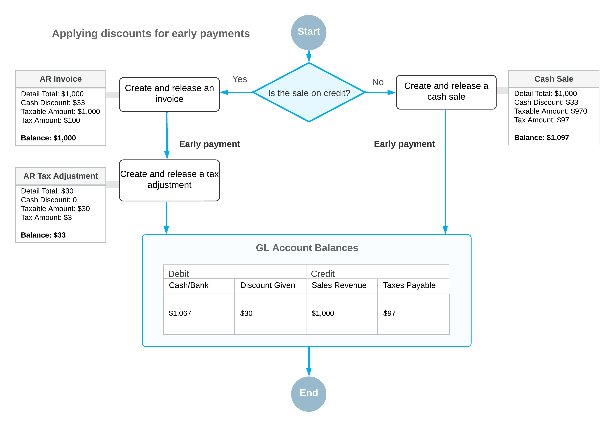

# VAT for Early Payments: General Information {#_a24a03fb-c39c-4ac2-8e5e-84c67b86605b .concept}

To meet the requirements of European value-added tax \(VAT\) legislation on discounts for early payments \(also known as *prompt payment discounts*, or *cash discounts* in Acumatica ERP\), in documents \(such as invoices\) for which the full payment has been received within the cash discount period, the VAT amount must be calculated based on the discounted taxable amount. If the payment is received after the cash discount period, the VAT amount is calculated based on the non-discounted taxable amount of a document. Thus, VAT is to be calculated based on the payment that was actually received by the vendor; as a result, the customer recovers the amount of VAT that has been actually paid.

This functionality is available only if the *VAT Reporting* feature is enabled on the [Enable/Disable Features](CS_10_00_00.md) \(CS100000\) form.

## Learning Objectives {#section_p5m_fjv_vxb .section}

In this chapter, you will learn how to do the following:

-   Create a taxable invoice
-   Process a payment for the invoice within the cash discount period
-   Generate a credit memo to adjust the VAT amount
-   Prepare a new revision of the tax report

## Applicable Scenarios {#section_r5m_fjv_vxb .section}

You adjust VAT for early payments if a VAT on invoices settled within the cash discount period must be calculated based on the discounted taxable amount. Typically, when the invoice is entered into the system, the vendor \(your company\) does not know whether the cash discount will be taken. The invoice must show the entire amount \(without the cash discount applied\) and the VAT calculated on this amount. If the cash discount is taken, you must adjust the VAT charged by issuing a credit memo to reflect the actual amount paid for the goods or services.

## Using VAT for Accounts Receivable {#section_t5m_fjv_vxb .section}

In Acumatica ERP, when you initially enter a document \(such as an invoice or credit memo\), the system shows the VAT amount calculated on the full document amount, because when you enter an invoice, you may not know whether the discount will be taken. However, in the document, you specify the appropriate cash discount terms \(in the **Terms** box\), so the system calculates the discounted taxable amount and tax amount that can be applied if the terms are met. You can view these discounted amounts \(**Tax on Discounted Price** and **Discounted Taxable Total**\) in the **Tax Totals** section on the **Taxes** tab of the [Invoices and Memos](AR_30_10_00.md) \(AR301000\) form, or on the **Totals** tab of the [Invoices](SO_30_30_00.md) \(SO303000\) form.

If the invoice or credit memo is fully paid within the cash discount period—that is, if the payment for the document is released on the [Payments and Applications](AR_30_20_00.md) \(AR301000\) form—then the cash discount is to be applied to that document. In this case, the system leaves the status of the document as *Open* and makes its balance equal to the appropriate cash discount amount \(which has been specified in the **Cash Discount** box\). This document appears in the list of documents on the [Generate AR Tax Adjustments](AR_50_45_00.md) \(AR504500\) form. On this form, you should generate the credit memo or debit memo for the invoice in which the corresponding cash discount amount is specified. This tax adjustment will be automatically applied to the invoice, and after that, this invoice will be *Closed*.

**Tip:** After you have generated a tax adjustment, the invoice will be closed automatically only if the **Automatically Release Tax Adjustments** check box is selected in the **VAT Recalculation Settings** section on the [Accounts Receivable Preferences](AR_10_10_00.md) \(AR101000\) form. Otherwise, you need to release the tax adjustment on the [Release AR Documents](AR_50_10_00.md) \(AR501000\) form manually.

## Using VAT for Accounts Payable {#section_x5m_fjv_vxb .section}

When you initially enter a document \(such as a bill\), the system shows the VAT amount calculated on the full document amount, because when you enter a bill on the [Bills and Adjustments](AP_30_10_00.md) \(AP301000\) form, you may not know whether the discount will be taken. However, in the **Terms** box for the bill, you specify the appropriate credit terms \(which determine the cash discount\), so the system calculates the discounted taxable amount and tax amount that can be applied if the terms are met. You can view these discounted amounts \(**Tax on Discounted Price** and **Discounted Taxable Total**\) in the **Cash Discount Info** section on the **Financial** tab of the [Bills and Adjustments](AP_30_10_00.md) form.

If the bill is fully paid—that is, if a payment for the bill is released on the [Checks and Payments](AP_30_20_00.md) \(AP301000\) form—then the cash discount is to be applied to that bill. In this case, the system leaves the status of the bill as *Open* and makes its balance equal to the appropriate cash discount amount \(which has been specified in the **Cash Discount** box\). This bill appears in the list of documents on the [Generate AP Tax Adjustments](AP_50_45_00.md) \(AP504500\) form. On this form, you generate a debit adjustment for each bill or credit adjustment, or a credit adjustment for each debit adjustment in which the corresponding cash discount amount is specified. This VAT adjustment will be automatically applied to the bill, credit adjustment, or debit adjustment to which the system will assign the *Close* status.

## Configuring a VAT Used for Documents That Are Paid Early {#section_avm_fjv_vxb .section}

If a VAT applies to your company and your company offers cash discounts on documents for which the payment is made in time to qualify for the discount, you need to configure the VAT appropriately in the system.

For documents \(cash sales, cash returns, and cash purchases\) that record payments made immediately, the GL accounts involved in the transaction \(the tax, discount, and cash accounts\) are adjusted at the beginning with the discount percent. The following diagram illustrates how the system applies discounts to AR invoices \(by creating a credit memo\) and to cash sale documents \(by adjusting the amounts immediately\). In either case, the resulting balances of GL accounts are the same.

You configure this tax of the *VAT* type on the [Taxes](TX_20_50_00.md) \(TX205000\) form and select the *Reduce Taxable Amount on Early Payment* option in the **Cash Discount** box.

**Attention:**

Taxes for which *Reduces Taxable Amount* is selected in the **Cash Discount** box on the [Taxes](TX_20_50_00.md) form cannot be used for cash sales, cash returns, or cash purchases if either of the following conditions are met:

-   The documents have discounts
-   The documents have lines for which other types of taxes are applied

For example, a tax with the *Does Not Affect Taxable Amount* option and a tax with the *Reduces Taxable Amount on Early Payment* option can both be used in one document, while a tax with the *Reduces Taxable Amount* option cannot be used in a document for which a tax with the *Reduces Taxable Amount on Early Payment* option is applied.

For details, see [Value-Added Taxes: To Create a General VAT and Exempt VAT](../ImplementationGuide/Taxes_Configuring_VAT_Impem_Activity_General_VAT.md).

Later, if a document with this tax applied is paid in full before the cash discount date specified in the invoice or the bill \(**Cash Discount Date**\), you can generate a credit memo or a debit adjustment to adjust the tax and taxable amounts of the invoice or the bill.

## Generating Credit Memos and Tax Adjustments {#section_jvm_fjv_vxb .section}

On the [Generate AR Tax Adjustments](AR_50_45_00.md) \(AR504500\) form, you can view the list of the documents for which the full payment has been made before the final date of the cash discount period. On this form, you can process the generation of an AR tax adjustment \(for the document or documents that you select\) or tax adjustments \(for all listed documents\) by clicking **Process** or **Process All**, respectively.

Depending on whether you clear or select the **Consolidate Tax Adjustments by Customer** check box on the [Generate AR Tax Adjustments](AR_50_45_00.md) form before processing, you can generate a debit memo for each particular document or one credit memo for a group of documents with similar properties, such as branch, customer, customer location, currency, AR account \(and AR subaccount, if applicable\), and tax zone.

Similarly, you can generate an AP tax adjustment or multiple AP tax adjustments on the [Generate AP Tax Adjustments](AP_50_45_00.md) \(AP504500\) form. If you clear the **Consolidate Tax Adjustments by Vendor** check box on this form before processing, you can generate a tax adjustment for each particular document. If you select this check box, you can generate one tax adjustment for a group of documents with similar properties, such as branch, vendor, vendor location, currency, AP account \(and AP subaccount, if applicable\), and tax zone.

**Tip:** You can schedule the generation of adjusting credit and debit memos to perform this process periodically—for example, nightly or on the last day of each tax period. To do this, you need to click **Schedules** &gt; **Add** on the form toolbar of the [Generate AR Tax Adjustments](AR_50_45_00.md) or [Generate AP Tax Adjustments](AP_50_45_00.md) form, and configure the schedule on the [Automation Schedules](SM_20_50_20.md) \(SM205020\) form.

**Parent topic:**[Adjusting VAT for Early Payments](../UserGuide/Taxes_Adjusting_VAT_Early_Payments_Mapref.md)

