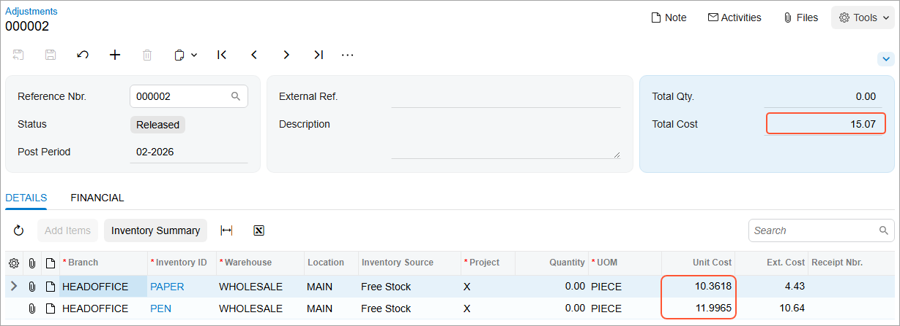

# Taxes Included in the Cost of Items: Process Activity {#_c7525007-6870-4b8e-9a29-c4881c310ef6 .task}

The following activity will walk you through the processing of a purchase that is subject to a sales tax of the *Input* group with this tax included in the cost of the items being purchased.

## Story {#section_ybl_fjv_vxb .section}

Suppose that on February 13, 2026, SweetLife Fruits &amp; Jams company purchased stationery for its office needs \(printing paper and pens\) from the Frontsource Ltd. vendor. The vendor is located in the state of New York—that is, the New York sales tax has to be applied to this purchase.

Acting as a SweetLife purchasing manager, you need to enter the purchase order and process it to completion by creating the related purchase receipt and AP bill. Then you need to review how the processed purchase has affected the cost of the purchased items.

## Configuration Overview {#section_bcl_fjv_vxb .section}

In the *U100* dataset, the following tasks have been performed to support this activity:

-   On the [Enable/Disable Features](CS_10_00_00.md) \(CS100000\) form, the *Inventory* feature, which provides the ability to create purchase orders with stock items, has been enabled
-   On the [Taxes](TX_20_50_00.md) \(TX205000\) form, the *NYSTATETAX* tax has been configured.
-   On the [Tax Zones](TX_20_60_00.md) \(TX206000\) form, the *NYSTATE* tax zone has been configured and *NYSTATETAX* has been added to it.
-   On the [Tax Categories](TX_20_55_00.md) \(TX205500\) form, the *TAXABLE* tax category has been created and *NYSTATETAX* has been added to it.
-   On the [Vendors](AP_30_30_00.md) \(AP303000\) form, the *FRONTSRC \(Frontsource Ltd.\)* vendor has been configured.
-   On the [Stock Items](IN_20_25_00.md) \(IN202500\) form, the *PAPER* and *PEN* stock items have been configured.

## Process Overview {#section_dcl_fjv_vxb .section}

In this activity, you will create a purchase order on the [Purchase Orders](PO_30_10_00.md) \(PO301000\) form, and add lines with taxable stock items to it. Then you will process the related purchase receipt on the [Purchase Receipts](PO_30_20_00.md) \(PO302000\) form, and create the related bill on the [Bills and Adjustments](AP_30_10_00.md) \(AP301000\) form. You will release the bill and review the inventory adjustment that updates the items' costs. On the [Journal Transactions](GL_30_10_00.md) \(GL301000\) form, you will review the GL transaction generated by the system when the inventory adjustment have been released.

## System Preparation {#section_fcl_fjv_vxb .section}

Before you begin performing the steps of this activity, do the following:

1.  Launch the Acumatica ERP website with the *U100* dataset preloaded, and sign in as an accountant Anna Johnson by using the *johnson* username and the *123* password.
2.  In the info area, in the upper-right corner of the top pane of the Acumatica ERP screen, make sure that the business date in your system is set to *2/13/2026*. If a different date is displayed, click the Business Date menu button, and select *2/13/2026*. For simplicity, in this process activity, you will create and process all documents in the system on this business date.
3.  On the Company and Branch Selection menu on the top pane of the Acumatica ERP screen, make sure that the *SweetLife Head Office and Wholesale Center* branch is selected. If it is not selected, click the Company and Branch Selection menu button to view the list of branches that you have access to, and then click *SweetLife Head Office and Wholesale Center*.
4.  As a prerequisite activity, change the settings of the New York State tax \(*NYSTATETAX*\) as described in [Taxes Included in the Cost of Items: Implementation Activity](Taxes_Including_Tax_to_Item_Cost_Implem_Activity.md).

## Step 1: Creating a Purchase Order {#section_hcl_fjv_vxb .section}

To create a purchase order, do the following:

1.  Open the [Purchase Orders](PO_30_10_00.md) \(PO301000\) form.

    **Tip:** To open the form for creating a new record, type the form ID in the Search box, and on the Search form, point at the form title and click **New** right of the title.

2.  Click **Add New Record** on the form toolbar, and specify the following settings in the Summary area:
    -   **Type**: *Normal*
    -   **Vendor**: *FRONTSRC*
    -   **Date**: *2/13/2026* \(the current business date, which is inserted by default\)
    -   **Promised On**: *2/13/2026* \(inserted by default based on the selected date\)
    -   **Description**: `Purchase of stationery`
3.  On the **Details** tab, add rows with the following settings:

    |Branch|Inventory ID|Warehouse|Order Qty.|Unit Cost|Tax Category|
    |------|------------|---------|----------|---------|------------|
    |*HEADOFFICE* \(inserted by default\)|*PAPER*|*WHOLESALE*|`5`|`9.99`|*TAXABLE*|
    |*HEADOFFICE* \(inserted by deafult\)|*PEN*|*WHOLESALE*|`10`|`11.99`|*TAXABLE*|

4.  On the **Taxes** tab, review the tax calculated for the purchase order.

    For both purchase order lines, you selected the *TAXABLE* category. It contains the *NYSTATETAX* tax with the 8.875% tax rate, which has been applied to the purchase order. The taxable amount is $169.85, and the calculated total tax is $15.07.

5.  On the form toolbar, click **Save** to save your changes.
6.  On the form toolbar, click **Remove Hold** so you can continue processing the purchase order. Now it has the *Open* status.

## Step 2: Processing the Purchase Receipt and AP Bill {#section_kcl_fjv_vxb .section}

To create a purchase receipt and an AP bill for the purchase order, do the following:

1.  On the form toolbar of the [Purchase Orders](PO_30_10_00.md) \(PO301000\) form while you are still viewing the purchase order, click **Enter PO Receipt**.

    The system prepares the purchase receipt for the selected purchase order and opens it on the [Purchase Receipts](PO_30_20_00.md) \(PO302000\) form.

2.  In the Summary area of this form, select the **Create Bill** check box and save your changes.
3.  On the form toolbar, click **Release**.
4.  On the **Billing** tab, click the **Reference Nbr.** link to open the bill that the system has created on the [Bills and Adjustments](AP_30_10_00.md) \(AP301000\) form.
5.  On the **Taxes** tab, review the tax that was applied to the bill, and make sure it is the same tax that was applied to the purchase order.
6.  On the form toolbar, click **Release** to release the bill.
7.  On the **Taxes** tab, click the **Adjustment Nbr.** link.
8.  On the [Adjustments](IN_30_30_00.md) \(IN303000\) form, which opens with the inventory adjustment transaction that was generated on release of the AP bill \(see the screenshot below\), review this adjustment.

    The **Total Cost** of the adjustment, shown in the Summary area, is equal to the calculated tax \($15.07\). On the **Details** tab, the **Unit Cost** column shows the cost of each item with accumulated tax.

    

9.  On the **Financial** tab, click the **Batch Nbr.** link and review the generated GL transaction on the [Journal Transactions](GL_30_10_00.md) \(GL301000\) form, which is opened. Notice that for each purchased item, the system has generated the following entries:
    -   The Inventory account of the stock item \(*12100*\) is debited in the amount of the tax calculated for each line.
    -   The PO Accrual account of the stock item \(*20100*\) is credited in the amount of the tax calculated for each line.

**Parent topic:**[Including Taxes in the Cost of Items](../UserGuide/Taxes_Including_Tax_to_Item_Cost_Mapref.md)

