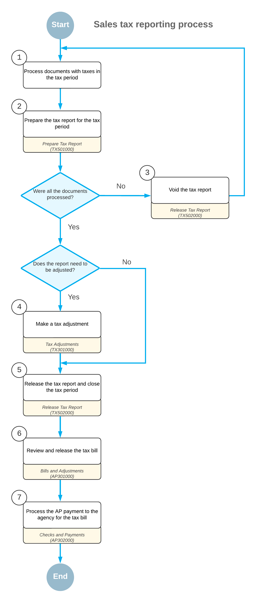

# Tax Report Preparation: Overview of the Tax Reporting Process {#_c94d67fa-3b5b-46c5-a5f5-12276031df7e .concept}

The diagram below displays the process of reporting taxes in Acumatica ERP.

You start with creating and processing documents with taxes \(Item 1 in the diagram\) for which the system automatically calculates taxes based on the specified settings. After you have processed all the needed documents, you prepare the tax report for the tax period \(2\).

If you have prepared the tax report and then you have realized that some documents were not processed, you need to void the report \(3\) and process all the needed documents; you then re-prepare the tax report for the period. If you need to amend the tax amounts and taxable amounts included in the prepared tax report, you make tax adjustments \(4\).

After all the required documents have been processed and all the adjustments have been made, you release the tax report, and the tax period is closed in the system \(5\). After closing the tax period, you review and release the tax bill that the system has generated for the tax agency \(6\). When an AP payment to the tax agency for the tax bill has been processed \(7\), the tax reporting process is closed.

**Parent topic:**[Preparing a Tax Report for Sales Taxes](../UserGuide/Taxes_Preparing_a_Tax_Report_Mapref.md)

