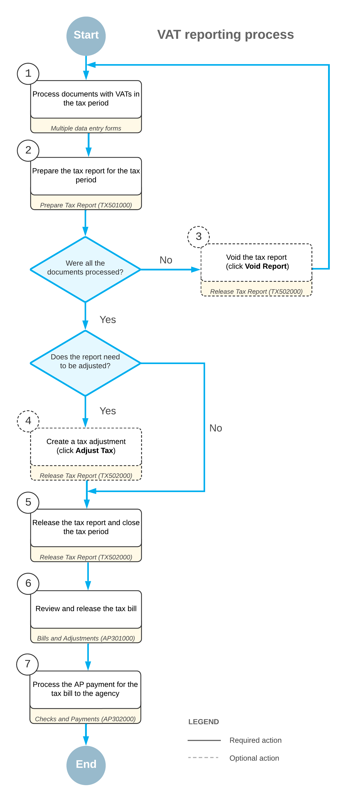

# Tax Report for VAT: General Information {#_9648a697-16a0-4622-af68-b2058c092c47 .concept}

At the end of the tax period, you need to prepare and release the tax report. The system automatically generates tax periods for the current year when you prepare the tax report for the first period of the year. There can be multiple open tax periods in which you process tax invoices. When you prepare a tax report for the tax period, it is assigned the *Prepared* status. Once you have released the prepared tax report for the tax period, this tax period becomes closed.

## Learning Objectives {#section_fn4_fjv_vxb .section}

In this chapter, you will learn how to do the following:

-   Prepare a tax report
-   Release the tax report and close the tax period

## Applicable Scenarios {#section_hn4_fjv_vxb .section}

You prepare a tax report for an open tax period if the previous tax period has been closed and after the tax period to be reported on has ended.

## VAT Reporting Process {#section_jn4_fjv_vxb .section}

The process of reporting value-added taxes in Acumatica ERP is displayed on the diagram below.

You start with creating and processing the documents with taxes \(1\), for which the system automatically calculates taxes based on the specified settings. After you have processed all the needed documents, you prepare the tax report for the tax period \(2\). If you have prepared the tax report and then you recognized some documents that were not processed, you need to void the tax report \(3\) and process all the needed documents; you then re-prepare the tax report for the period. If you need to amend tax amounts and taxable amounts included in the prepared tax report, you create tax adjustments \(4\). After all the required documents have been processed and all the adjustments have been made, you release the tax report, and the tax period is closed in the system \(5\). When the tax period is closed, you review and release the tax bill that the system has generated for the tax agency \(6\). When an AP payment for the tax bill to the tax agency is processed \(7\), the tax reporting process is completed for the tax period.

## Preparation of a Tax Report for an Open Reporting Period {#section_mn4_fjv_vxb .section}

Acumatica ERP provides functionality that simplifies the process of tax calculation and tax report preparation. You can configure the tax report according to the requirements of the respective tax agency \(for details, see [Tax Agency](../Shared/../ImplementationGuide/Taxes_TaxAgency_Mapref.md)\), set up tax calculation rules, and then generate a tax report.

In Acumatica ERP, you can prepare a tax report for a particular tax agency. A tax report can be prepared either for an open reporting period or for a closed reporting period if the **Update Closed Tax Periods** check box is selected for the tax agency on the **Tax Agency** tab of the [Vendors](../Shared/../UserGuide/AP_30_30_00.md) \(AP303000\) form. The frequency of preparing tax reports depends on the setting that you specify for the tax agency in the **Default Tax Period Type** box on the [Vendors](../Shared/../UserGuide/AP_30_30_00.md) form. This setting can be overridden for the particular company on the [Tax Periods](../Shared/../UserGuide/TX_20_70_00.md) \(TX207000\) form.

If your tenant contains multiple companies \(and if a company type is *With Branches Requiring Balancing*\), you can prepare a tax report for each particular company or for a particular branch if you file taxes by branch—that is, if the **File Taxes by Branch** check box is selected for the company on the [Companies](../Shared/../UserGuide/CS_10_15_00.md) \(CS101500\) form. If you report taxes by branches for a company, you need to prepare tax reports for all branches of the company and then close the tax period for the company.

To prepare a tax report for an open reporting period, on the [Prepare Tax Report](../Shared/../UserGuide/TX_50_10_00.md) \(TX501000\) form, you should select the required company and branch \(if you report taxes by branches\), the tax agency, and the reporting period. You can select a period on this form if the **Update Closed Tax Periods** check box is selected for the tax agency on the **Tax Agency** tab of the [Vendors](../Shared/../UserGuide/AP_30_30_00.md) \(AP303000\) form. If the check box is cleared, the first open tax period is selected automatically by the system and disabled.

**Important:** All previous reporting periods must be closed.

The tax report structure that was previously configured for the selected tax agency appears with the tax amounts and taxable amounts inserted into its lines. The system recalculates these values each time a user opens the [Prepare Tax Report](../Shared/../UserGuide/TX_50_10_00.md) form, based on the taxable documents released in the system.

To initiate tax report preparation, you click **Prepare Tax Report** on the form toolbar of the [Prepare Tax Report](../Shared/../UserGuide/TX_50_10_00.md) form. The system prepares the tax report and opens the [Release Tax Report](../Shared/../UserGuide/TX_50_20_00.md) \(TX502000\) form.

When you prepare the report for the first period of the tax year, the system generates periods with the *Open* status for this year. On the [Tax Periods](../Shared/../UserGuide/TX_20_70_00.md) \(TX207000\) form, you can review the periods that have been generated by the process \(or that will be generated if you select an upcoming year on the form\).

**Attention:** If on the [Prepare Tax Report](../Shared/../UserGuide/TX_50_10_00.md) form, you prepare a tax report for a company or tax agency for the first time, the system prepares a tax report for the tax period that corresponds to the earliest of two dates: the current business date, or the date of the earliest taxable document. The process automatically generates tax periods for the entire tax year while closing any preceding periods for which there are no taxable documents.

If a user voids a tax report run for the first period of the tax year, the system deletes the tax periods for this year. This process is demonstrated in [Voiding of a Sales Tax Report: Process Activity](../Shared/../UserGuide/Taxes_Voiding_a_Tax_Report_Activity.md).

## AP Documents Generated on Release of the Tax Report {#section_nn4_fjv_vxb .section}

You can set up the system to generate an AP bill once the tax report is released. The AP bill will contain the total tax amount that you must pay to the tax agency for the selected reporting period according to the released tax report. After the tax report is released, the corresponding AP bill appears in the list on the **AP Documents** tab of the [Release Tax Report](../Shared/../UserGuide/TX_50_20_00.md) \(TX502000\) form.

**Tip:** If your company type is *With Branches Requiring Balancing* and you file taxes by company branches—that is, the **File Taxes by Branch** check box is selected for the company on the **Company Details** tab of the [Companies](../Shared/../UserGuide/CS_10_15_00.md) \(CS101500\) form—prepare tax reports for all branches first, and then release the company tax report.

If the tax agency owes money to your company according to the documents included in the revision, the system generates an AP debit adjustment. This can happen in the following cases:

-   The total tax to be claimed exceeds the total tax to be paid if the tax is a VAT
-   The total tax amount in credit memos exceeds the total tax amount in invoices
-   The **Net Tax** amount is negative

To set up the system to generate an AP bill while releasing a tax report, on the [Reporting Settings](../Shared/../UserGuide/TX_20_51_00.md) \(TX205100\) form for the report, you need to configure a reporting line that accumulates appropriate tax amount, and select the **Net Tax** check box for that line. If this check box is selected and the **Automatically Generate Tax Bill** check box is selected for the tax agency on the **Tax Agency** tab of the [Vendors](../Shared/../UserGuide/AP_30_30_00.md) \(AP303000\) form, the system will generate AP bills when a tax report is released.

If you prepare and release a tax report for a closed tax period \(that is, for a period for which the tax report has been already released; for details, see [Tax Report Preparation: To Prepare a Tax Report for a Closed Tax Period](../Shared/../UserGuide/TX__how_To_Prepare_a_Tax_Report_for_Closed_Reporting_Period.md)\), the system will generate another AP bill according to this revision of the tax report. This AP bill will be listed on the **AP Documents** tab \(in addition to the AP bill generated by the previous release\). Each AP bill will contain the amount of the particular tax report revision.

## Closing the Tax Period {#section_on4_fjv_vxb .section}

When the tax report is released, the system automatically closes the tax period. Taxable invoices posted after the tax period has been closed will be reported in the next open period.

If you do not want the invoices to be reported in the next open period, you can prepare a revision of the tax report for the closed tax period \(if this is allowed by the tax agency\) to include the invoices to the next revision of the tax report for the period. For more details, see [Tax Report Preparation: To Prepare a Tax Report for a Closed Tax Period](../Shared/../UserGuide/TX__how_To_Prepare_a_Tax_Report_for_Closed_Reporting_Period.md).

## Tax Report Revisions {#section_pn4_fjv_vxb .section}

On the [Release Tax Report](../Shared/../UserGuide/TX_50_20_00.md) \(TX502000\) form, you can prepare a tax report for the same or a closed reporting period if the **Update Closed Tax Periods** check box is selected for the tax agency on the **Tax Agency** tab of the [Vendors](../Shared/../UserGuide/AP_30_30_00.md) \(AP303000\) form. Each time you prepare a tax report for a closed period, the revision number displayed in the **Revision** box on the [Release Tax Report](../Shared/../UserGuide/TX_50_20_00.md) form is incremented by 1.

On the [Release Tax Report](../Shared/../UserGuide/TX_50_20_00.md) form, you can also view the details of different revisions of the tax report that have been prepared for the same or closed reporting period. On this form, in the **Revision** box, you can review all possible revisions of this tax report. You can select any number in the box to view the respective report details. For more information, see [Purchases with Use Taxes: Process Activity](../Shared/../UserGuide/Taxes_Processing_Purchase_with_UseTax_Activity.md) and [VAT for Early Payments: To Prepare a New Revision of VAT Tax Report](../Shared/../UserGuide/Taxes_Adjusting_VAT_Early_Payments_Process_Activity2.md).

**Parent topic:**[Preparing a Tax Report for Value-Added Taxes](../UserGuide/Taxes_Preparing_a_Tax_Report_VAT_Mapref.md)

