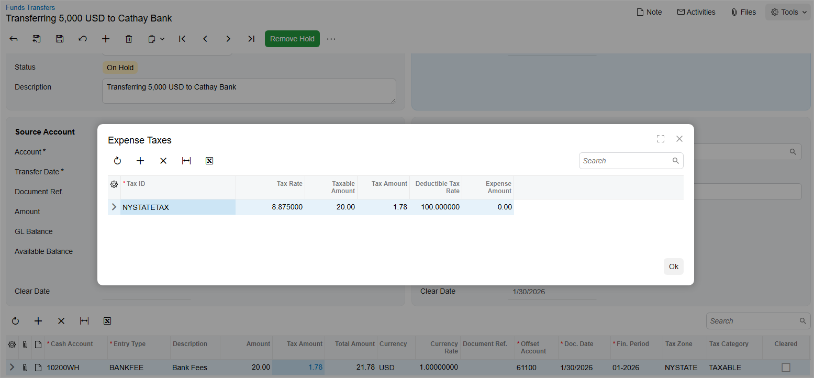

# Funds Transfers with Taxable Fees: Process Activity {#_8dba8161-f2b2-481c-943f-82ab4754304c .task}

The following activity will walk you through the process of performing a funds transfer with taxable fees.

## Story {#section_ijj_fjv_vxb .section}

Suppose that in January 2026, the Head office of SweetLife needs to transfer $5,000 to the company's account in Cathay Bank \(*10300WH*\), which is currently empty. The bank fee for this funds transfer is $20 and is taxable.

Acting as a SweetLife accountant, you need to perform the funds transfer from the *10200WH \(Wholesale Checking\)* account to the *10300WH - Cathay Bank Savings* and record the taxable bank fee that should be paid from the *10200WH* account.

## Configuration Overview {#section_tz4_djx_cnb .section}

In the *U100* dataset, the following tasks have been performed to support this activity:

-   On the [Entry Types](CA_20_30_00.md) \(CA203000\) form, the *BANKFEE* entry type with the *Disbursement* type has been configured.
-   On the [Cash Accounts](CA_20_20_00.md) \(CA202000\) form, the *10300WH* cash account has been configured. The *10200WH* cash account has been configured and the *BANKFEE* entry type has been added to it on the **Entry Types** tab.
-   On the [Taxes](TX_20_50_00.md) \(TX205000\) form, the *NYSTATETAX* tax has been configured.
-   On the [Tax Zones](TX_20_60_00.md) \(TX206000\) form, the *NYSTATE* tax zone has been configured and *NYSTATETAX* has been added to it.
-   On the [Tax Categories](TX_20_55_00.md) \(TX205500\) form, the *TAXABLE* tax category has been created and *NYSTATETAX* has been added to it.
-   On the [Cash Management Preferences](CA_10_10_00.md) \(CA101000\) form, the **Automatically Post to GL on Release** is selected.

## Process Overview {#section_mjj_fjv_vxb .section}

In this activity, you will first modify the settings of the *10200WH* cash account on the [Cash Accounts](CA_20_20_00.md) \(CA202000\) form by adding the tax zone to the *BANKFEE* entry type of this cash account. Then on the [Funds Transfers](CA_30_10_00.md) \(CA301000\) form, you will record a funds transfer in the amount of $5,000 from the *10200WH* cash account to the *10300WH* cash account. On the form table, you will add a bank fee for this transfer and specify the tax zone and tax category for this line. You will then open the **Expense Taxes** dialog box to review the tax that has been automatically applied by the system to this expense line.

## System Preparation {#section_ojj_fjv_vxb .section}

Before you begin performing the steps of this activity, do the following:

1.  Launch the Acumatica ERP website and sign in to a company with the *U100* dataset preloaded. You should sign in as Anna Johnson by using the *johnson* username and the *123* password.
2.  In the info area at the upper-right corner of the top pane of the Acumatica ERP screen, make sure that the business date is set to *1/30/2026*. If a different date is displayed, click the Business Date menu button and select *1/30/2026* from the calendar. For simplicity, you'll create and process all documents in this activity using this business date.
3.  On the Company and Branch Selection menu on the top pane of the Acumatica ERP screen, select the *SweetLife Head Office and Wholesale Center* branch.

## Step 1: Specifying the Tax Zone for the Entry Type {#section_qjj_fjv_vxb .section}

To specify the tax zone for the *Disbursement* entry type used by the *10200WH* account, do the following:

1.  Open the [Cash Accounts](CA_20_20_00.md) \(CA202000\) form.
2.  In the **Cash Account** box, select *10200WH - Wholesale Checking*.
3.  On the **Entry Types** tab, make sure that the *BANKFEE* entry type has been added.
4.  In the **Tax Zone** column for the *BANKFEE* entry type, select *NYSTATE*.
5.  On the form toolbar, click **Save** to save your changes.

## Step 2: Processing a Funds Transfer {#section_sjj_fjv_vxb .section}

To process a funds transfer with a bank fee, do the following:

1.  Open the [Funds Transfers](CA_30_10_00.md) \(CA301000\) form.

    **Tip:** To open the form for creating a new record, type the form ID in the Search box, and on the Search form, point at the form title and click **New** right of the title.

2.  On the form toolbar, click **Add New Record**, and in the **Description** box of the Summary area, type `Transferring 5,000 USD to Cathay Bank`.
3.  In the **Source Account** section, specify the following settings:

    -   **Account**: *10200WH - Wholesale Checking*
    -   **Transfer Date**: *1/30/2026* \(inserted automatically\)
    -   **Document Ref.**: `325676330`
    -   **Amount**: `5000`
    These settings indicate that $5,000 will be transferred from the *10200WH - Wholesale Checking* account on January 30, 2026.

4.  In the **Destination Account** section, specify the following settings:

    -   **Account**: *10300WH - Cathay Bank Savings*
    -   **Receipt Date**: *1/30/2026*
    These settings indicate that the funds will be transferred to the *10300WH* account, which is the company's account in Cathay Bank.

5.  On the table toolbar, click **Add Row** and specify the following settings for the added row:

    -   **Cash Account**: *10200WH*
    -   **Entry Type**: *BANKFEE*
    -   **Amount**: `20`
    -   **Tax Zone**: *NYSTATE* \(inserted automatically by the system\)
    -   **Tax Category**: *TAXABLE*
    Notice that the tax zone has been selected in the **Tax Zone** column automatically by the system, because you specified it for the entry type in Step 1.

6.  In the **Tax Amount** column, click the link that the system has inserted. The **Expense Taxes** dialog box opens, as shown in the following screenshot.

    

7.  Review the tax that the system has automatically applied to this bank fee and click **OK** to close the dialog box.
8.  On the form toolbar, click **Save** to save the funds transfer.
9.  On the form toolbar, click **Remove Hold** and then click **Release** to release the funds transfer.
10. In the **Destination Account** section, click the link in the **Batch Number** box, and review the transaction, which the system has opened on the [Journal Transactions](GL_30_10_00.md) \(GL301000\) form, as follows:

    -   The company checking account \(*10200*\) is credited in the amount of the transfer and in the total amount of bank fees \(which is the fee amount plus the amount of calculated taxes\).
    -   The company bank account \(*10300*\) is debited in the amount of the transfer.
    -   The tax expense account \(*65100*\) is debited in the amount of tax calculated on fees.
    -   The offset account specified for the cash entry type \(*61100*\) is debited in the fee amount to record the expenses.
    The system has posted the batch to the general ledger on release of the funds transfer because the **Automatically Post to GL on Release** check box on the [Cash Management Preferences](CA_10_10_00.md) \(CA101000\) form is selected.

**Parent topic:**[Processing Funds Transfers with Taxable Fees](../UserGuide/Taxes_Processing_Funds_Transfers_with_Taxable_Expenses_Mapref.md)

