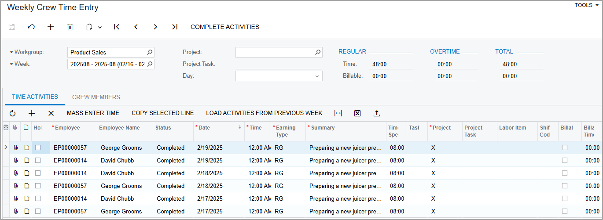

# Employee Time Entry: To Create a Crew Time Activity {#_a7b14392-9691-460b-be66-2b440c14fde4 .task}

The following activity will walk you through the process of creating a crew time activity.

**Attention:** This activity is based on the *U100* dataset. If you are using another dataset or if any system settings have been changed in *U100*, these changes can affect the workflow of the activity and the results of the processing. To avoid issues, restore the *U100* dataset to its initial state.

## Story { .section}

Suppose that David Chubb and George Grooms, employees of the *Product Sales* workgroup in the sales department of the SweetLife Fruits &amp; Jams company, have collaborated on preparing a juicer presentation for customers. They both spent three days working on this large presentation. Now David needs to record the spent time in the system for both of them as members of the workgroup \(that is, the crew\).

Acting as David Chubb, you will create a crew time activity and record the amount of time spent by both David and George on the presentation.

## Configuration Overview {#section_tz4_djx_cnb .section}

In the *U100* dataset, the following tasks have been performed to support this activity:

-   The *Time Management* feature is enabled on the [Enable/Disable Features](CS_10_00_00.md) \(CS100000\) form.
-   On the [Company Tree](EP_20_40_61.md) \(EP204061\) form, the *Product Sales* workgroup has been created. This group consists of *David Chubb* and *George Grooms*.

## Process Overview { .section}

On the [Weekly Crew Time Entry](EP_30_71_00.md) \(EP307100\) form, you will create time activities for the entire crew \(that is, the *Product Sales* workgroup\) and then complete and release the time activities.

## System Preparation { .section}

To sign in to the system and prepare to perform the instructions of the activity, launch the Acumatica ERP website, and sign in as David Chubb by using the *chubb* username and the *123* password.

## Step 1: Entering Weekly Time for a Crew { .section}

To enter group time activities for members of the *Product Sales* workgroup, do the following:

1.  On the [Weekly Crew Time Entry](EP_30_71_00.md) \(EP307100\) form, add a new record.
2.  In the Summary area, specify the following settings:
    -   **Workgroup**: *Product Sales*
    -   **Week**: Select *2025-08*
3.  On the table toolbar of the **Time Activities** tab, click **Mass Enter Time**.
4.  In the left pane of the **Mass Enter Time** dialog box, which opens, do the following:
    1.  Select the **Show All Members** check box.
    2.  Select the unlabeled check box for each employee in the table.
5.  In the right pane of the **Mass Enter Time** dialog box, add three rows with the settings shown in the table below. Leave the default values in the columns that are not included in the table.

    |Date|Time Spent|Summary|Billable|
    |----|----------|-------|--------|
    |*02/17/2025*|*08:00*|`Preparing a juicer presentation for customers`|Cleared|
    |*02/18/2025*|*08:00*|`Preparing a juicer presentation for customers`|Cleared|
    |*02/19/2025*|*08:00*|`Preparing a juicer presentation for customers`|Cleared|

6.  Click **Add &amp; Close**.

    The system adds six rows to the table—three dates for each of two workgroup members specified in the **Mass Enter Time** dialog box.

7.  On the form toolbar, click **Complete Activities** and then click **Save**. The activities should look as shown in the following screenshot.

    

## Step 2: Releasing the Time Activities { .section}

To release the time activities of the product sales crew so that they become available in payroll, do the following:

1.  On the [Release Time Activities](EP_50_70_20.md) \(EP507020\) form, click the header of the **Workgroup** column of the table and add a filter for the *Product Sales* workgroup. Six time activities should be shown in the table.
2.  On the form toolbar, click **Release All**. The system releases the time activities.

You have created and released the time activities for the crew.

**Parent topic:**[Entering Employee Time](../UserGuide/TimeExpenses_Entering_Employee_Time_Mapref.md)

