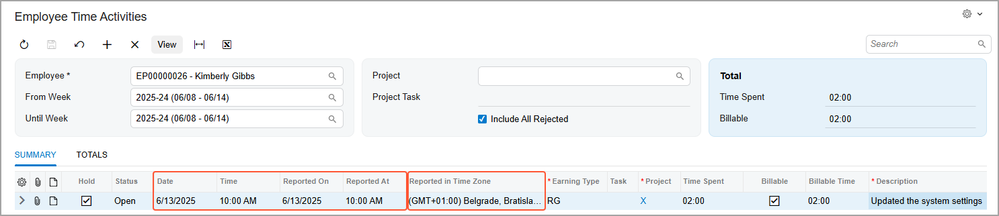
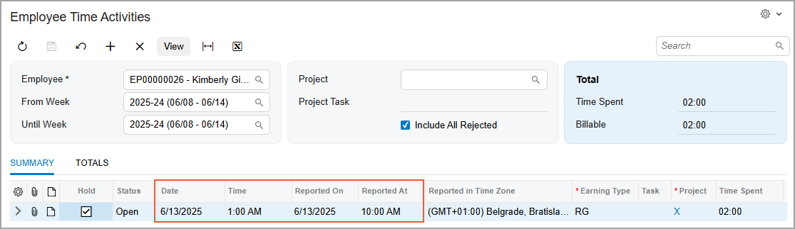

# Employee Time Entry: Time Zones in Time Activities {#_e8e87994-f74c-45c4-aa60-66a5f346b3fd .concept}

A time zone reflects the local time for a specific geographic area. In Acumatica ERP, the system determines your current time zone and uses this time zone to display the date and time in a time activity you’re viewing. This is true of time activities created on the following forms:

-   [Employee Time Cards](EP_30_50_00.md) \(EP305000\)
-   [Employee Time Activities](EP_30_70_00.md) \(EP307000\)
-   [Activity](CR_30_60_10.md) \(CR306010\)
-   [Email Activity](CR_30_60_15.md) \(CR306015\)
-   [Daily Field Report](PJ_30_40_00.md) \(PJ304000\)
-   [Weekly Crew Time Entry](EP_30_71_00.md) \(EP307100\)
-   [Appointments](FS_30_02_00.md) \(FS300200\)
-   [Create Labor Time Activities](AM_51_30_00.md) \(AM513000\)

## Determination of the Time Zone { .section}

When you're viewing a time activity—whether it's one you're creating, one you've created in the past, or one created by another employee—the system fills the **Date** and **Time** UI elements by using your current time zone. To determine your current time zone, it checks the following forms and applies the first one it finds:

1.  [User Profile](SM_20_30_10.md) \(SM203010\): The time zone you’ve specified for your user account.

    **Tip:** You can enter or change this time zone at any time.

2.  [Work Calendar](CS_20_90_00.md) \(SC209000\): The time zone of the calendar specified for your employee account, if one has been associated with your user account.
3.  [Site Preferences](SM_20_05_05.md) \(SM200505\) form: The system-wide default time zone that has been set by a system administrator.

If no time zone is found, the system uses UTC+0.

**Tip:** UTC \(which means *Universal Time Coordinated*, also referred to as *Coordinated Universal Time*\) is a precise global time standard used as a point of reference for time zones. UTC represents the current time without regard to daylight saving time or geographic location, ensuring consistency across time zones. Every time zone is defined by its difference from UTC, which is known as its *UTC offset*.

If you're creating the activity, the system determines the time zone by using this algorithm. Then it saves the time zone it has selected and stores the date and time in UTC.

## Time-Related Data { .section}

While viewing a time activity on most forms, you’ll see the date and time in both your current time zone and the zone where the activity was entered. The system displays the following columns:

-   **Date** and **Time**: The values in your current time zone. If your time zone changes, these values will reflect the current time zone.
-   **Reported On** and **Reported At**: The date and time in the original time zone, as recorded when the time activity was created.
-   **Reported in Time Zone**: The time zone used at the time of entry.

**Tip:** These columns are read-only and hidden by default. You can make them visible by using the Column Configuration dialog box.

You can view these columns on the following forms:

-   [Employee Time Cards](EP_30_50_00.md) \(EP305000\): **Details** tab
-   [Employee Time Activities](EP_30_70_00.md) \(EP307000\): **Details** tab
-   [Daily Field Report](PJ_30_40_00.md) \(PJ304000\): **Labor Time and Activities** tab
-   [Weekly Crew Time Entry](EP_30_71_00.md) \(EP307100\): **Time Activities** tab
-   [Approve Time Activities](EP_50_70_10.md) \(EP507010\): **Details** tab
-   [Release Time Activities](EP_50_70_20.md) \(EP507020\): **Details** tab

When you review time activities on the [Employee Time Cards](EP_30_50_00.md), [Employee Time Activities](EP_30_70_00.md), and [Weekly Crew Time Entry](EP_30_71_00.md) forms, the system shows the particular time activities if their **Reported On** date falls within the specified week or week range.

## Example: Time Zone Changes in Action { .section}

Suppose that you’ve specified the *GMT+1 \(Belgrade\)* time zone for your user account on the [User Profile](SM_20_30_10.md) \(SM203010\) form.

When you create a time activity on the [Employee Time Activities](EP_30_70_00.md) \(EP307000\) form:

-   The **Date** and **Time** columns display the date and time in your user account's time zone *\(GMT+1\)*.
-   The **Reported On** date and **Reported At** time match the **Date** and **Time** \(as shown below\) because you’re viewing the activity in the same time zone it was reported in.
-   The **Reported in Time Zone** column confirms that the system has correctly saved your time zone as *\(GMT+1\)*.

Later, while traveling for business, you manually change your time zone on the [User Profile](SM_20_30_10.md) form to *GMT-8 \(Pacific Time US &amp; Canada\)*. When you open the same time activity again, the system displays \(as shown below\):

-   **Date** and **Time** in your current time zone *\(GMT-8\)*
-   The **Reported On** date and **Reported At** time in the original time zone *\(GMT+1\)*

This ensures that your reported time always reflects the correct date and time, even if you are in a different time zone.

## Changes to Reported Data { .section}

In some cases, you may need to update the values in either the **Reported On** or **Reported At** columns of a time activity \(or both of them\)—for example, to ensure that the correct date is reflected in a project transaction. To do this, update the **Date** and **Time** columns of the time activity.

If your current time zone differs from the original time zone, when you update **Date** and **Time**, the system also updates the value in the **Reported in Time Zone** column based on your current time zone.

Consider this example: A time activity was originally reported with the D1 date and the T1 time in the TZ1 time zone. If you edit the date and time while working in the TZ2 time zone, the system updates the values as follows:

-   **Date**: D2
-   **Time**: T2
-   **Reported On**: D2
-   **Reported At**: T2
-   **Reported in Time Zone**: TZ2

**Parent topic:**[Entering Employee Time](../UserGuide/TimeExpenses_Entering_Employee_Time_Mapref.md)

