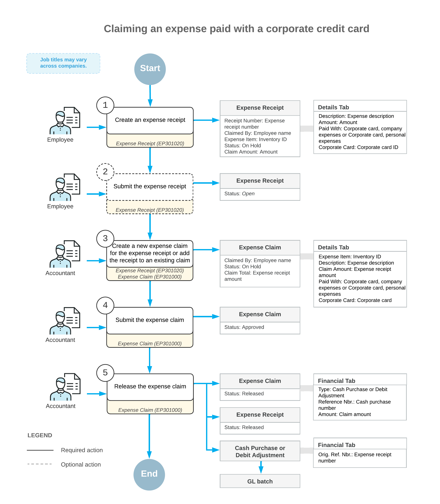

# Expense Receipts with Corporate Cards: General Information {#_a394c60d-5b80-44cb-acc4-34602b8efd17 .concept}

Acumatica ERP supports the use of corporate credit cards in expense receipts and expense claims. This helps employees to categorize and track expenses, including the expenses related to a project. For example, while in the field, employees can buy something that they want to charge on a project and pay for it with a corporate card. Employees can also have out-of-pocket expenses that are then reimbursed to these employees.

## Learning Objectives { .section}

In this chapter, you will learn how to do the following:

-   Create an expense receipt for company expenses paid by the corporate credit card
-   Process an expense claim for the expense receipt paid with the corporate credit card
-   Process personal expenses paid with the corporate credit card
-   Process company expenses paid with a personal account
-   Review the documents and transactions that are generated on release of the expense claim
-   Reconcile the balance of the corporate credit card in the system

## Applicable Scenarios { .section}

You process an expense receipt with a corporate credit card if you are an employee who incurs expenses for the company and wants to record expenses paid by a company credit card.

You process an expense claim for expense receipts, including receipts paid with corporate credit cards, if you are an accountant who wants to process the recorded expenses.

## Payment of Expense Receipts with Corporate Cards { .section}

On the [Expense Receipt](EP_30_10_20.md) \(EP301020\) form, you create expense receipts for the employee account that is associated with your user account. You can also create expense receipts for any subordinates. In each expense receipt, you specify the key settings as follows:

-   In the **Amount** box, you specify the amount paid with a corporate card. You can specify the amount in the card currency or in a foreign currency.

    **Attention:** If the *Multiple Base Currency* feature is enabled on the [Enable/Disable Features](../Shared/../UserGuide/CS_10_00_00.md) \(CS100000\) form, the base currency of the cash account that corresponds to the corporate card must be the same as base currency of the employee. For more information on configuring multiple base currencies, see [Multiple Base Currencies: General Information](../Shared/../ImplementationGuide/config_Multicurrency_MultipleBaseCurrencies_GeneralInfo.md).

    In each line with corporate card expenses, you can specify a positive amount to claim expenses, or a negative amount, which means that you should refund these expenses to the corporate card. For more information about processing a refund of company expenses paid with a corporate card, see [Expense Returns to Corporate Cards: General Information](TimeExpenses_Expense_Returns_GeneralInfo.md).

-   In the **Paid With** box \(in the **Expense Details** section of the **Details** tab\), you select how the expense receipt has been paid. The following options are available:
    -   *Personal Account*: The company expenses that you \(the employee\) paid with your own funds; the company will need to reimburse this amount to you. This is the default option if your employee account has no active corporate card assigned.
    -   *Corporate Card, Company Expense*: The company's expenses that are paid with a corporate card. This is the default option if your employee account has an active corporate card assigned.

        Corporate card expenses cannot be split. That is, on the [Expense Receipt](EP_30_10_20.md) form, in the **Expense Details** section of the **Details** tab, the **Employee Part** of an expense receipt paid with a corporate card must be *0*.

    -   *Corporate Card, Personal Expense*: Your personal expenses that are paid with a corporate card.
-   For the lines with the *Corporate Card, Company Expense* or *Corporate Card, Personal Expense* method in the **Paid With** column, you select the corporate card from which the expenses have been paid in the **Corporate Card** box. By default, the system specifies the corporate card in this box as follows:
    -   The corporate card used in the employee's most recent expense receipt is selected \(if the corporate card is still active in the system and assigned to the employee\). The most recent receipt is determined by the receipt's creation date.
    -   If the corporate card that was used most recently is unavailable—that is, inactive, deleted, or no longer assigned to the employee—the system inserts the employee's only active card or the first active card it finds for the employee. The first corporate card is the first card in the employee's card list; this list is sorted alphabetically by name.
-   In the **Ref. Nbr.** box, you enter the reference number that usually matches the number of the original receipt.
-   In the **Project/Contract**, **Project Task**, and **Cost Code** boxes, you enter the contract, or the project budget key, if the incurred expenses are related to a particular project or contract.

## Claiming of Expense Receipts Paid with Corporate Cards { .section}

On the [Expense Claim](EP_30_10_00.md) \(EP301000\) form, you can claim with a single expense claim all of your expense receipts paid with corporate cards. Each expense claim line on the **Details** tab contains a link to an expense receipt. If you create a new expense claim line on the form that doesn’t originate from any expense receipt, on release of the expense claim, the system creates the corresponding expense receipt for that expense claim line and inserts the link into the expense claim.

After you have added expense claim lines, you click **Submit** to assign the expense claim the *Approved* status. Then you click **Release**. The system assigns the expense claim the *Closed* status and creates the corresponding AP documents for the expenses. On release of the AP documents, the system generates a project transaction \(if expenses are related to a particular project\) and the corresponding GL transaction. On release of this project transaction, the system updates the actual amount in the corresponding project budget line to decrease the expenses recorded to the project budget and returns the refunded amount to the balance of the credit card.

The following table summarizes the types of the documents that are prepared on release of the expense claim, depending on the sign of the amount in the line and the value in the **Paid With** column.

|Paid With|Total Line Amount|AP Document Type|Number of Documents|
|---------|-----------------|----------------|-------------------|
|*Personal Account*|Positive|AP bill|A single document for all expense claim lines of this type|
|*Personal Account*|Negative|AP debit adjustment|A single document for all expense claim lines of this type|
|*Corporate Card, Personal Expense*|Positive only|AP debit adjustment|A single document for all expense claim lines of this type|
|*Corporate Card, Company Expense*|Positive or *0*|Cash purchase|One document or multiple documents, depending on the state of the **Post Summarized Company Expenses by Corporate Card** check box on the **General** tab of the [Time and Expenses Preferences](EP_10_10_00.md) \(EP101000\) form|
|*Corporate Card, Company Expense*|Negative|Cash return|One document or multiple documents, depending on the state of the **Post Summarized Company Expenses by Corporate Card** check box|

For the lines that have the *Corporate Card, Company Expense* option selected in the **Paid With** column on the **Details** tab of the [Expense Claim](EP_30_10_00.md) \(EP301000\) form, the system aggregates the AP documents \(cash purchases or cash returns\) generated on release of the expense claim as follows:

-   If the **Post Summarized Company Expenses by Corporate Card** check box is selected on the [Time and Expenses Preferences](EP_10_10_00.md) form, the system creates a single document for each group of expense claim lines with this **Paid With** option that have the same expense receipt date, receipt reference number, corporate card, and tax calculation mode.

    **Attention:** The system doesn’t aggregate expense claim lines by project. Suppose that an employee has purchased some items for two projects and some items that aren’t related to any project with one physical receipt and paid for this receipt with a corporate card. For each item, the employee will create a separate expense receipt. On release of the expense claim to which these expense receipts were added, the system will create one aggregated AP document with all the expense receipt lines, including the project ones and non-project ones. This would later help an accountant to identify these expenses and match them in reconciliation statements.

-   If the **Post Summarized Company Expenses by Corporate Card** check box is cleared, the system creates a separate AP document for each expense claim line with this **Paid With** option.

## Workflow of Claiming Expenses Paid with Corporate Cards {#section_i3l_d4p_mcb .section}

The following diagram illustrates the workflow of an employee claiming an expense paid with a corporate credit card.

**Parent topic:**[Processing Expense Receipts with Corporate Cards](../UserGuide/TimeExpenses_Expense_Receipts_Mapref.md)

