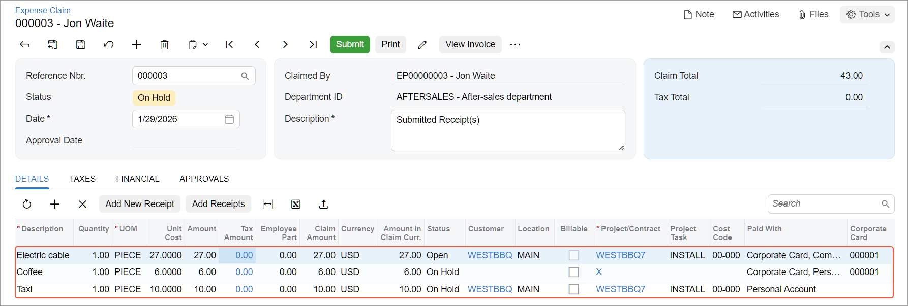

# Expense Receipts with Corporate Cards: To Claim Expenses for a Project {#_e05f8f66-7eee-43bb-be83-12a10b1bcd12 .task}

This activity will walk you through the process of creating and processing expense receipts with corporate cards.

## Story { .section}

Suppose that the West BBQ Restaurant customer ordered the installation service for previously bought juicers from the SweetLife Fruits &amp; Jams company. The project accountant of SweetLife created a project to account for the provided services.

Jon Waite, a SweetLife employee, worked in the customer's restaurant installing a juicer on January 29, 2026, and realized that there wasn’t enough electric cable. Jon went to a construction store and bought 20 meters of electric cable for $27, which he paid for with a company corporate card. He also bought a cup of coffee in a cafe near the store and paid $6 for it by using the same corporate credit card. Then Jon took a taxi, for which he paid $10 in cash, to return to SweetLife.

The next day, January 30, another SweetLife employee, Alberto Jimenez, went to a meeting with the customer to discuss the project. He took a taxi and paid $25 by using a corporate card.

Acting as Jon Waite, you will enter all related expenses into the system and file a claim for the reimbursement of expenses.

## Configuration Overview { .section}

In the *U100* dataset, the following tasks have been performed to support this activity:

-   The *Expense Management* feature has been enabled on the [Enable/Disable Features](CS_10_00_00.md) \(CS100000\) form.
-   On the [Projects](PM_30_10_00.md) \(PM301000\) form, the *WESTBBQ7* project has been created, and the *INSTALL* project task has been created for the project and specified as the default task. The cost budget of the project includes a single line with 12 hours of installation.
-   On the [Non-Stock Items](IN_20_20_00.md#) \(IN202000\) form, the *CABLE*, *MEAL*, and *TAXI* non-stock items with the *Expense* type have been created.
-   On the [Employees](EP_20_30_00.md#) \(EP203000\) form, the accounts for Jon Waite and Alberto Jimenez have been created.

## Process Overview { .section}

First, you will create an expense receipt for Jon Waite paying for electric cable on the [Expense Receipts](EP_30_10_10.md#) \(EP301010\) form. You then will create an expense claim, which will also include expenses for the taxi and coffee, on the [Expense Claim](EP_30_10_00.md#) \(EP301000\) form. As the last step, you will create the second expense receipt, for Alberto Jimenez paying for the taxi, on the [Expense Receipts](EP_30_10_10.md#) form.

## System Preparation { .section}

To sign in to the system and prepare to perform the instructions of the activity, do the following:

1.  As a prerequisite activity, create a corporate card as described in [Corporate Cards: To Configure a Corporate Card](../ImplementationGuide/Corporate_Card_Implem_Activity_CorpCard.md).
2.  Launch the Acumatica ERP website, and sign in as Jon Waite by using the *waite* username and the *123* password.
3.  In the info area, in the upper-right corner of the top pane of the Acumatica ERP screen, make sure that the business date in your system is set to *1/29/2026*. If a different date is displayed, click the Business Date menu button, and select *1/29/2026* from the calendar. For simplicity, in this activity, you will create and process all documents in the system during this business date.

## Step 1: Creating the First Expense Receipt { .section}

To create an expense receipt to enter the purchase of electric cable, do the following:

1.  Open the [Expense Receipts](EP_30_10_10.md#) \(EP301010\) form.
2.  On the form toolbar, click **Add New Record**. The system opens the [Expense Receipt](EP_30_10_20.md#) \(EP301020\) form.
3.  In the Summary area, select *CABLE* in the **Expense Item** box.
4.  Make sure that the expense date is *1/29/2026* and *EP00000003 - Jon Waite* is selected in the **Claimed by** box.
5.  On the **Details** tab, specify the following settings:
    -   **Description**: `Electric cable`
    -   **Unit Cost**: `27.00`
    -   **Project/Contract**: *WESTBBQ7*
    -   **Project Task**: *INSTALL* \(inserted automatically\)
    -   **Cost Code**: *00-000*
    -   **Paid With**: *Corporate Card, Company Expense*
    -   **Corporate Card**: *000001 - USD Corporate Card* \(inserted automatically\)
6.  Save the receipt.
7.  On the form toolbar, click **Submit**. Notice that the receipt has the *Open* status.

## Step 2: Processing an Expense Claim for the Expense Receipt { .section}

To claim the expense receipt you have created, along with the cost of coffee and a taxi, do the following:

1.  While you are still viewing the expense receipt on the [Expense Receipt](EP_30_10_20.md#) \(EP301020\) form, on the form toolbar, click **Claim**.

    The [Expense Claim](EP_30_10_00.md#) \(EP301000\) form opens. On the **Details** tab, notice the line for the electric cable.

2.  On the table toolbar of the **Details** tab, click **Add Row**, and specify the following settings in the new row \(see below\):
    -   **Date**: *1/29/2026*
    -   **Expense Item**: *MEAL*
    -   **Description**: `Coffee`
    -   **Quantity**: `1`
    -   **Unit Cost**: `6`
    -   **Paid With**: *Corporate Card, Personal Expense*

        Notice that when you select *Corporate Card, Personal Expense* in the **Paid With** column, the system automatically populates the **Project/Contract** column with the non-project code \(*X*\) and clears the **Project Task**, **Cost Code**, **Customer**, and **Location** columns.

    -   **Corporate Card**: *000001 - USD Corporate Card* \(inserted automatically\)
3.  Click **Add Row**, and specify the following settings in the new row:

    -   **Date**: *1/29/2026*
    -   **Expense Item**: *TAXI*
    -   **Description**: `Taxi`
    -   **Quantity**: `1`
    -   **Unit Cost**: `10`
    -   **Project/Contract**: *WESTBBQ7*
    -   **Project Task**: *INSTALL* \(inserted automatically\)
    -   **Cost Code**: *00-000*
    -   **Paid With**: *Personal Account*
    

4.  In the Summary area, make sure that the claim total is $43.
5.  Save the expense claim.
6.  In the **Receipt Number** column on the **Details** tab, click the link to the expense receipt that has the *MEAL* expense item.
7.  On the [Expense Receipt](EP_30_10_20.md#) form, which opens, click **Submit** on the form toolbar.
8.  Click Back in the browser tab to return to the [Expense Claim](EP_30_10_00.md#) form with the claim open.
9.  In the **Receipt Number** column on the **Details** tab, click the link to the expense receipt that has the *TAXI* expense item.
10. On the [Expense Receipt](EP_30_10_20.md#) form, which opens, click **Submit** on the form toolbar.
11. Click Back in the browser tab to return to the [Expense Claim](EP_30_10_00.md#) form with the claim open.
12. On the form toolbar, click **Submit**.

    The system assigns the *Approved* status to the claim.

13. On the form toolbar, click **Release**.

    The system assigns the *Released* status to the claim.

    In the **Link to AP** table on the **Financial** tab, review the documents that the system has generated for the claim:

    -   A $27 cash purchase for the cable
    -   A $6 debit adjustment for the coffee
    -   A $10 bill for the taxi

## Step 3: Creating the Second Expense Receipt { .section}

To create an expense receipt to enter the amount spent on the taxi by Alberto Jimenez, do the following:

1.  In the info area, in the upper-right corner of the top pane of the Acumatica ERP screen, set the business date to *1/30/2026*.
2.  Open the [Expense Receipts](EP_30_10_10.md#) \(EP301010\) form, and on the form toolbar, click **Add New Record**.

    The system opens the [Expense Receipt](EP_30_10_20.md#) \(EP301020\) form.

3.  In the Summary area, specify the following settings:
    -   **Expense Item**: *TAXI*
    -   **Claimed by**: *EP00000004 - Alberto Jimenez*
4.  On the **Details** tab, specify the following settings:
    -   **Description**: `Taxi to the customer's site`
    -   **Unit Cost**: `25.00`
    -   **Project/Contract**: *WESTBBQ7*
    -   **Project Task**: *INSTALL* \(inserted by default\)
    -   **Cost Code**: *00-000*
    -   **Paid With**: *Corporate Card, Company Expense*
    -   **Corporate Card**: *000001 - USD Corporate Card* \(inserted automatically\)
5.  Save the expense receipt.
6.  On the [Projects](PM_30_10_00.md) \(PM301000\) form, open the *WESTBBQ7* project.

    On the **Cost Budget** tab, notice that the following lines have been added to the budget when the expense claim that you have processed in this activity has been released. \(Alberto Jimenez's expenses on the taxi haven’t been recorded to the project budget because these expenses haven’t been claimed yet.\)

    -   The line with the *CABLE* item has an actual amount of *27.00*
    -   The line with the *TAXI* item has an actual amount of *10.00*

You have recorded corporate card expenses to the project budget.

**Parent topic:**[Processing Expense Receipts with Corporate Cards](../UserGuide/TimeExpenses_Expense_Receipts_Mapref.md)

