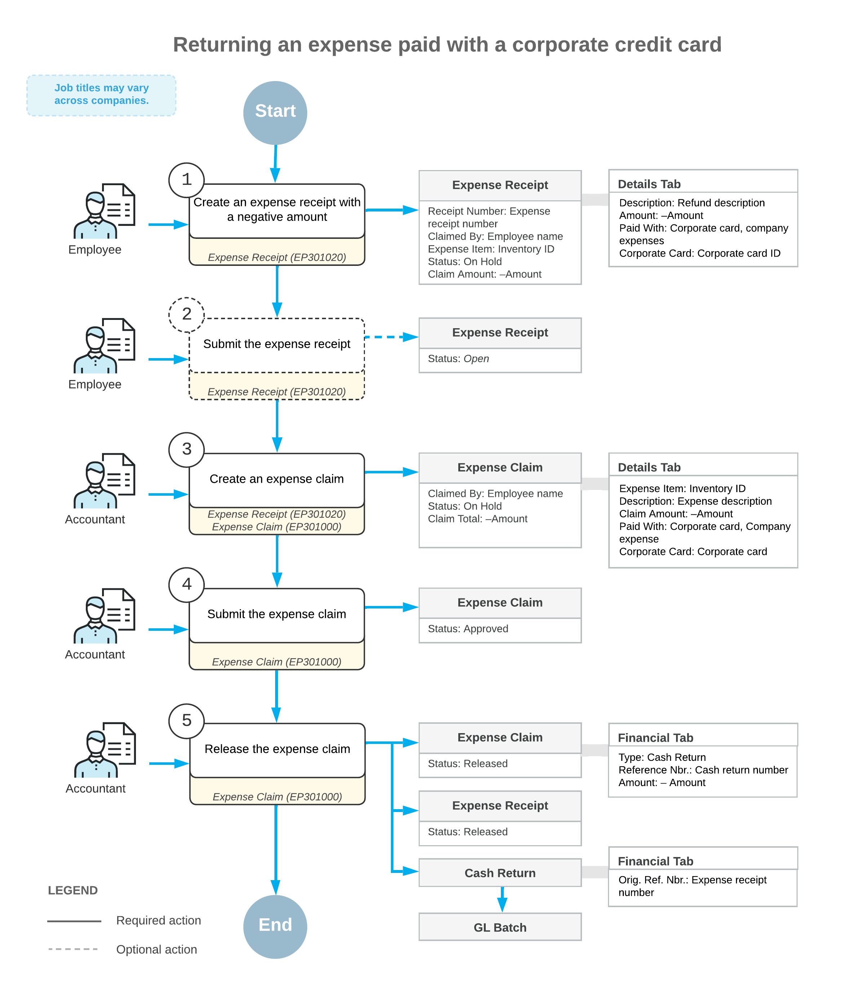

# Expense Returns to Corporate Cards: General Information {#_93689c15-4c87-43d5-b436-4c719d061340 .concept}

Acumatica ERP supports the use of corporate credit cards on the [Expense Claim](EP_30_10_00.md) \(EP301000\) and [Expense Receipt](EP_30_10_20.md) \(EP301020\) forms. If an employee needs to return all or a portion of the funds for expenses that have been paid with a corporate card, the employee can make a return to the corporate card by processing a negative expense receipt.

## Learning Objectives { .section}

In this chapter, you will learn how to do the following:

-   Create a negative expense receipt for company expenses paid by the corporate credit card
-   Process an expense claim for the negative expense receipt
-   Review the documents and transactions that are generated on release of the expense claim

## Applicable Scenarios { .section}

You, as an employee who incurs expenses and creates the needed receipts and claims, need to process a refund to a corporate credit card if items have been purchased with the corporate card and then have been returned fully or partially.

You, as an accountant who wants to process the recorded expenses and refunds, need to process an expense claim for expense receipts entered by an employee.

## Entry of a Negative Expense Receipt { .section}

To process a return to a corporate card, you need to create a negative expense receipt and then process an expense claim for it. On the [Expense Receipt](EP_30_10_20.md) \(EP301020\) form, you create an expense receipt for the employee account that is associated with your user account. In the expense receipt, you specify the key settings as follows:

-   In the **Amount** box, you specify the negative amount, which is the amount to be refunded to the corporate card. You can specify the amount in the card currency or in a foreign currency.

    **Attention:** If the *Multiple Base Currency* feature is enabled on the [Enable/Disable Features](../Shared/../UserGuide/CS_10_00_00.md) \(CS100000\) form, the base currency of the cash account that corresponds to the corporate card must be the same as base currency of the employee. For more information on configuring multiple base currencies, see [Multiple Base Currencies: General Information](../Shared/../ImplementationGuide/config_Multicurrency_MultipleBaseCurrencies_GeneralInfo.md).

-   In the **Tip Amount** box, you specify the negative amount of the tips \(if any\) for the amount to be returned.
-   In the **Paid With** box \(in the **Expense Details** section of the **Details** tab\), you select *Corporate Card, Company Expense* to indicate that the expenses have been paid with the corporate card and must be returned to this card.
-   In the **Corporate Card** box, you select the corporate card with which the original expenses have been paid.
-   In the **Project/Contract**, **Project Task**, and **Cost Code** box, you enter the contract, or the project budget key, if the incurred expenses are related to a particular project or contract.

## Claiming of a Negative Expense Receipt { .section}

After you have specified the expense receipt details, you click **Claim** on the form toolbar. The system creates an expense claim and opens it on the [Expense Claim](EP_30_10_00.md) \(EP301000\) form. On the **Details** tab, the system adds a line with a negative amount that refers to the expense receipt that you have created.

**Tip:** Alternatively, you can add a line with the expense receipt to an existing expense claim on the **Details** tab of the [Expense Claim](EP_30_10_00.md) \(EP301000\) form.

After you have added expense claim lines, you click **Submit** to assign the expense claim the *Approved* status. Then you click **Release**. The system assigns the expense claim the *Closed* status and creates the corresponding cash return on the [Cash Purchases](AP_30_40_00.md) \(AP304000\) form. On release of the AP documents, the system generates a project transaction \(if expenses are related to a particular project\) and the corresponding GL transaction. On release of this project transaction, the system updates the actual amount in the corresponding project budget line to decrease the expenses recorded to the project budget and returns the refunded amount to the balance of the credit card.

The following table summarizes the types of the documents that are prepared on release of the expense claim, depending on the sign of the amount in the line and the state of the **Post Summarized Company Expenses by Corporate Card** check box on the [Time and Expenses Preferences](EP_10_10_00.md) \(EP101000\) form.

**Tip:** This table relates only to the expense claim lines with the *Corporate Card, Company Expense* option selected in the **Paid With** column on the [Expense Claim](EP_30_10_00.md) form. For information about documents prepared for lines with the *Personal Account* or *Corporate Card, Personal Expense* option, see [Expense Receipts with Corporate Cards: General Information](TimeExpenses_Expense_Receipts_GeneralInfo.md).

|Post Summarized Company Expenses by Corporate Card|Total Line Amount|AP Document Type|Number of Documents|
|--------------------------------------------------|-----------------|----------------|-------------------|
|Selected|Positive or *0*|Cash purchase|A single document for each group of expense claim lines that have the same date, corporate card, reference number, and tax calculation mode|
|Cleared|Positive or *0*|Cash purchase|A separate document for each expense claim line|
|Selected|Negative|Cash return|A single document for each group of expense claim lines that have the same date, corporate card, and reference number|
|Cleared|Negative|Cash return|A separate document for each expense claim line|

For the lines that have the *Corporate Card, Company Expense* option selected in the **Paid With** column on the **Details** tab of the [Expense Claim](EP_30_10_00.md) \(EP301000\) form, the system aggregates the AP documents \(cash purchases or cash returns\) generated on release of the expense claim as follows:

-   If the **Post Summarized Company Expenses by Corporate Card** check box is selected on the [Time and Expenses Preferences](EP_10_10_00.md) form, the system creates a single document for each group of expense claim lines with this **Paid With** option that have the same expense receipt date, receipt reference number, corporate card, and tax calculation mode.
-   If the **Post Summarized Company Expenses by Corporate Card** check box is cleared, the system creates a separate AP document for each expense claim line with this **Paid With** option.

## Workflow of Returning Expenses Paid with Corporate Cards {#section_vv2_1y4_y4b .section}

For a scenario when an employee is refunding expenses paid with corporate cards, the typical process involves the actions and generated documents shown in the following diagram.

**Parent topic:**[Processing Expense Returns to Corporate Cards](../UserGuide/TimeExpenses_Expense_Returns_Mapref.md)

