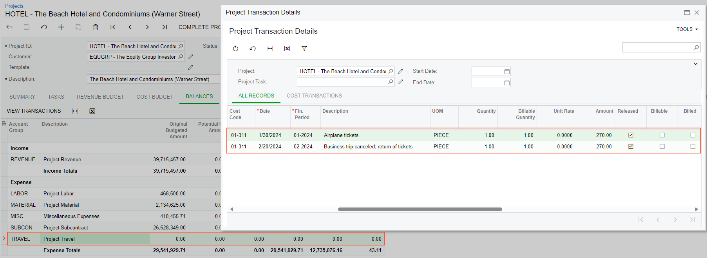

# Expense Returns with Corporate Cards: To Process an Expense Return to a Corporate Card {#_e05f8f66-7eee-43bb-be83-12a10b1bcde2 .task}

This activity will walk you through the processing of an expense return for expenses that were paid for with a corporate card.

## Story { .section}

Suppose that the ToadGreen Building Group company is building a hotel for the Equity Group Investors customer. A ToadGreen project manager, Ellen Watson, has planned a business trip to the customer office, which is located in another state. On January 30, 2026, she bought airplane tickets for this visit, which was scheduled in mid-March. Then on February 20, 2026, the customer asked Ellen to cancel the visit, so she needs to return the tickets and return funds to the corporate card.

Acting as this employee, you will process the needed documents in the system to enter the travel expenses related to a project and then record a return of expenses to corporate card.

## Configuration Overview { .section}

In the *U100* dataset, the following tasks have been performed to support this activity:

-   On the [Enable/Disable Features](CS_10_00_00.md) \(CS100000\) form, the *Expense Management* feature has been enabled.
-   On the [Non-Stock Items](IN_20_20_00.md#) \(IN202000\) form, the *TRAVEL* non-stock item with the *Expense* type has been created.
-   On the [Employees](EP_20_30_00.md#) \(EP203000\) form, the *EP00000033 \(Ellen Watson\)* account has been created.
-   On the [Projects](PM_30_10_00.md) \(PM301000\) form, the *HOTEL* project has been created with multiple project tasks.

## Process Overview { .section}

You will create an expense receipt for purchasing airplane tickets on the [Expense Receipts](EP_30_10_10.md#) \(EP301010\) form and process an expense claim for this expense receipt on the [Expense Claim](EP_30_10_00.md#) \(EP301000\) form. Then you will create an expense receipt with a negative amount on the [Expense Receipts](EP_30_10_10.md#) form and process the expense claim with a negative amount on the [Expense Claim](EP_30_10_00.md#) form. Finally, you will review the project budget on the [Projects](PM_30_10_00.md) \(PM301000\) form.

## System Preparation { .section}

To prepare to perform the instructions of this activity, do the following:

1.  Perform the [Expense Returns with Corporate Cards: To Configure a Corporate Card](TimeExpenses_Expense_Returns_Implem_Activity_Constr.md) prerequisite activity to configure a corporate credit card.
2.  Launch the Acumatica ERP website, and sign in as Ellen Watson by using the *ewatson* username and the *123* password.
3.  In the info area at the upper-right corner of the top pane of the Acumatica ERP screen, make sure that the business date is set to *1/30/2026*. If a different date is displayed, click the Business Date menu button and select *1/30/2026* from the calendar. For simplicity, you'll create and process all documents in this activity using this business date.

## Step 1: Processing Expenses { .section}

To record the expenses paid with a corporate card, do the following:

1.  Open the [Expense Receipts](EP_30_10_10.md#) \(EP301010\) form, and on the form toolbar, click **Add New Record**. The system opens the [Expense Receipt](EP_30_10_20.md#) \(EP301020\) form.
2.  In the **Expense Item** box of the Summary area, select *TRAVEL*.
3.  In the **Claimed By** box, make sure that *EP00000033 \(Ellen Watson\)* is selected.
4.  On the **Details** tab, specify the following settings:
    -   **Description**: `Airplane tickets`
    -   **Quantity**: `1`
    -   **Unit Cost**: `270.00`
    -   **Project/Contract**: *HOTEL*
    -   **Project Task**: *01*
    -   **Cost Code**: *01-311*
    -   **Paid With**: *Corporate Card, Company Expense*
    -   **Corporate Card**: *000001 - USD Corporate Card ToadGreen*
5.  Save the expense receipt.
6.  On the form toolbar, click **Claim**.

    The system creates an expense claim for the expense receipt and opens it on the [Expense Claim](EP_30_10_00.md#) \(EP301000\) form. The line for the airplane tickets has been added to the claim and the total claim amount is $270.

7.  On the More menu, click **Submit**, and then click **Release**. On the **Financial** tab, review the table, and notice that the system has generated a cash purchase document, which now has the *Closed* status.

## Step 2: Processing an Expense Refund { .section}

To process a return of expenses paid with a corporate card, you will do the following:

1.  In the info area, in the upper-right corner of the top pane of the Acumatica ERP screen, set the business date to *2/20/2026*.
2.  On the [Expense Receipt](EP_30_10_20.md#) \(EP301020\) form, click **Add New Record**.
3.  In the **Expense Item** box of the Summary area, select *TRAVEL*.
4.  In the **Claimed By** box, make sure that *EP00000033 \(Ellen Watson\)* is selected.
5.  On the **Details** tab, specify the following settings:
    -   **Description**: `Business trip canceled; return of tickets`
    -   **Quantity**: `-1`
    -   **Unit Cost**: `270.00`
    -   **Project/Contract**: *HOTEL*
    -   **Project Task**: *01*
    -   **Cost Code**: *01-311*
    -   **Paid With**: *Corporate Card, Company Expense*
    -   **Corporate Card**: *000001 - USD Corporate Card ToadGreen*
6.  Save the expense receipt.
7.  On the form toolbar, click **Claim**.

    The system creates an expense claim for the expense receipt and opens it on the [Expense Claim](EP_30_10_00.md#) \(EP301000\) form. The total claim amount is –$270.

8.  On the More menu, click **Submit**, and then click **Release**. On the **Financial** tab, review the table, and notice that the system has generated a cash return document, which now has the *Closed* status.
9.  On the [Projects](PM_30_10_00.md) \(PM301000\) form, open the *HOTEL* project. In the table on the **Balances** tab, notice that all amounts in the line with the *TRAVEL* account group are *0*.
10. Click the line with the *TRAVEL* account group, and on the table toolbar, click **View Transactions**.

    On the [Project Transaction Details](PM_40_10_00.md) \(PM401000\) form, review the lines that have been created on release of the processed documents, as shown in the following screenshot. The expense return has been processed and recorded to the project budget.

    

**Parent topic:**[Processing Expense Returns to Corporate Cards](../UserGuide/TimeExpenses_Expense_Returns_Mapref.md)

