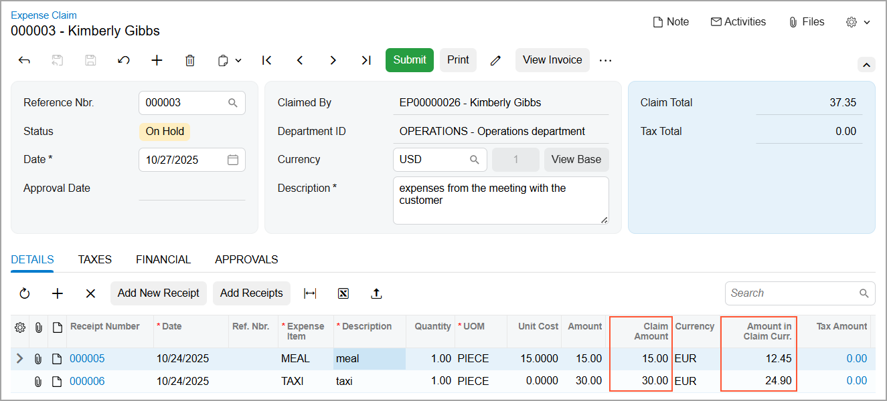
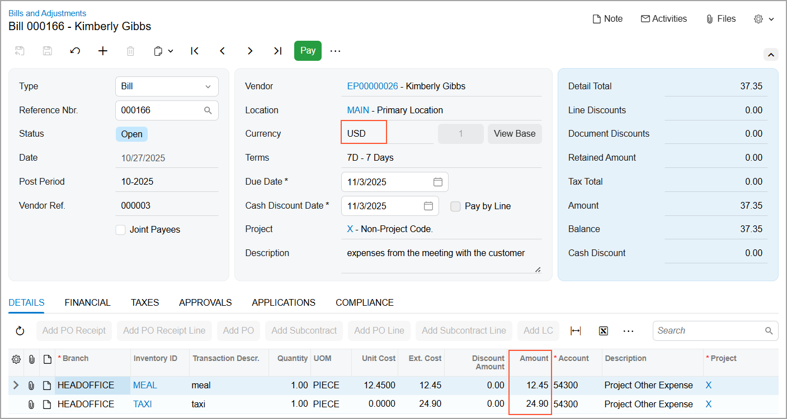
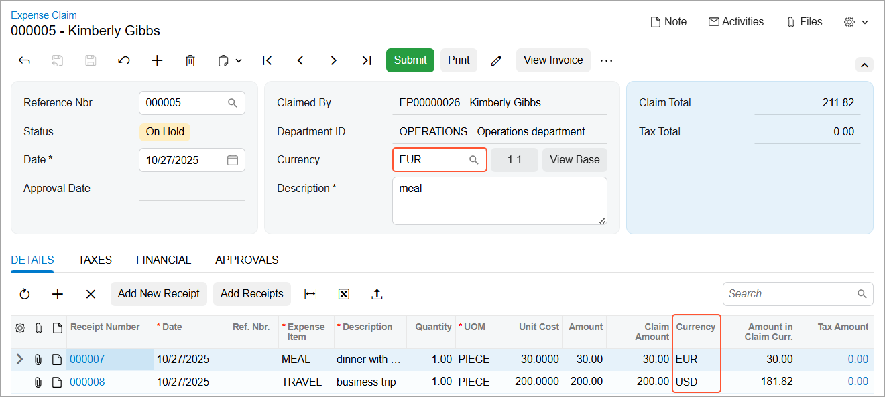
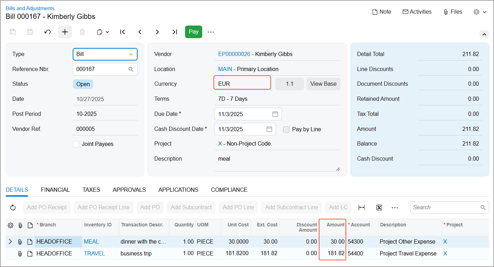

# Expense Claims: Expense Claims in Different Currencies {#_17a653aa-668e-4964-ba3a-344c52fce9fe .concept}

If your company's employees incur expenses in different currencies, they can create expense receipts or expense claims in currencies other than the base currency if the *Multicurrency Accounting* feature is enabled on the [Enable/Disable Features](CS_10_00_00.md) \(CS100000\) form.

## Prerequisite Settings { .section}

A non-base currency can be used in expense receipts and expense claims if the **Active** check box is selected for that currency on the [Currencies](CM_20_20_00.md) \(CM202000\) form.

On the [Employees](EP_20_30_00.md) \(EP203000\) form, you can specify each employee’s default currency—which may differ from the base currency. This currency is automatically inserted in new expense receipts and expense claims created by the employee.

**Tip:** If no currency is selected for the employee on the [Employees](EP_20_30_00.md) form, the base currency is inserted by default. For details, see [Multicurrency Functionality: Base Currency and Foreign Currencies](../ImplementationGuide/config_Multicurrency_Basic_Base_Currency.md).

By selecting the following check boxes on the [Employees](EP_20_30_00.md) \(EP203000\) form, you can allow the employee to make currency-related changes in expense claims:

-   **Enable Currency Override** to select a different currency
-   **Enable Rate Override** to change the exchange rate

However, an expense receipt can be created in any currency, regardless of the state of the **Enable Currency Override** check box.

## An Expense Claim in the Base Currency { .section}

On the [Expense Claim](EP_30_10_00.md) \(EP301000\) form, the expense claim’s currency is specified in the Summary area.

You can add expense receipts in one currency or multiple currencies to an expense claim in the employee's default currency.

On the **Details** tab of the [Expense Claim](EP_30_10_00.md) form, you can view the settings of the claim's expense receipts, including these read-only columns:

-   **Currency**. The currency of each expense receipt. You can submit expense receipts in any currency, including a non-accounting currency—one with the **Use for Accounting** check box cleared on the [Currencies](CM_20_20_00.md) \(CM202000\) form.
-   **Claim Amount**. The amount in the receipt currency \(see below\).
-   **Amount in Claim Curr.**. The amount in the claim currency \(also shown below\). The system automatically calculates this amount based on the exchange rate for the expense receipt's currency.

When you release the expense claim, the system creates an AP document \(such as bill, debit adjustment, or cash purchase\) in the currency of the expense claim. The AP document lines on the **Details** tab—which represent the expense receipts—are also displayed in the currency of the AP document, as shown below.

## An Expense Claim in a Non-Base Currency { .section}

If the employee's default currency differs from the company's base currency or an employee can override the currency, the expense claim can be created in a non-base currency. You can use the Currency Toggle button in the Summary area to view the expense claim either in the base currency or in another currency selected in the **Currency** box.

**Important:** Only currencies that are active and marked as used for accounting can be selected in the **Currency** box of the [Expense Claim](EP_30_10_00.md) \(EP301000\) form. For details about configuring currencies, see [Implementing Currency Management](../ImplementationGuide/config_Mapref_CM.md).

The expense claim can include expense receipts created either in the same currency as the claim or in a different currency \(see below\).

If you add a new line on the **Details** tab for an expense receipt, the currency in the line will be the same as the currency of the expense claim.

When you release the expense claim, the system creates an AP bill in the currency of the expense claim. If the currency of the expense receipts included in the expanse claim differs from the claim currency, the amounts in the AP document lines are converted based on the exchange rate of the AP document currency \(see below\).

**Parent topic:**[Processing Expense Claims](../UserGuide/TimeExpenses_Process_Expense_Claims_Mapref.md)

