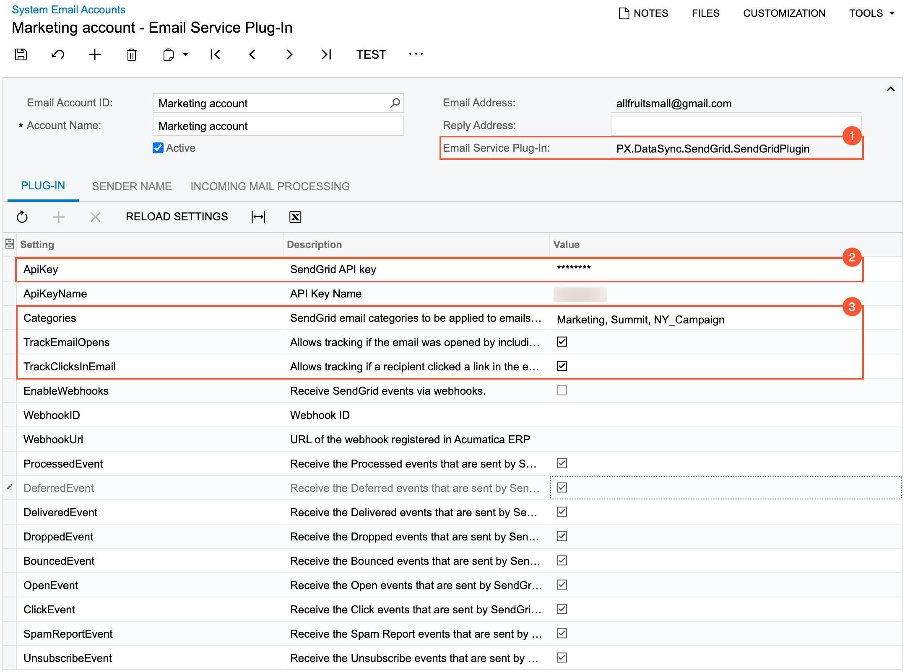
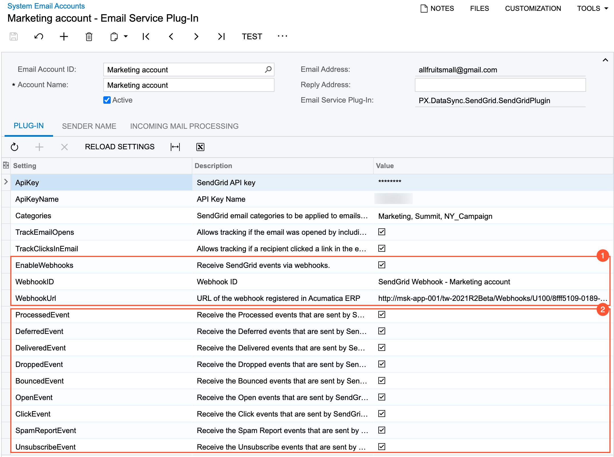

# Configuration of Integration with SendGrid {#_856c575f-5ced-4e07-9932-b3645b0df79f .concept}

To start using the service provided by the SendGrid platform, your company should set up an account with SendGrid and obtain API keys for the email accounts to be configured.

**Attention:** Using the SendGrid portal, for each API key, you should configure full access to the following API capabilities: *Mail Send*, *Scheduled Sends*, and *Event Notification*.

To make the integration functionality available in Acumatica ERP, you enable the *SendGrid Integration* feature on the [Enable/Disable Features](CS_10_00_00.md) \(CS100000\) form.

## Configuration of a SendGrid Email Account {#section_mcn_gqw_sqb .section}

Your company may use multiple email addresses for sending emails with SendGrid. For each email address you can configure a corresponding email account in Acumatica ERP using the same API key.

On the [Email Accounts](SM_20_40_02.md) \(SM204002\) form, you create an email account and select *SendGrid* in the **Email Service Plug-In** box \(see Item 1 in the following screenshot\). With the plug-in selected, the system changes the layout of the form to display the settings that are relevant to the SendGrid integration only. At minimum, the administrator needs to specify an API key in the *APIKey* row on the **Plug-In** tab of the form to start sending emails with the SendGrid account \(Item 2\).

Also, you can specify several settings that will be used by default for every email sent from this email account \(the settings can be overridden for a particular email\). The following parameters \(Item 3 in the screenshot above\) are available:

-   *Categories*: The list of SendGrid email categories \(with a comma used as the separator\) to be used for reporting purposes in your SendGrid portal.
-   *TrackEmailOpens*: A check box that indicates \(if selected\) that a system will include a single-pixel image in the body of email to track whether a recipient opened the email.
-   *TrackClicksInEmail*: A check box that indicates \(if selected\) that SendGrid will collect information about navigation to all URLs included in the body of email.

With this configuration, users of Acumatica ERP can send emails by using the email account and review tracking results by using the SendGrid portal.

To enable support of the SendGrid Reply-to functionality for the email account, you select the **Add Tags for the Incoming Processing** check box on the Incoming Mail Processing tab of the [Email Accounts](SM_20_40_02.md) form.

## Configuration of Receiving Tracking Results for an Email {#section_jvc_zx5_kqb .section}

For the results of email tracking to be displayed in Acumatica ERP, the system needs to receive the corresponding information from SendGrid. This connection is implemented by using webhooks. For webhooks to be used, an Acumatica ERP instance should be accessible through the web, or a proxy server should be configured.

On the [Email Accounts](SM_20_40_02.md) \(SM204002\) form, for the corresponding system email account, you enable the receipt of information from SendGrid by selecting the check box in the *EnableWebhooks* row on the **Plug-In** tab of the form \(see Item 1 the following screenshot\).

With this check box selected, the system automatically creates a webhook that is associated with the API key specified for the email account. On the **Plug-In** tab of the form, the system inserts the identifier of the created webhook in the *WebhookID* row and the webhook's URL in the *WebhookURL* row \(also shown in Item 1\). You can manually select another webhook or specify the webhook's URL for an email account.

**Tip:** You can review the details of a webhook or configure a new one manually on the [Webhooks](SM_30_40_00.md) \(SM304000\) form.

Additionally, you can configure what tracking information should be sent to Acumatica ERP by selecting or clearing the check boxes in the corresponding rows on the **Plug-In** tab of the form \(Item 2\).

**Parent topic:**[Integrating Acumatica ERP with SendGrid](../UserGuide/US_MNG_Integrating_with_SendGrid.md)

