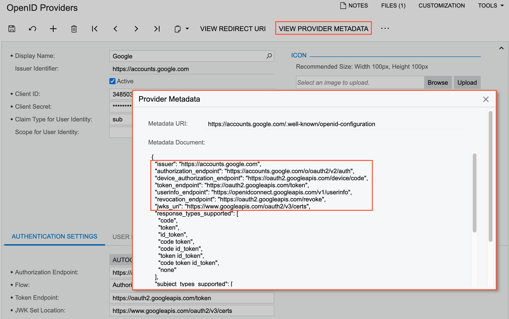
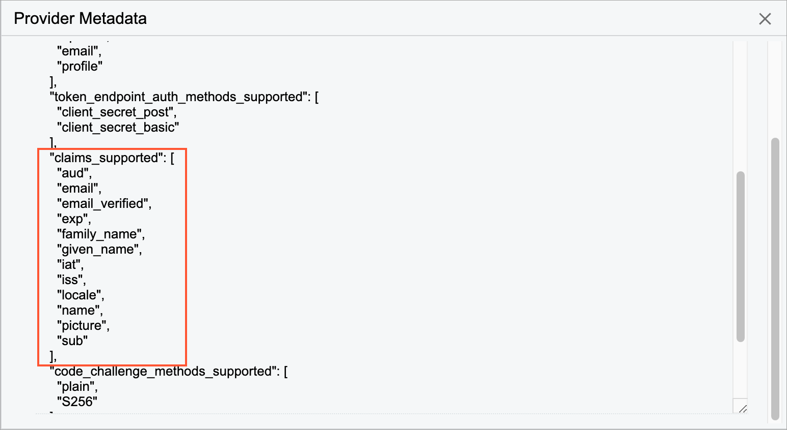
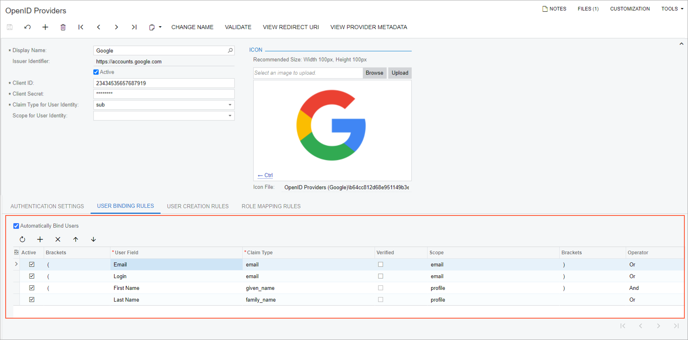
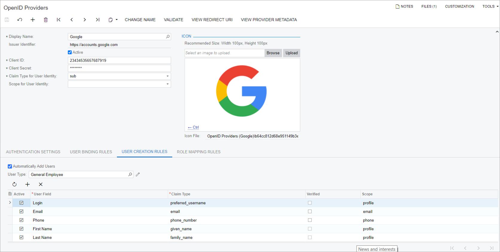
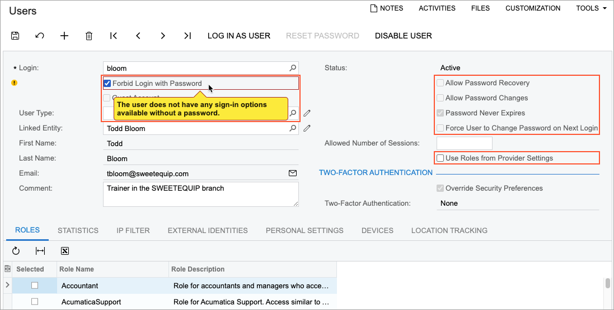
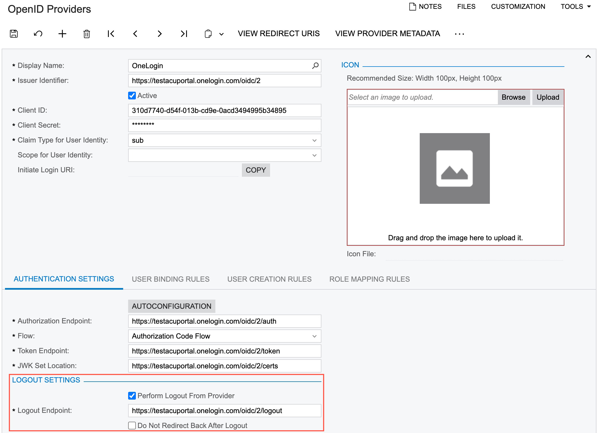

# Configuration of an OpenID Identity Provider {#_992b1b4c-a0ec-4b7b-aba3-85a3c152a1a4 .concept}

OpenID Connect is a simple identity layer on top of the OAuth 2.0 protocol. There are multiple public OpenID identity providers that you can use for authorizing users, such as Microsoft and Google identity platforms, OneLogin, and Okta.

In a multitenant instance, you configure OpenID providers for each tenant, if needed. Different tenants may have different sets of providers configured \(or no providers\).

## Registering with an OpenID Provider {#section_zx2_25s_qqb .section}

To configure integration with an OpenID provider, you need to register with the provider and to obtain public and private keys \(Client ID and Client Secret, respectively\) to be used in your authorization requests. For the registration, you will need to provide the corresponding redirect URI of the Acumatica ERP tenant for which you are configuring the integration.

To find this URI, on the [OpenID Providers](SM_30_30_20.md) \(SM303020\) form, you click **View Redirect URI** on the form toolbar. The system opens the **Redirect URI** dialog box, where you can copy the URI.

For more information, see [To Register an Acumatica ERP Instance with Google](US__how_SSO_with_Google.md) and [To Configure Microsoft Entra ID for Integration with Your Acumatica ERP Instance](US__how_AzureAD_Registering_with_Azure.md).

## Configuring an OpenID Provider {#section_gxt_4kk_4qb .section}

You use the [OpenID Providers](SM_30_30_20.md) \(SM303020\) form to configure each provider in the system and specify its integration settings. You enter the provider's name in the **Display Name** box, specify its identifier in the **Issuer Identifier** box, and enter the public and private keys you have obtained in the **Client ID** and **Client Secret** boxes, respectively.

If the OpenID provider supports discovery requests, you can click the **Autoconfiguration** button on the **Authentication Settings** tab, and the system will request the configuration metadata by using the identifier specified in the **Issuer Identifier** box. The system will parse the document it receives and fill in the authentication settings on the tab automatically.

Alternatively, you can receive the OpenID provider's configuration metadata by clicking the **View Provider Metadata** button on the form toolbar. The system displays the **Provider Metadata** dialog box \(see the following screenshot, which shows this metadata for a Google OpenID provider\), which shows configuration metadata that you can use to manually specify settings on the **Authentication Settings** tab.

After you have filled in the authentication settings either manually by using the metadata document or automatically, you can validate the configuration by clicking the **Validate** command on the More menu.

If the OpenID provider does not support discovery requests, you should obtain the authentication settings from the provider and fill in the settings manually. You cannot validate your configuration by using **Validate** in this case.

After specifying the authentication settings, you upload the icon to be used for the OpenID provider by using the buttons in the **Icon** section of the Summary area. On the Sign-In page, the system will display a button with the name specified in the **Display Name** box and the icon you upload.

**Tip:** If at a later time, you want to change the display name that is initially specified for the provider, you use the **Change Name** command on the More menu; the new provider name will then be displayed on the Sign-In page.

## Configuring User Identification {#section_ktg_4kj_qqb .section}

When a user signs in to Acumatica ERP with an OpenID provider for the first time, the system will send an authorization request to the provider's server; this request is generated by using the provider's settings on the [OpenID Providers](SM_30_30_20.md) \(SM303020\) form. If the user has been authorized successfully, the provider's server returns a corresponding ID token with the user information. Then the system asks the user to enter their Acumatica ERP credentials to identify the user profile in the system. The system uses information from the ID token to bind the external account of the user with the Acumatica ERP user profile and enable single sign-on \(SSO\) functionality for the user. The next time the user signs in with the OpenID provider, the system will use information from the ID token to find the bound Acumatica ERP user profile and will not request Acumatica ERP credentials if the account has been found.

The user information inside an ID token is organized in claims. Claims are name–value pairs that contain information about the user and the OpenID Connect service. You can find the list of supported claims in the metadata document in the `claims_supported` section, as the following screenshot shows for a Google OpenID provider.

For an OpenID provider, you can select a claim \(*sub* or *oid*\) to be used by the system for user profile identification in the **Claim Type for User Identity** box of the [OpenID Providers](SM_30_30_20.md) form.

In most cases, the `sub` claim is used for user identification. We recommend using the configuration guidelines of the OpenID provider of your choice.

The set of claims to be returned in an ID token is defined with the `scope` parameter in an authorization request. A scope is a logical grouping of claims. A common example is the standard OpenID Connect scope `profile`. If you use this scope in an request, you will get an ID token that includes the following claims: `name`, `family_name`, `given_name`, `middle_name`, `nickname`, `preferred_username`, `profile_picture`, `website`, `gender`, `birthdate`, `zone_info`, `locale`, and `updated_at`.

The system requests the `openid` scope by default. You can add to the request two more scopes \(`email` and `profile`\) by selecting the corresponding options in the **Scope for User Identity** box.

**Tip:** If you are working with the Microsoft OpenID solution, Microsoft recommends using the `oid` claim along with the `profile` scope.

## Configuring Automatic User Binding {#section_bjw_1lj_qqb .section}

When a user signs in to the system by using an OpenID provider for the first time, the system prompts the user to enter their Acumatica ERP credentials, so it can find a corresponding user profile in the system to bind with the external user profile. You can configure the system to search for a user profile by using the information received in an ID token from an OpenID provider. If the system finds a corresponding user profile in the system, it will bind the profiles automatically without prompting the user to enter their Acumatica ERP credentials.

**Attention:** OpenID integration can only bind the native Acumatica ERP and Open ID user profiles. It could not bind users authorized via Active Directory, Microsoft Entra ID, or other external identity providers.

On the **User Binding Rules** tab of the [OpenID Providers](SM_30_30_20.md) form, for the OpenID provider, you configure a set of conditions for the identification of each user profile and select the **Automatically Bind Users** check box.

A condition is a mapping of a user setting in Acumatica ERP and the claim received in an ID token from the provider. You can configure multiple mappings, group them into logical groups by using brackets, and join them with logical operators. \(The following screenshot shows the conditions that make up a user binding rule.\)

To create a condition, you select a user setting in the **User Field** column, which can be any of the following: *Email*, *First Name*, *Last Name*, *Login*, and *Phone*. Then in the **Claim Type** column, from the list of supported by provider claims, you select a corresponding claim to be returned in the ID token. The system automatically fills in a value in the **Scope** column based on the selected claim. If you want the system to bind the external user profile with the Acumatica ERP user profile only if the email address or phone number of the external user is verified, you can select the **Verified** check box for the `email` or `phone_number` claim type.

With automatic binding enabled, when a user signs in the system by using an OpenID provider for the first time, the system will search for a user account by comparing the values of user settings with the values of the claims mapped to the settings. If the system does not find a user account whose settings comply with the configured rule, the system will prompt the user to enter their Acumatica ERP credentials.

## Configuring Automatic User Creation {#section_op1_lbq_qqb .section}

To perform binding of an Acumatica ERP user profile and an external user account of an OpenID provider, both of these accounts should exist in the corresponding systems. So if a user does not have any of the accounts, it needs to be created either manually or automatically if automatic user creation has been set up.

If automatic user creation is not set up, when the system cannot find a corresponding user profile for a user who is trying to sign in with an OpenID provider, it prompts the user to enter their Acumatica ERP credentials. If the user cannot provide the correct credentials, they need to contact the system administrator to resolve the issue.

You can configure the system to automatically create a user account in Acumatica ERP if it does not find a corresponding user account based on the information returned in the ID token. \(In this case, the system will not prompt the user to enter their Acumatica ERP credentials.\) To perform this configuration, on the **User Creation Rules** tab of the [OpenID Providers](SM_30_30_20.md) form, for the OpendID provider, you configure the set of rules for filling in user account settings and select the **Automatically Add Users** check box \(see the screenshot below\).

To create a rule, you select a user setting in the **User Field** column, which can be any of the following: *Email*, *First Name*, *Last Name*, *Login*, and *Phone*. Then in the **Claim Type** column, from the list of claims supported by this provider, you select the claim to be returned in the ID token. Based on the selected claim, the system automatically fills in a value in the **Scope** column. If you want the system to create an Acumatica ERP user profile only if the email address or phone number of the external user is verified, you can select the **Verified** check box for the `email` or `phone_number` claim type.

For a user account to be created on the [Users](SM_20_10_10.md) \(SM201010\) form, Acumatica ERP requires only the user's login and email address. Therefore, for successful user creation, at minimum, you must configure rules for the *Login* and *Email* user fields.

If role assignment has not been set up, the system does not assign any access roles to the newly created user account. You need to assign roles manually so that the user can perform job responsibilities.

You can automate the assignment of a set of roles to the users created automatically by creating a user type on the [User Types](EP_20_25_00.md) \(EP202500\) form; on the **Roles** tab, you specify the roles to be assigned to each automatically created user that has signed in by using the OpenID provider. Then on the **User Creation Rules** tab of the [OpenID Providers](SM_30_30_20.md) form for the provider, you specify the created user type in the **User Type** box.

With the automatic user creation enabled, during the first time a user signs in by using this OpenID provider, if the system cannot find a corresponding user account, it creates a new user profile in the tenant the user selected and binds it to the external account. For the new user, based on the user creation rules and the information received in the ID token, the system fills in the settings on the [Users](SM_20_10_10.md) \(SM201010\) form as follows:

-   In the **User Type** box, the user type that is specified on the **User Creation Rules** tab of the [OpenID Providers](SM_30_30_20.md) form for the OpenID provider. The system assigns to the user account the roles specified for the user type on the **Roles** tab of the [User Types](EP_20_25_00.md) form.
-   The **Login**, **First Name**, **Last Name**, **Email**, and **Phone** boxes are filled with the appropriate data according to the user creation rules.
-   The status of the user account is set to *Active*.
-   The **Forbid Login with Password** check box is selected.

As an alternative to assigning roles, you can configure the system to assign roles to the newly created user account based on the rules configured for the provider on the **Role Mapping Rules** tab of the [OpenID Providers](SM_30_30_20.md) form, as described in the following section.

## Configuring Role Mapping {#section_tsd_pbq_qqb .section}

You can use an OpenID provider for managing user access by directly configuring the mapping of external roles to the roles defined in Acumatica ERP and allowing the system to override user roles with provider settings.

To configure the mapping, on the provider side, you need to configure a claim or a scope that will return external roles in the ID token for a user.

Then on the **Role Mapping Rules** tab of the [OpenID Providers](SM_30_30_20.md) form, you specify the claim and scope you configured on the provider side in the **Claim Type** and **Scope** boxes, respectively. In each row of the table of the tab, you configure the mapping of a value returned in the claim to an Acumatica ERP role.

On the tab, you select the **Use Roles from Provider Settings** to activate the use of role mapping based on the rules specified on the tab.

With the role mapping rules activated, the system will deal with the role assignment in accordance with the restrictions specified for the user on the [Users](SM_20_10_10.md) \(SM201010\) form.

Suppose a user account is bound to an external account, and for this user the **Forbid Login with Password** and **Use Roles from Provider Settings** check boxes are selected on the [Users](SM_20_10_10.md) form. In this case, when the user signs in to Acumatica ERP, the system will override the user's access roles and assign roles according to the role mapping rules.

Suppose a user has an account in Acumatica ERP and signs in for the first time with their OpenID provider credentials. For this user, the **Forbid Login with Password** and **Use Roles from Provider Settings** check boxes are selected on the [Users](SM_20_10_10.md) form. In this case, when the user signs in to Acumatica ERP, the system will override the user's access roles according to the role mapping rules.

If an automatic creation of user accounts is configured for an OpenID provider and a user who has no account in Acumatica ERP signs in for the first time with the credentials of the OpenID provider. If a user type is specified in the **User Type** box on the **User Creation Rules** tab of the [OpenID Providers](SM_30_30_20.md) form, the system selects the **Use Roles from Provider Settings** check box for the user on the [Users](SM_20_10_10.md) form and assigns the user only those roles that are listed for the user type and that comply with the role mapping roles. If a user type is not specified, the system selects the **Use Roles from Provider Settings** check box and assigns the user roles according to the role mapping rules.

## Configuring User Restrictions {#section_rnc_wbq_qqb .section}

If your company prefers to use the OpenID providers for the authentication and authorization of users, you can forbid any of the users to sign in with Acumatica ERP credentials.

For a user, on the [Users](SM_20_10_10.md) \(SM201010\) form, you select the **Forbid Login with Password** check box. With the check box selected, the system makes the **Allow Password Recovery**, **Allow Password Changes**, **Password Never Expires**, and **Force User to Change Password on Next Login** check boxes unavailable and makes the **Use Roles from Provider Settings** check box available \(see the following screenshot\). If the user does not have any other sign-in options, the system displays a warning message, so that you do not define a user with no way to sign in.

If the **Forbid Login with Password** check box is selected on the [Users](SM_20_10_10.md) form for a particular user, the following UI elements become unavailable in the user profile on the **General Info** tab on the [User Profile](SM_20_30_10.md) \(SM203010\) form:

-   The **Password** box
-   The **Password Recovery Question** box
-   The **Change Password** button
-   The **Change Answer** button

Users can view information about an external identity linked to their Acumatica ERP accounts on the **External Identities** tab of the [User Profile](SM_20_30_10.md) \(SM203010\) form. A system administrator can review this information for each user on the **External Identities** tab of the [Users](SM_20_10_10.md) form. On the tab, in the **Provider Name** column, the system displays the display name of the OpenID provider. The check box in the **OIDC** column is selected for the active OpenID Provider and cannot be edited.

## Configuring Automated Sign-Out {#section_bhq_tgd_kcc .section}

Usually, when a user signs in to Acumatica ERP with an OpenID provider, the user remains signed in with the identity provider even after signing out from the system. In some cases—for example, to comply with legal requirements—it might be necessary to terminate a session with the identity provider when a user signs out of Acumatica ERP.

To configure automated sign-out from the identity provider, you use settings in the **Logout Settings** section on the **Authentication Settings** tab of the [OpenID Providers](SM_30_30_20.md) \(SM303020\) form \(see the following screenshot\). With these settings specified, when a user signs out of Acumatica ERP, the system redirects the user to the sign-out page of the OpenID provider that was used to sign in to Acumatica ERP. The system also sends a sign-out request to the provider to automatically sign the user out. After successful signing out, the system redirects the user back to the Acumatica ERP sign-in page.

To configure this behavior, you select the **Perform Logout From Provider** check box, and the system makes the **Logout Endpoint** box required. In this box, you specify the sign-out endpoint for the OpenID provider. Alternatively, if the OpenID provider supports discovery requests, you can click the **Autoconfiguration** button on the tab, and the system will automatically fill in the value.

Then you clicks **View Redirect URIs** on the form toolbar, and the system opens the **Redirect URIs** dialog box. In the dialog box, you copy the value from the **Post Logout Redirect URI** box. In the configuration settings for Acumatica ERP on the OpenID provider platform, you paste the value to make the OpenID provider redirect a user back to the Acumatica ERP sign-in page. \(The place to paste the link may differ, depending on the OpenID provider.\)

In some cases, a user should not be redirected back to the Acumatica ERP sign-in page after they sign out from the OpenID provider. To support this system behavior, you select the **Do Not Redirect Back After Logout** check box in the **Logout Settings** section on the **Authentication Settings** tab of the [OpenID Providers](SM_30_30_20.md) form. In this case, you do not need to specify a corresponding redirect URI in the configuration settings for Acumatica ERP on the OpenID provider platform.

**Parent topic:**[Integrating Acumatica ERP with OpenID Identity Providers](../UserGuide/US__MNG_Integrating_with_Open_ID_Identity_Providers.md)

