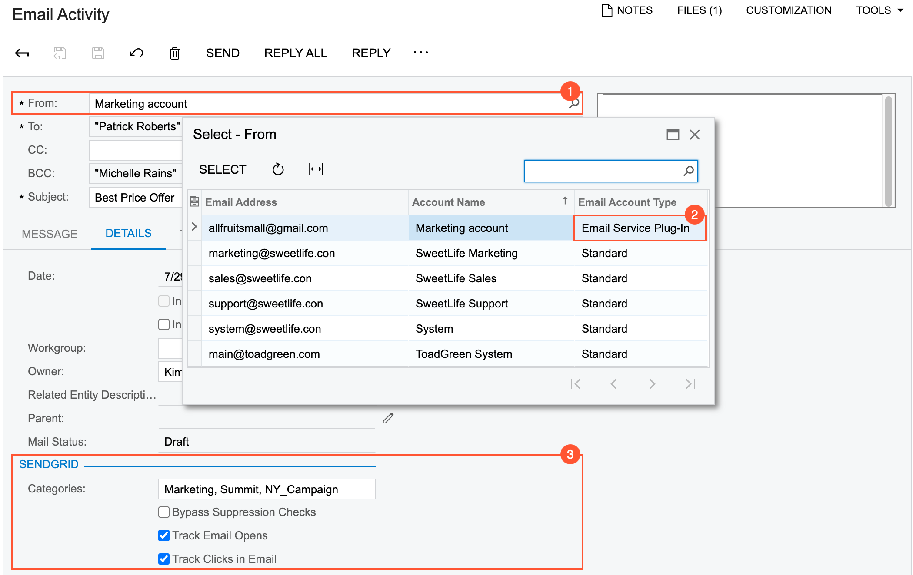
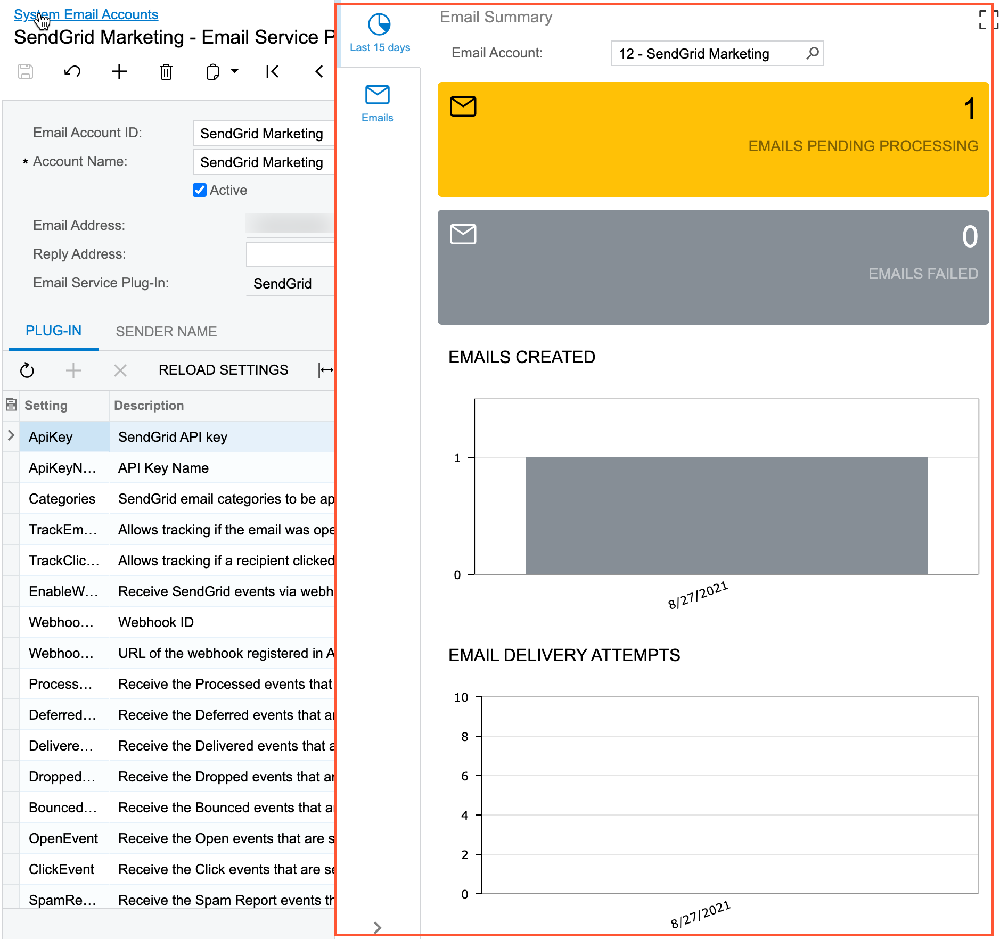
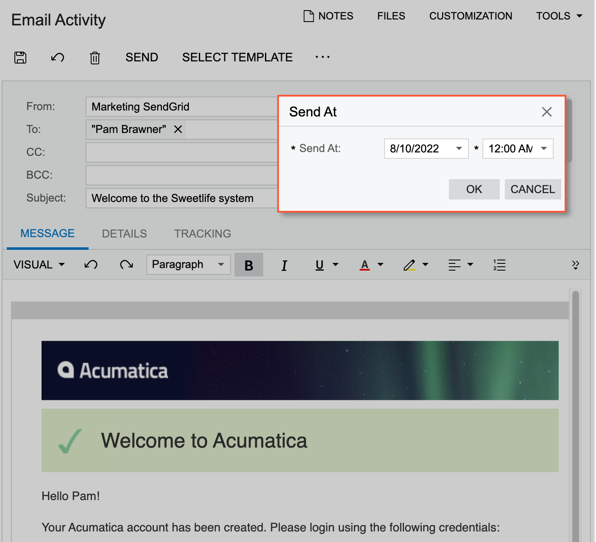
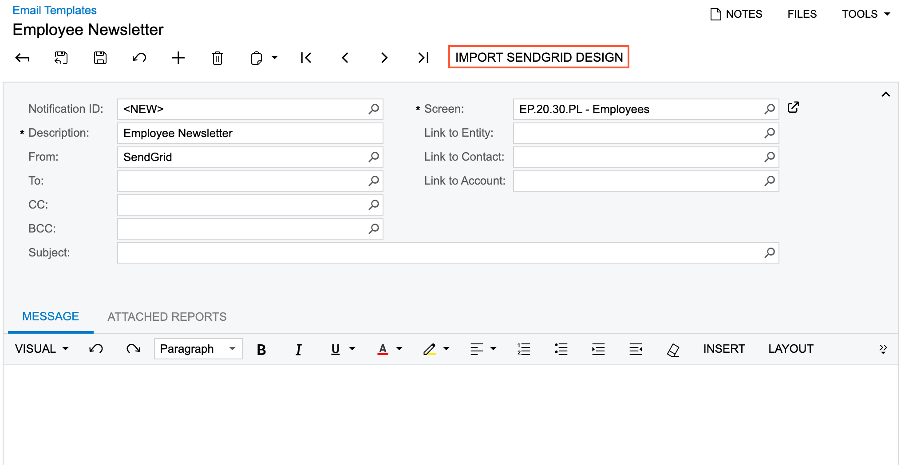
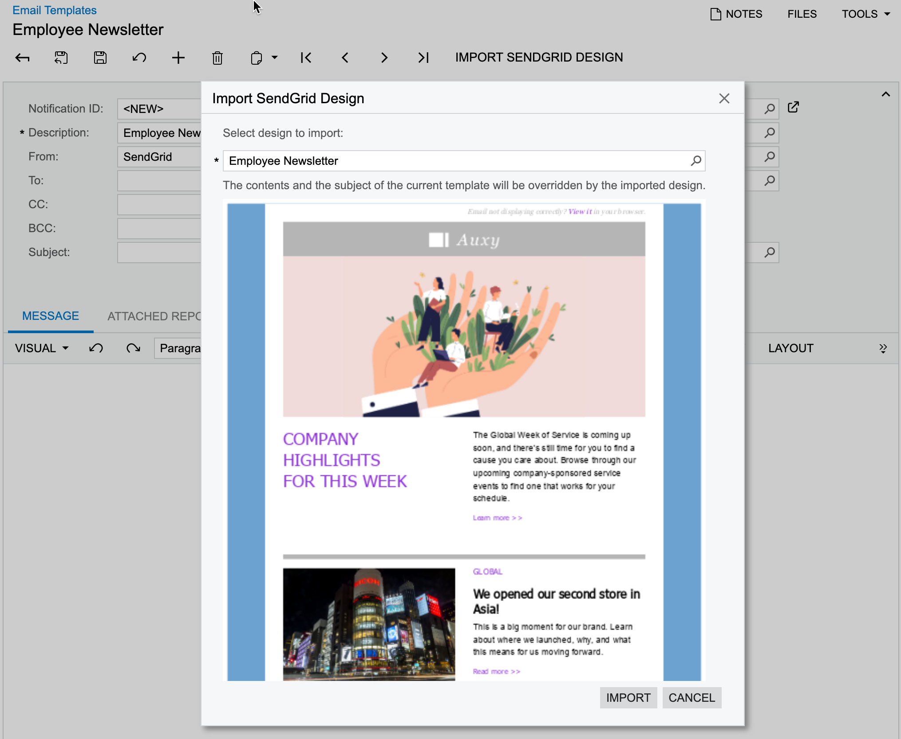

# Mail Processing by Using SendGrid {#_47aa9229-498b-4222-8094-75d35b0dda4a .concept}

After the integration with SendGrid has been configured, you can start processing emails and track activities related to a specific email account.

## Sending and Tracking of an Email {#section_i4k_tjv_kqb .section}

On the [Email Activity](CR_30_60_15.md) \(CR306015\) form, you create a new email. In the **From** box \(see Item 1 in the following screenshot\), you select an email account of the *Email Service Plug-In* type \(Item 2\). With an account of this type selected, the system displays the **SendGrid** section \(Item 3\) on the **Details** tab of the form.

In the section, you can edit the list of categories and override the default tracking settings. Additionally, by selecting the **Bypass Suppression Checks** check box, you can specify whether the system should send the email to the specified addresses even if these addresses are in the **Suppressions** list of SendGrid. The **Suppressions** list includes email addresses that have unsubscribed, email addresses that have marked the email as spam, and email addresses to which the system failed to deliver emails \(because they bounced, are blocked, or are invalid\).

After the email has been sent, you can review the tracking results in the SendGrid portal. If receipt of the tracking results was configured for the email account on the [Email Accounts](SM_20_40_02.md) \(SM204002\) form, you can review the tracking results of a particular email on the **Tracking** tab of the [Email Activity](CR_30_60_15.md) \(CR306015\) form.

## Tracking Activities for an Email Account {#section_x2h_szg_m5b .section}

For tracking activities related to a specific email account of the *Email Service Plug-In* type, you can use the **Email Summary** dashboard and the **Email Tracking** inquiry located on the side panel of the [Email Accounts](SM_20_40_02.md) \(SM204002\) form \(see the following screenshot\).

## Scheduling of an Email Delivery {#section_kqn_txg_m5b .section}

On the [Email Activity](CR_30_60_15.md) \(CR306015\) form, you create an email to be sent from the email account that is connected to SendGrid and click **Send At** on the More menu. The system opens the **Send At** dialog box, where you specify the date and time of delayed email delivery, as the following screenshot shows.

The system sends the data to SendGrid for processing, and upon receiving a confirmation, the system changes the email's status to *Scheduled* and displays the scheduled date and time in the **Send At** box on the **Details** tab.

For the email activities with the *Scheduled* status, the **Cancel Sending** command is available on the More menu of the form. If you cancel the sending of a scheduled email, the system clears the value of the **Send At** box and changes the email's status to *Draft*.

## Import of SendGrid Designs {#section_yjz_vxg_m5b .section}

To enable importing of SendGrid designs, you enable the *SendGrid Integration* and *Import of SendGrid Designs \(Experimental\)* features on the [Enable/Disable Features](CS_10_00_00.md) \(CS100000\) form. With the features enabled the **Import SendGrid Design** button is displayed on the toolbar of the [Email Templates](SM_20_40_03.md) \(SM204003\) form.

You select an email account that has been configured for integration with the SendGrid email service in the **From** box for an email template and the **Import SendGrid Design** button becomes available, as the following screenshot shows.

You click **Import SendGrid Design**, and the system opens the **Import SendGrid Design** dialog box, where you selects a design to be imported by searching the list of the available templates \(if any have been created in SendGrid\). The following screenshot shows the **Import SendGrid Design** dialog box with the preview of the selected design loaded.

Then you click **Import** in the dialog box, and the system replaces the content in the **Subject** box of the Summary area and on the **Message** tab of the form. You can edit the imported content then.

**Parent topic:**[Integrating Acumatica ERP with SendGrid](../UserGuide/US_MNG_Integrating_with_SendGrid.md)

