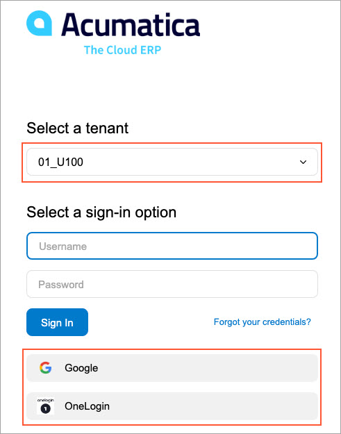
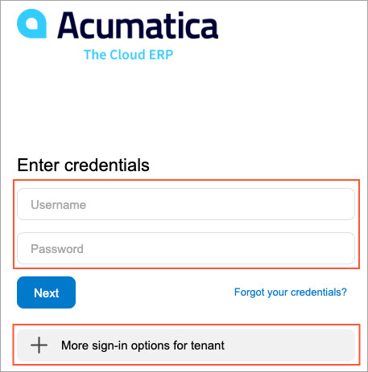
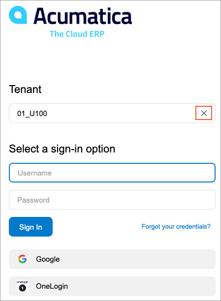

# Sign-In with OpenID Identity Providers {#_ad2fd555-518b-4e4c-9dad-bfb1d808b534 .concept}

When general and authentication settings are specified, a system user can select a sign-in option on the Sign-In page.

In this topic, you will learn how the sign-in process looks in a multitenant instance depending on whether access to tenants is restricted. The process of signing in to a single-tenant instance is not different from the process of signing in to an unrestricted multitenant instance, except for a user has no ability to select a tenant.

## Signing In to an Unrestricted Multitenant Instance {#section_jn4_flk_4qb .section}

In a multitenant instance, the system displays the list of available sign-in options for the selected tenant on the Sign-In page. If the user selects another tenant, the system will display the list of any sign-in options available for the newly selected tenant.

## Signing In to a Restricted Multitenant Instance {#section_bfd_clk_4qb .section}

A system administrator may restrict the list of tenants a user can see to only the tenants the user has access to by selecting the **Secure Tenant on the Sign-In Page** check box on the Tenant Setup page of the Acumatica ERP Configuration Wizard. In this case, the **Tenant** box does not appear on the Sign-In page \(see the following screenshot\). To sign in, a user should authenticate themselves by entering their Acumatica ERP credentials.

Then if the configuration of the sign-in provider is the same across all tenants added to the instance, the user will be signed in to the first tenant that is available for them. In this case, the instance will automatically handle all the user-related operations, such as user creation, user association, and user binding.

If at least one of the tenants has a different provider configuration, the user needs to click **More sign-in options for tenant**, type the needed tenant name, and view the sign-in options that are available for the specified tenant.

If a user has permitted a browser to save information about the tenant to which a user signed in most recently, the system will display the tenant name and sign-in options available for the tenant, as shown in the following screenshot. The user may remove the tenant selection and specify another tenant after either signing in with Acumatica ERP credentials or clicking the **More sign-in options for tenant** button.

**Parent topic:**[Integrating Acumatica ERP with OpenID Identity Providers](../UserGuide/US__MNG_Integrating_with_Open_ID_Identity_Providers.md)

