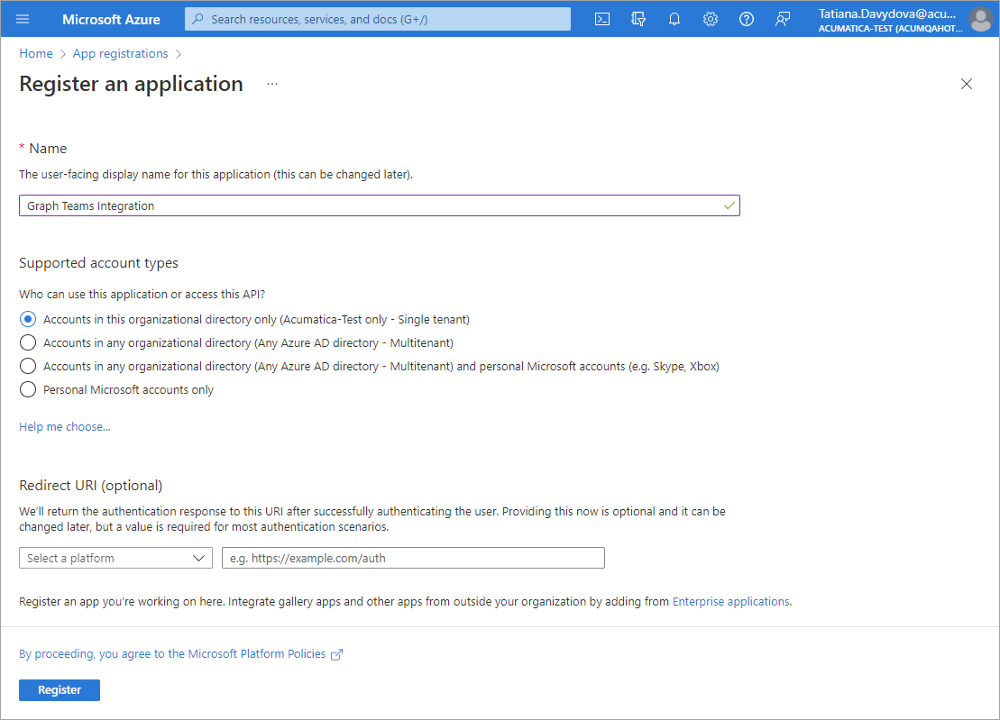
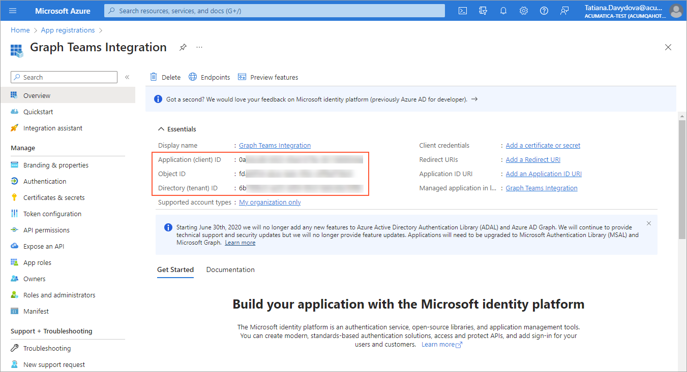
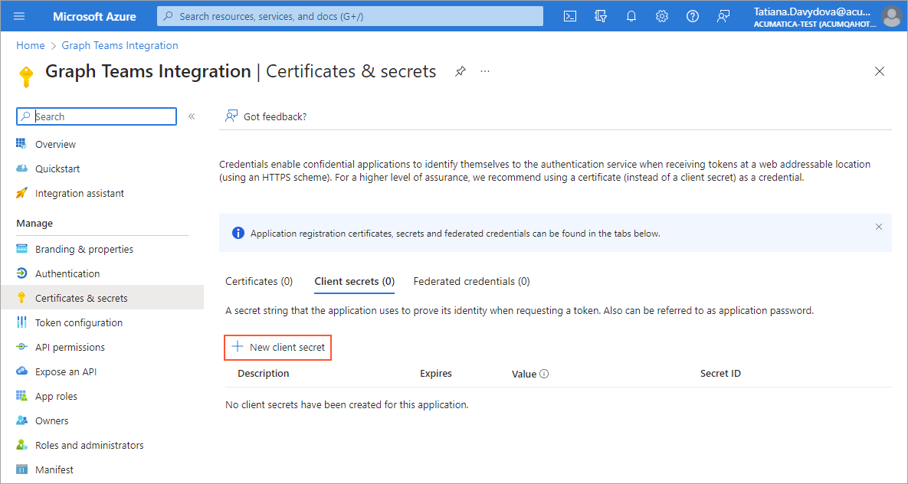
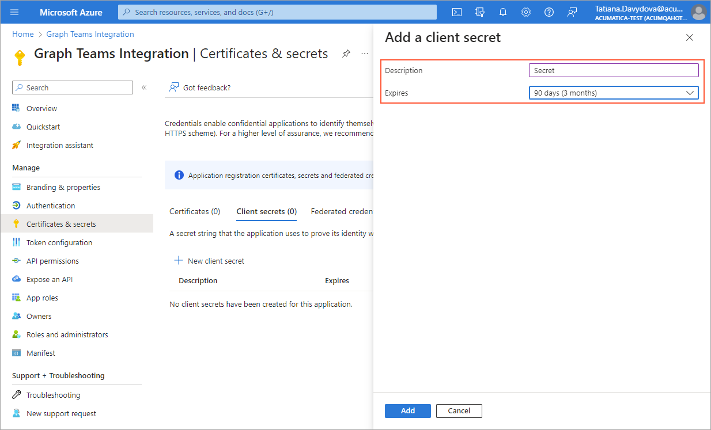
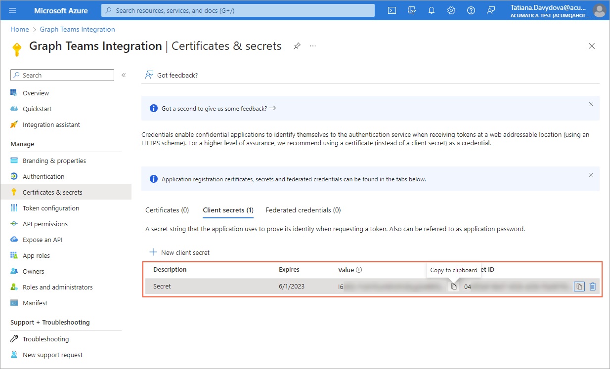
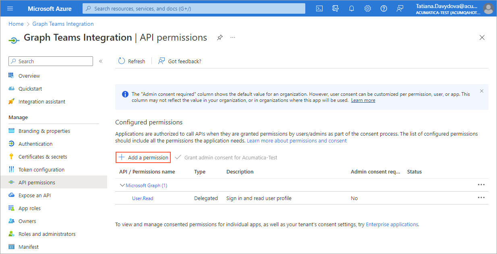
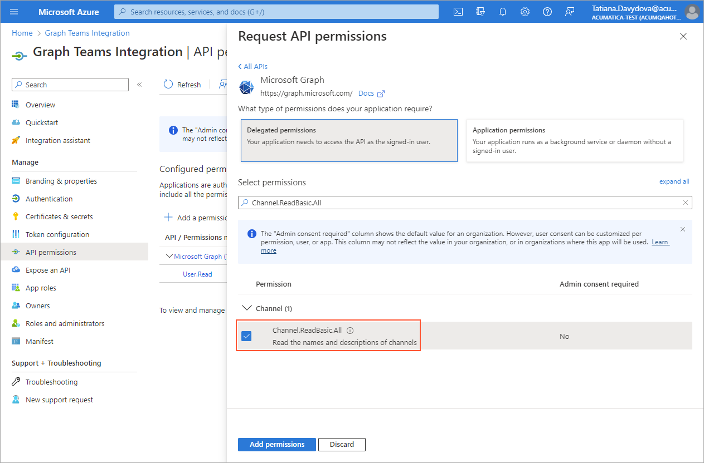
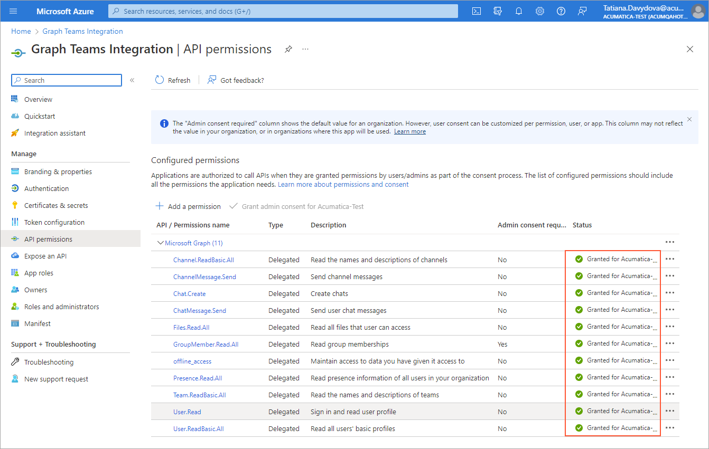
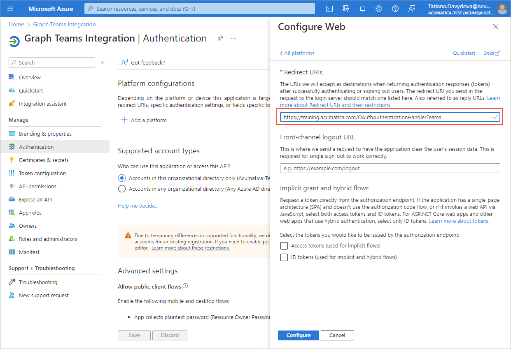

# To Configure Microsoft Azure for Teams Integration {#_fb35e0b4-d454-477e-b0d1-8462ebf3a35d .task}

To configure Microsoft Azure for the integration of Microsoft Teams with your Acumatica ERP instance, you perform the following actions in the Microsoft Azure portal:

1.  Registering your Acumatica ERP instance, and copying the registration parameters for further use.
2.  Obtaining the client secret and copying it.
3.  Configuring API permissions.
4.  Specifying your Acumatica ERP instance redirect URI.

Each of which is described in a section of this topic.

**Attention:** Note the following:

-   The procedure below covers the most common usage scenarios. If you’re implementing a more complicated scenario and you encounter difficulties, contact Acumatica ERP technical support.
-   The vendor of the third-party software may change the user interface and settings. The labels you see in the UI may differ from the ones described in the procedure.
-   The procedure will be updated to describe new common scenarios and UI changes arise.

## Before You Proceed { .section}

Before you begin, make sure that the following conditions are met:

-   You have created Microsoft Teams users and Teams Administrator users.
-   Your company has a Microsoft Entra ID instance configured. For more information, see [Integration with Microsoft Entra ID](US__con_AzureAD_Integration.md).
-   Your company has a Microsoft Azure subscription so that you can register your Acumatica ERP instance in Microsoft Entra ID.

## Step 1: To Register the Graph Application { .section}

To register your application on the Microsoft Azure portal, perform the following instructions:

1.  Sign in to the [Microsoft Azure portal](https://portal.azure.com).
2.  In the **Azure services** section, click **App registrations**.
3.  On the pane toolbar, click **New registration**.
4.  On the **Register an application** page, which is opened \(see the following screenshot\), specify the name of your application in the **Name** box, and click **Register**.

    

    A page opens with the name you entered for the application, which indicates that your Acumatica ERP instance is registered with Microsoft Entra ID. Notice that the **Application \(Client\) ID** and **Directory \(tenant\) ID** values have been generated, as shown in the following screenshot.

    

5.  Copy the **Application \(Client\) ID**, **Object ID**, and **Directory \(tenant\) ID** values.

## Step 2: To Create the Client Secret { .section}

To create the client secret on Microsoft Azure portal, while you are still in the page with the name of your application, perform the following instructions:

1.  In the left pane, click **Certificates &amp; secrets**.
2.  On the **Client secrets** tab, click **New client secret** \(see the following screenshot\).

    

3.  In the **Description** box of the **Add a client secret** pane, type the description of the client secret.
4.  In the **Expires** box, select the appropriate option for the secret's duration \(see the following screenshot\).

    

5.  Click **Add** to create a secret and close the pane.
6.  Immediately copy the value of the client secret, which appears in the **Value** column of the **Client secrets** pane \(see the following screenshot\), to use it as a client secret in Acumatica ERP.

    **Important:** You must copy the client secret value right after clicking **Add** and before you leave the page. The value will be hidden after you leave the page and will not be shown anymore.

    

You have obtained the client secret for further use in your application. Now you can specify API permissions.

## Step 3: To Add the Graph API Permissions { .section}

To add graph API permissions for your application, do the following:

1.  On the left pane, click **API permissions**.
2.  On the **API permissions** pane, click **Add a permission** \(see the following screenshot\).

    

3.  On the Request API Permissions pane, click **Microsoft Graph** &gt; **Delegated Permissions**.
4.  In the **Channel** group, select the *Channel.ReadBasic.All* permission \(see the following screenshot\). At the bottom of the page, click**Add permissions**.

    

5.  By repeating the previous instruction, add the following permissions for your application:
    -   *ChannelMessage.Send*
    -   *Chat.Create*
    -   *ChatMessage.Send*
    -   *Files.Read.All*
    -   *GroupMember.Read.All*
    -   *offline\_access*
    -   *Presence.Read.All*
    -   *Team.ReadBasic.All*
    -   *User.ReadBasic.All*
6.  Click **Grant admin consent for &lt;Application\_Name&gt;**.

    **Important:** To grant consent, you must have administrative access rights. Otherwise, you need to ask the instance administrator to grant this consent.

7.  Confirm your action by clicking **Yes**. The status of the permission has been changed to *Granted for &lt;Azure\_Instance\_Name&gt;* \(see the **Status** column in the following screenshot\).

    

You have configured API permissions. Now you can specify your application ID URI.

## Step 4: To Add the Redirect URI { .section}

The redirect URI is used as the destination when authentication responses \(tokens\) are returned after Microsoft Azure successfully authenticates users. To specify the redirect URI for your application, do the following:

1.  On the left pane, click **Authentication**.
2.  In the **Platform configuration** section, click **Add a platform**.
3.  On the **Configure platforms** pane, click **Web**.
4.  In the **Redirect URIs** box, type the URI of your Acumatica ERP instance with */OAuthAuthenticationHandlerTeams* added at the end—that is, `Full_Acumatica_Instance_URL/OAuthAuthenticationHandlerTeams` \(see the following screenshot\). For example, it could be `http://localhost/Acumatica192000078/OAuthAuthenticationHandlerTeams`.

    

5.  Click **Configure**.

    **Tip:** It can take several minutes for the system to add the redirect URI.

You have specified the redirect URI of your Acumatica ERP instance.

**Parent topic:**[Integrating Acumatica ERP with Microsoft Teams](../UserGuide/US_mng_Teams_Integration.md)

