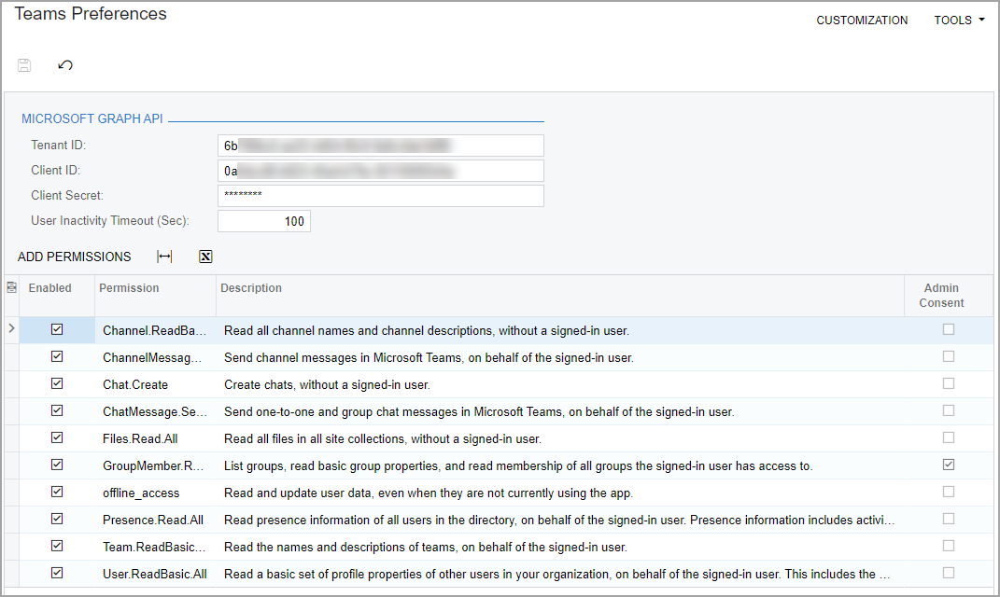
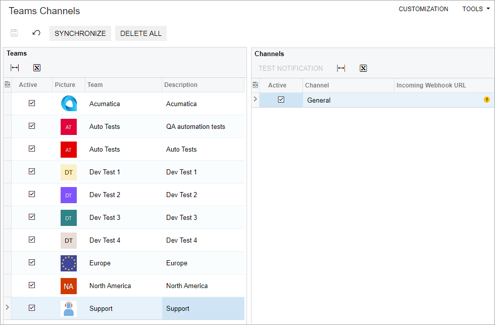
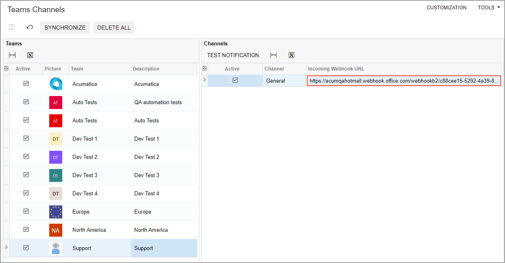
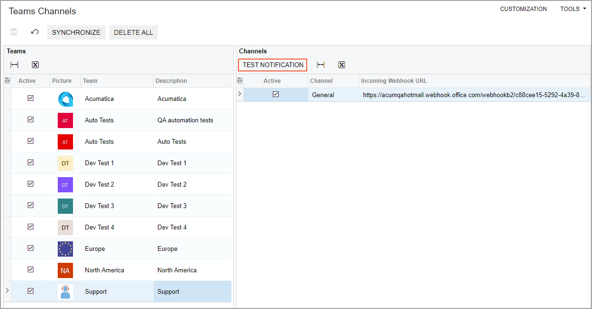
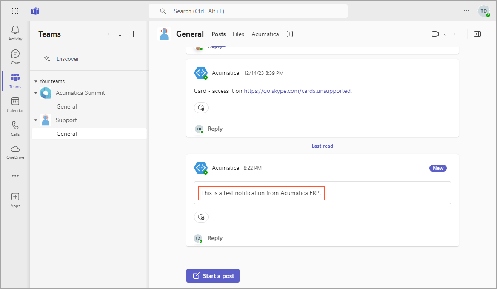

# To Configure Acumatica ERP for Teams Integration {#_0f784cc5-6f56-473a-9162-e5d7d2bb4db8 .task}

After you configure [Microsoft Azure for Teams Integration](US__HOW_Teams_Integration_Configuring_Azure.md), you need to specify the required settings in your Acumatica ERP instance. You also need to configure webhooks in [Microsoft Power Automate](https://make.powerautomate.com/). The following sections provide detailed instructions to perform this configuration.

**Tip:** These instructions are performed by the system administrator who sets up the functionality.

## Before You Proceed { .section}

Before you begin, make sure that the following conditions are met:

-   You have configured Microsoft Azure for Teams integration, as described in [To Configure Microsoft Azure for Teams Integration](US__HOW_Teams_Integration_Configuring_Azure.md).
-   You have enabled the *Teams Integration* feature on the [Enable/Disable Features](CS_10_00_00.md) \(CS100000\) form.

## Step 1: To Configure Teams Preferences { .section}

On the [Teams Preferences](SM_22_00_00.md) \(SM220000\) form, do the following:

1.  In the **Tenant ID** box, enter the **Directory \(tenant\) ID** value that you have generated in Step 1 of [To Configure Microsoft Azure for Teams Integration](US__HOW_Teams_Integration_Configuring_Azure.md).
2.  In the **Client ID** box, enter the **Application \(client\) ID** value that you have generated in Step 1 of [To Configure Microsoft Azure for Teams Integration](US__HOW_Teams_Integration_Configuring_Azure.md).
3.  In the **Client Secret** box, enter the client secret that you generated in Step 2 of [To Configure Microsoft Azure for Teams Integration](US__HOW_Teams_Integration_Configuring_Azure.md)—which was shown in the **Value** column of the **Client secrets** pane.
4.  On the table toolbar, click **Add Permissions**.

    The system adds to the table the permissions that you have specified in Step 3 of [To Configure Microsoft Azure for Teams Integration](US__HOW_Teams_Integration_Configuring_Azure.md) \(see the following screenshot\).

    

5.  On the form toolbar, click **Save**.

## Step 2: To Add a New Activity Type { .section}

To add a new activity type, do the following:

1.  On the form toolbar of the [Activity Types](CR_10_20_00.md) \(CR102000\) form, click **Add New Record**, and specify the following settings in the added row:
    -   **Type ID**: `TM`
    -   **Description**: `Teams Message`
    -   **Active**: Selected
    -   **Originated By**: *ERP Users* \(inserted automatically\)
    -   **Image**: *main@success*
2.  On the form toolbar, click **Save**.
3.  On the More menu of the [Apply Updates](SM_20_35_10.md) \(SM203510\) form, click **Reset Caches**.

    The system resets the caches, and is now ready for Teams channel synchronization.

## Step 3: To Configure an Incoming Webhook { .section}

To configure an incoming webhook for a Teams channel, you need to create a connection and a flow by using [Microsoft Power Automate](https://make.powerautomate.com/). Do the following:

1.  Download the [`PostToChannelWhenWebhookReceived.zip`](https://acumatica-builds.s3.amazonaws.com/builds/zip/software/ms-teams/PostToChannelWhenWebhookReceived24081903.zip) file that you will use to configure the flow.
2.  Open the [Microsoft Power Automate](https://make.powerautomate.com/) page and on the More menu on the left pane, click **Connections**.
3.  On the **Connections in &lt;Company\_Name&gt;** page, which opens, click **Create a connection**.
4.  On the **New connection** page, which opens, locate the **Microsoft Teams** connector and click **Create**.
5.  In the dialog box that opens, click **Create**.

    The connector is added to the **Connections in &lt;Company\_Name&gt;** page.

6.  On the left pane, click **My flows** and on the page toolbar of the **Flows** page, which opens, click **Import** &gt; **Import Package**.
7.  On the **Import package** page, which opens, click **Upload**, and select the [`PostToChannelWhenWebhookReceived.zip`](https://acumatica-builds.s3.amazonaws.com/builds/zip/software/ms-teams/PostToChannelWhenWebhookReceived24081903.zip) file that you have downloaded.
8.  In the **Related resources** table, click the *Select during import* link.
9.  On the **Import setup** side panel, which opens, click the connection to Teams that you have created, and click **Save**.
10. On the **Import package** page, click **Import**, and wait for the process to complete.
11. In the confirmation message that appears when the import is completed, click the **Open Flow** link.
12. In the diagram with the flow, which opens, click the **Post message in a chat or channel** box.
13. In the **Team** and **Channel** boxes on the side panel that opens, remove the default values and select the team and its channel, respectively, to which you want to send notifications.
14. In the diagram with the flow, click the **When a Teams webhook request is received** box and on the side panel that opens, copy the link in the **HTTP URL** box.
15. On the page toolbar, click **Save**, and then click **Back** to return to the **My flows** page.
16. On the page toolbar of the **My flows** page, click **Turn On**.

## Step 4: To Sign In to the Teams Account { .section}

Do the following to sign in to the Teams account:

**Attention:** This step needs to be performed by each user on the Acumatica ERP account they will be using.

1.  In the User menu, click **My Profile**.

    The [User Profile](SM_20_30_10.md) \(SM203010\) form opens.

2.  In the **Teams User Type** box of the **Teams Settings** tab \(**Authentication Token**\), select the user type with which you want to sign in \(*Administrator* or *Member*\), and click **Sign In**.

    The system signs you in to the Teams account.

3.  In the **Authentication Token** section, click **Test Connection**.
4.  In the pop-up window that opens, enter your Teams credentials, and click **Sign In**.
5.  On the form toolbar, click **Save**.

## Step 5: To Specify Additional Teams Settings { .section}

To specify additional Teams settings for your account, do the following on the **Teams Settings** tab of the [User Profile](SM_20_30_10.md) \(SM203010\) form:

**Tip:** The settings in this step, which are optional, can be specified for the specific user who will be using Teams integration.

1.  In the **Override Teams ID** box of the **Teams Preferences** section, enter the email address that the system should use to find the Teams identifier of the user instead of the email address specified in the **Contact Info** section of the **General** tab on the [Employees](EP_20_30_00.md) \(EP203000\) form, or in the **Contact** section of the **General** tab on the [Contacts](CR_30_20_00.md) \(CR302000\) form.
2.  In the **Teams Client** box, select the Teams client you want to use \(*Desktop* or *Web*\).
3.  On the form toolbar, click **Save**.

## Step 6: To Synchronize Teams Channels and Members { .section}

To synchronize your Teams channels and members, do the following on the [Teams Channels](SM_30_50_00.md) \(SM305000\) form:

1.  On the form toolbar, click **Synchronize**, and wait for the operation to complete.

    The system adds the Teams channels to the table on the form \(see the following screenshot\).

    

2.  On the **Teams** pane, click the team that contain the channel to which you want to send messages.
3.  On the Channels pane, click the needed channel.
4.  In the **Incoming Webhook URL** column, enter the URL you have copied in Step 3 \(see the following screenshot\).

    

5.  On the form toolbar, click **Save**.
6.  On the pane toolbar of the **Channels** pane, click **Test Notification** to send a test message to the channel in Teams \(see the following screenshot\).

    

7.  In the channel in Teams, make sure that the message is displayed \(see the following screenshot\).

    

## Step 7: Mapping the Contacts or Employees { .section}

To map the contacts in the Teams channel with the contacts or employees in Acumatica ERP, do the following:

1.  In Acumatica ERP, open the [Teams Members](SM_30_50_30.md) \(SM305030\) form.
2.  On the form toolbar, click **Map Contacts &amp; Employees**.

    Wait for the system to complete the mapping.

3.  If for a team member, the system has not specified an Acumatica ERP contact or employee, click the magnifier icon in the **Acumatica ERP Contact/Employee** column, and select the needed contact or employee.
4.  On the form toolbar, click **Save**.

**Parent topic:**[Integrating Acumatica ERP with Microsoft Teams](../UserGuide/US_mng_Teams_Integration.md)

