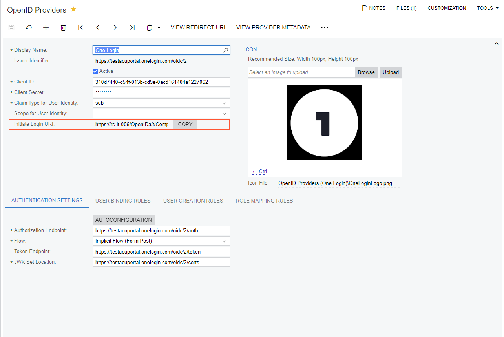

# Direct Sign-In Through an OpenID Identity Provider {#_eb0fd4ec-e6f3-4fe4-afcf-a73030afbebc .concept}

You can set up a single sign-in connection to Acumatica ERP from an OpenID identity provider—such as OneLogin or OKTA—that serve as central hubs for multiple applications, including Acumatica ERP. With this configuration, a user who is signed in to an OpenID provider can sign in to Acumatica ERP with just one click on the Acumatica ERP icon, bypassing the Acumatica ERP Sign-In page.

In this topic, you will learn how to set up direct sign-in access to Acumatica ERP from an OpenID provider.

## Configuring the Direct Sign-In Settings { .section}

To set up direct sign-in access to Acumatica ERP from an OpenID provider without entering credentials on the Acumatica ERP Sign-In page, first you need to register Acumatica ERP on the OpenID provider platform your company uses.

Then on the [OpenID Providers](SM_30_30_20.md) \(SM303020\) form of Acumatica ERP, you have to register an OpenID provider \(as described in [Configuration of an OpenID Identity Provider](US_CON_Configuration_of_Open_ID_Provider.md)\). Once the provider is registered and saved, Acumatica ERP generates the unique sign-in link and displays it in the **Initiate Login URI** box in the Summary area of the [OpenID Providers](SM_30_30_20.md) form, as shown in the following screenshot.

You need to copy this link by clicking **Copy** next to the **Initiate Login URI** box and pasting it in the configuration settings for Acumatica ERP on the OpenID provider platform. \(The place to paste the link may differ, depending on the OpenID provider.\) After the link is specified and the Acumatica ERP icon is added, users can access Acumatica ERP without having to enter their credentials on the Acumatica ERP Sign-In page.. To access Acumatica ERP, they need to sign in to the OpenID provider and click the Acumatica ERP icon.

**Parent topic:**[Integrating Acumatica ERP with OpenID Identity Providers](../UserGuide/US__MNG_Integrating_with_Open_ID_Identity_Providers.md)

