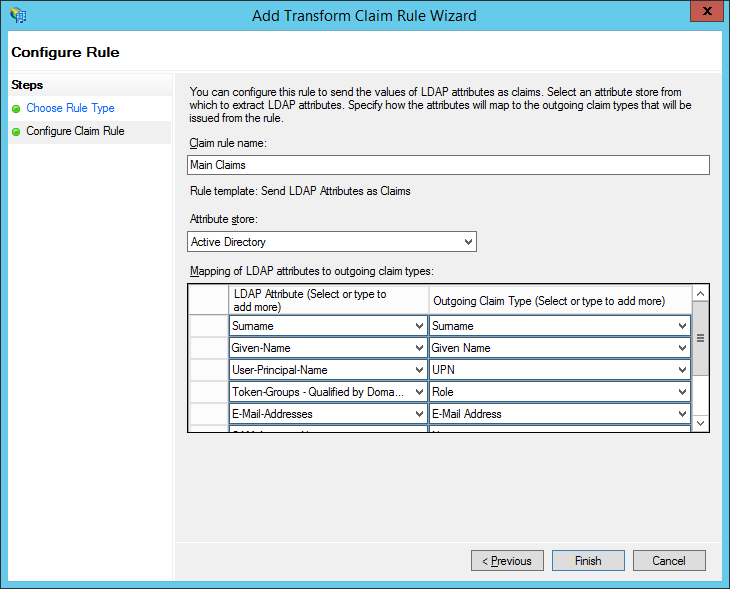
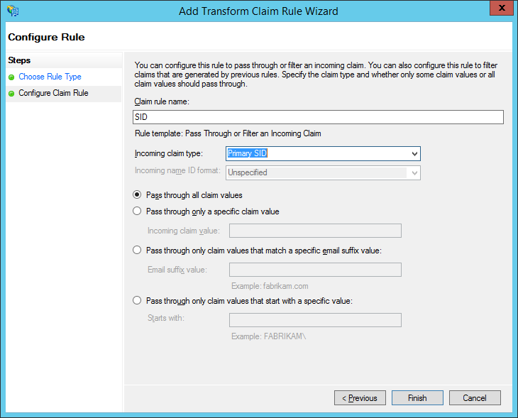

# To Configure AD FS Claims {#_80b25515-4e2e-4a34-bc94-942dada36c10 .task}

After you have added a relying party trust for your Acumatica ERP instance to the Microsoft Active Directory Federation Services \(AD FS\) server, you need to configure the necessary claims for the relying party trust. For description of all steps required for integrating Acumatica ERP with AD FS, see [Integration with AD FS](US__con_ADFS_Integration.md).

The procedure below provides a sample configuration of claims for AD groups. You may add other claims that are specific to your organization.

**Attention:** Note the following:

-   The procedure below covers the most common usage scenarios. If you’re implementing a more complicated scenario and you encounter difficulties, contact Acumatica ERP technical support.
-   The vendor of the third-party software may change the user interface and settings. The labels you see in the UI may differ from the ones described in the procedure.
-   The procedure will be updated to describe new common scenarios and UI changes arise.

## To Configure AD FS Claims for the Relying Party Trust { .section}

1.  Sign in to the AD FS server, open the AD FS Management tool, and select the relying party trust of your Acumatica ERP instance in **Trust Relationships** &gt; **Relying Party Trusts**.

    **Note:** To configure AD FS, you must be a member of the *Domain Admins* group in the domain to which the federation server is joined.

2.  In the right pane, click **Edit Claim Rules**.
3.  In the **Edit Claim Rules** dialog box, add the `Main Claims` rule. Do the following:
    1.  Click **Add Rule**.
    2.  In the **Add Transform Claim Rule Wizard** dialog box, in the **Claim rule template** box, select *Send LDAP Attributes as Claims*, and then click **Next**.
    3.  In the **Claim rule name** box, type `Main Claims`, as shown in the screenshot below.

        

    4.  In the **Attribute store** box, select *Active Directory*.
    5.  In the **Mapping of LDAP attributes to outgoing claim types** area, add the attributes specified in the following table.

        |LDAP Attribute|Outgoing Claim Type|Necessity|
        |--------------|-------------------|---------|
        |Surname|Surname|Optional|
        |Given-Name|Given Name|Optional|
        |User-Principal-Name|UPN|Required|
        |Token-Groups - Qualified by Domain Name|Role|Required|
        |E-Mail-Addresses|E-Mail Address|Required|
        |SAM-Account-Name|Name|Optional|
        |Display-Name|Common Name|Optional|

    6.  Click **Finish** to add the rule.
4.  In the **Edit Claim Rules** dialog box, add the *SID* rule. Do the following:
    1.  Click **Add Rule**.
    2.  In the **Add Transform Claim Rule Wizard** dialog box, in the **Claim rule template** box, select *Pass Through or Filter an Incoming Claim*, and then click **Next**.
    3.  In the **Claim rule name** box, type `SID`, as shown in the screenshot below.

        

    4.  In the **Incoming claim type** box, select *Primary SID*.
    5.  Select the **Pass through all claim values** option button.
    6.  Click **Finish** to add the rule.

Now that you have configured the AD FS server, you have to enable integration in your Acumatica ERP instance. For details, see [To Enable AD FS Integration with Acumatica ERP](US__how_ADFS_Enable_Integration.md).

**Parent topic:**[Integrating Acumatica ERP with AD FS](../UserGuide/US__mng_ADFS_Integration.md)

