# To Configure the AD FS Relying Party Trust {#_cd1daed4-fe33-4b33-abb9-3947ae26d973 .task}

To configure communication between your Active Directory Federation Services \(AD FS\) server and your Acumatica ERP instance, you should add a relying party trust for your Acumatica ERP instance. For a description of all steps required for integrating Acumatica ERP with AD FS, see [Integration with AD FS](US__con_ADFS_Integration.md).

The procedure below illustrates this process on Microsoft Windows 2012 R2.

**Attention:** Note the following:

-   The procedure below covers the most common usage scenarios. If you’re implementing a more complicated scenario and you encounter difficulties, contact Acumatica ERP technical support.
-   The vendor of the third-party software may change the user interface and settings. The labels you see in the UI may differ from the ones described in the procedure.
-   The procedure will be updated to describe new common scenarios and UI changes arise.

## To Add a New Relying Party Trust { .section}

1.  Sign in to the AD FS server and open the AD FS Management tool.

    **Attention:** To configure AD FS, you must be a member of the *Domain Admins* group in the domain to which the federation server belongs.

2.  In the left pane, right-click **Relying Party Trusts**, and then select **Add Relying Party Trust** \(as shown in the screenshot below\).

    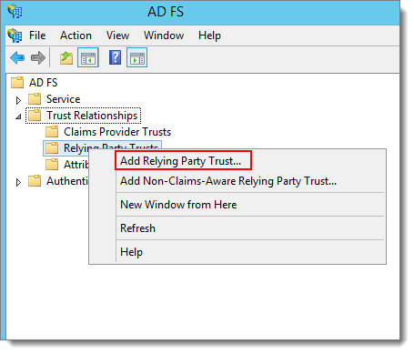

3.  On the **Welcome** page of the Relying Party Trust Wizard, which opens, click **Start** , as shown in the following screenshot.

    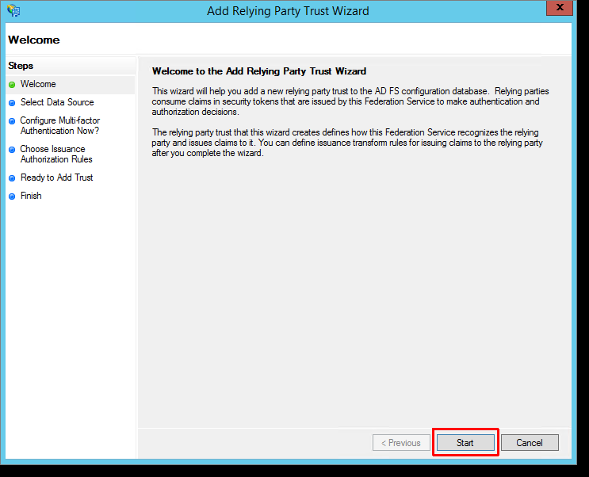

4.  On the **Select Data Source** page, select **Enter data about the relying party manually**, as shown in the screenshot below, and then click **Next**.

    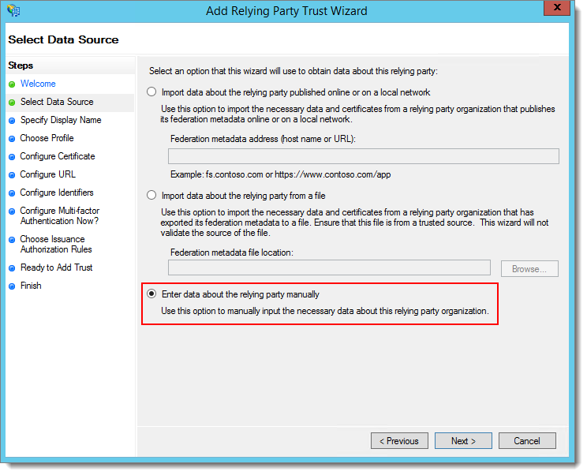

5.  On the **Specify Display Name** page, specify the display name for the relying party, as shown in the following screenshot. The display name is the name that will be displayed in the AD FS Management Console for the relying party. Then click **Next**.

    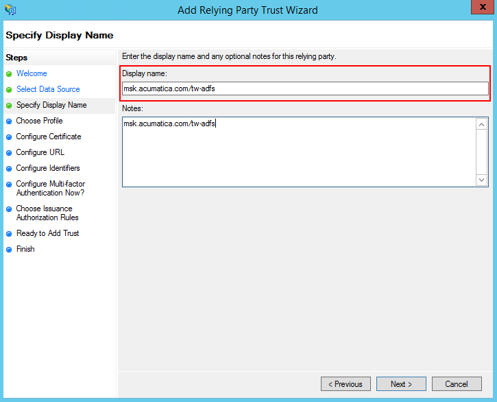

6.  On the **Choose Profile** page, select **AD FS Profile**, as shown in the screenshot below, and then click **Next**.

    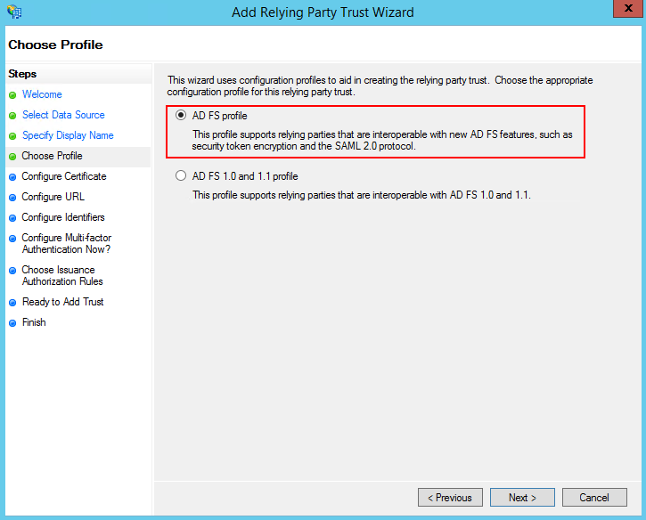

7.  On the **Configure Certificate** page, click **Next** to skip the step of specifying a token encryption certificate.

    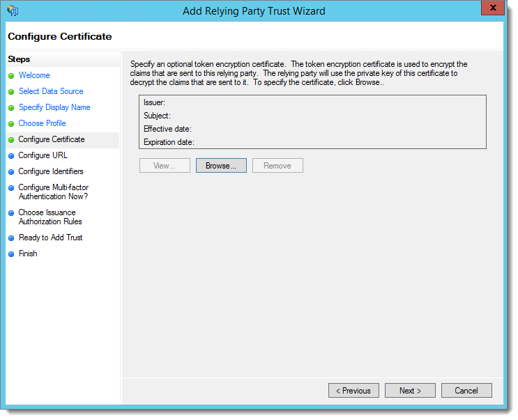

8.  On the **Configure URL** page, select the **Enable support for the WS-Federation Passive protocol** check box, and specify the full URL of your Acumatica ERP instance—for example, *https://app.site.net/instance\_name*—as shown in the following screenshot.

    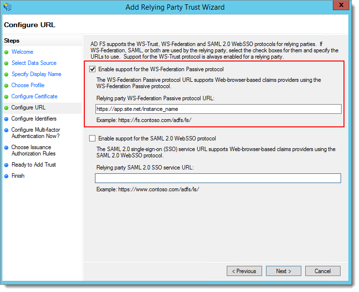

9.  On the **Configure Identifiers** page \(shown in the screenshot below\), specify the relying party trust identifier, and then click **Next**.

    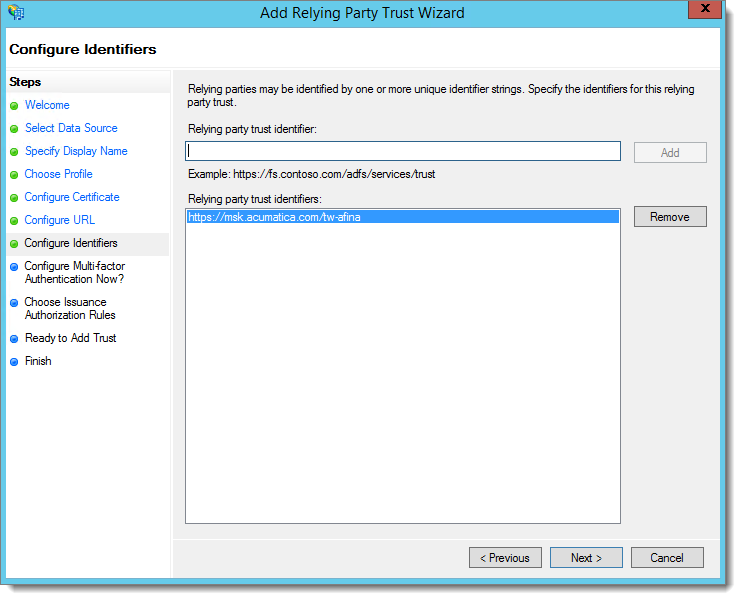

10. On the **Configure Multi-factor Authentication Now?** page, select the option button indicating that you do not want to configure multifactor authentication at this time, and then click **Next**. \(See the following screenshot.\)

    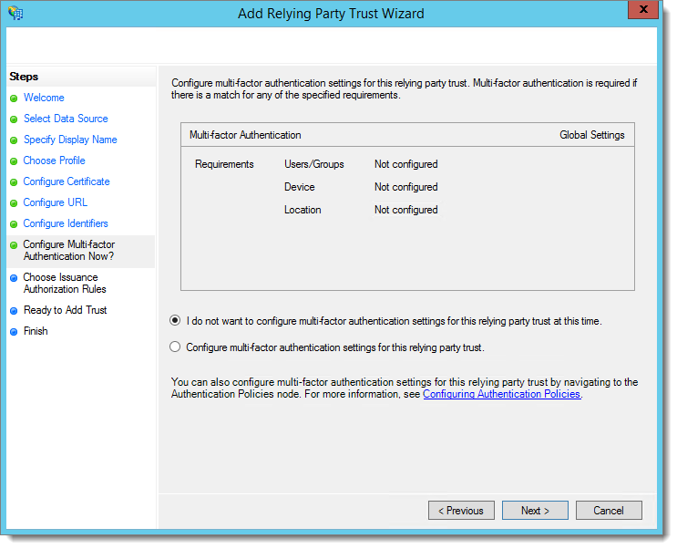

11. On the **Choose Issuance Authorization Rules** page, select the **Permit all users to access this relying party** option button, as shown in the following screenshot, and then click **Next**.

    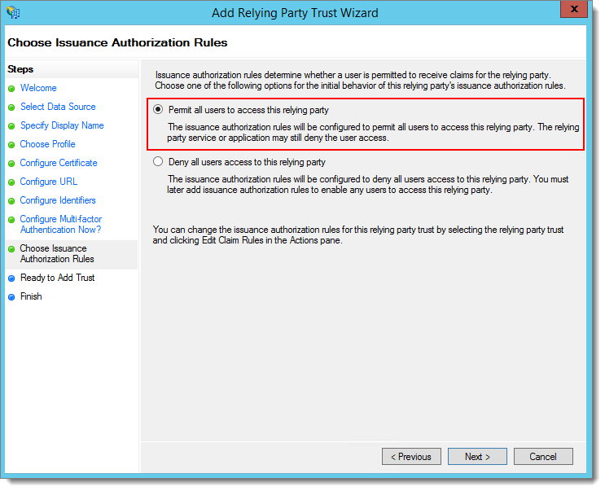

12. On the **Ready to Add Trust** page, review the settings, and then click **Next**.
13. On the **Finish** page, select the **Open the Edit Claim Rules dialog for this relying party trust when the wizard closes** check box \(as shown in the screenshot below\), and then click **Close**.

    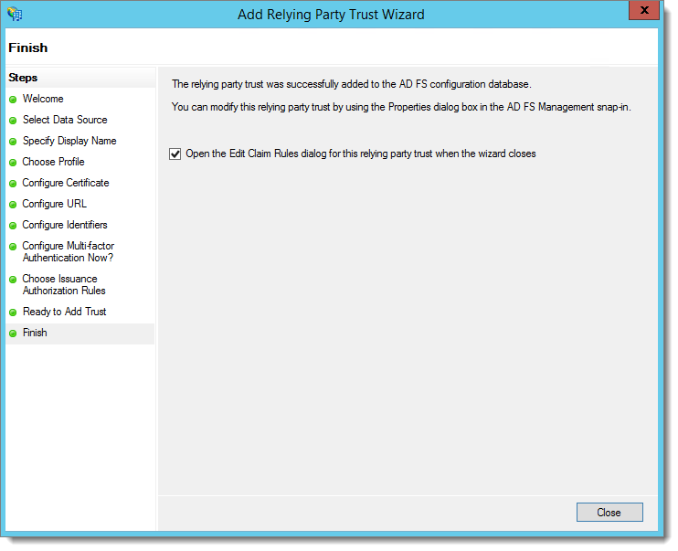

    This opens the **Edit Claim Rules** dialog box, which you will use to configure claim rules for the added relying party trust. For the detailed procedure, see [To Configure AD FS Claims](US__how_ADFS_Configure_ADFS_Claims.md).

**Parent topic:**[Integrating Acumatica ERP with AD FS](../UserGuide/US__mng_ADFS_Integration.md)

