# To Configure Microsoft Entra ID for Integration with Your Acumatica ERP Instance {#_6b852c66-01c4-40b5-af7d-c53d7e4bd672 .task}

To configure Microsoft Entra ID for integration with your Acumatica ERP instance, you perform the following actions in Microsoft Azure, each of which is described in a section of this topic:

1.  Registering your Acumatica ERP instance, and copying the registration parameters for further use in the `web.config` file
2.  Obtaining the client secret, and copying it, too, for further use in the `web.config` file
3.  Configuring API permissions
4.  Specifying your Acumatica ERP instance ID URI
5.  Specifying your Acumatica ERP instance redirect URI

**Attention:** Note the following:

-   The procedure below covers the most common usage scenarios. If you’re implementing a more complicated scenario and you encounter difficulties, contact Acumatica ERP technical support.
-   The vendor of the third-party software may change the user interface and settings. The labels you see in the UI may differ from the ones described in the procedure.
-   The procedure will be updated to describe new common scenarios and UI changes arise.

## Before You Begin { .section}

-   Ensure that your company has an Microsoft Entra ID instance configured. For more information, see [Microsoft Entra ID](https://www.microsoft.com/en-us/security/business/identity-access/microsoft-entra-id) on the Microsoft Azure Portal.
-   Make sure that your company has a Microsoft Azure subscription to register your Acumatica ERP instance in Microsoft Entra ID.

**Attention:** We recommend that you use the latest version of Microsoft Edge to work with Microsoft Azure because it was optimized to work in this browser. If you use other browsers, the web interface of Microsoft Azure may work incorrectly. For a list of the recommended browsers, see [Supported devices](https://docs.microsoft.com/en-us/azure/azure-portal/azure-portal-supported-browsers-devices) in the Microsoft Azure documentation.

## Step 1: To Register Your Application { .section}

To register your application on Microsoft Azure, perform the following instructions:

1.  Sign in to the [Microsoft Azure portal](https://portal.azure.com).
2.  On the left menu, click the Microsoft Entra ID icon. If you have one Microsoft Entra ID instance, it will be opened automatically. If you have multiple instances, click the Microsoft Entra ID instance where you want to register the application.
3.  In the left pane, expand the **Manage** node and click **App registrations**. You will see a list of applications or an empty list \(as shown in the following screenshot\), depending on whether any applications have been registered previously.

    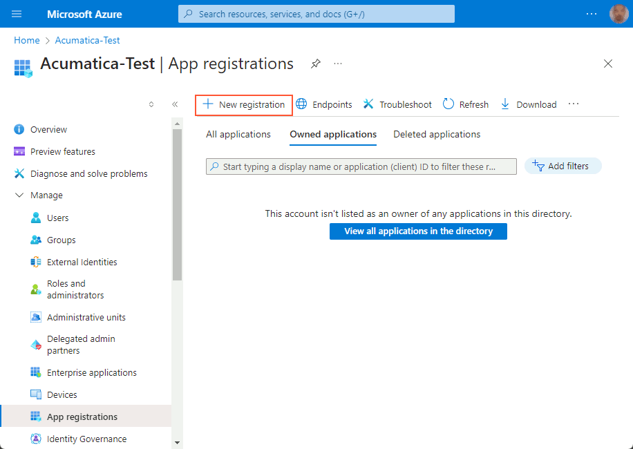

4.  On the pane toolbar, click **New registration**.
5.  In the **Register an application** pane \(which is shown in the following screenshot\), do the following:

    1.  In the **Name** box, type a name for your Acumatica ERP instance. This name will be displayed in the application list.
    2.  In the **Supported account types** section, select the **Accounts in this organizational directory only \(&lt;Your\_Entra\_ID\_Instance\_Name&gt; only - Single tenant\)** option button.
    3.  In the **Redirect URI** section, select *Web* in the first box.
    4.  Click **Register**.
    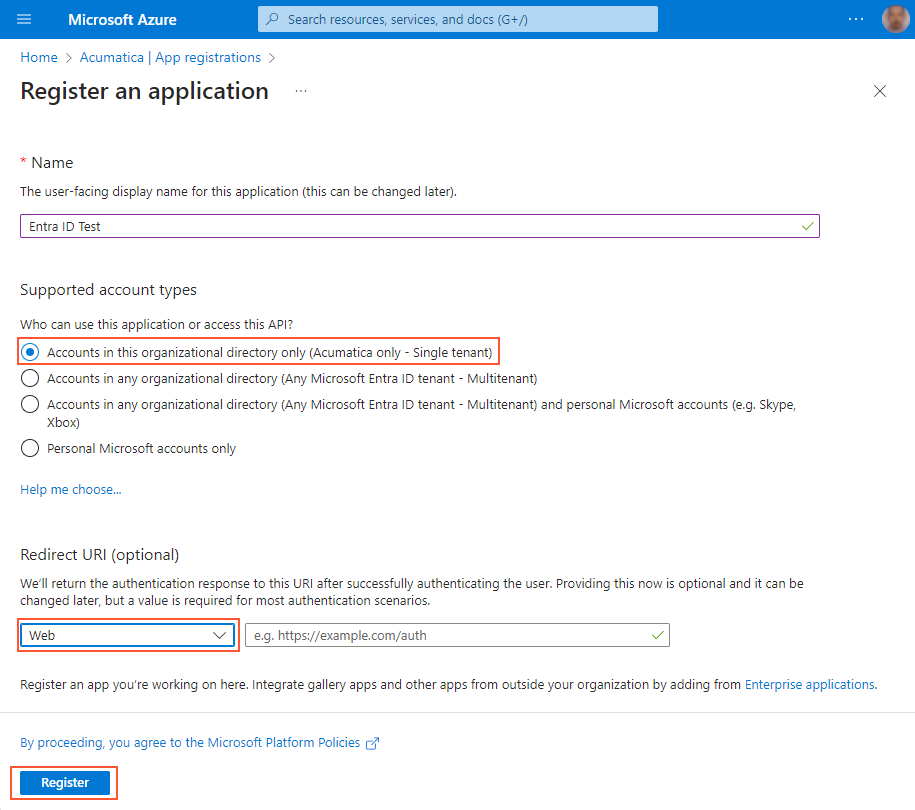

    Now your Acumatica ERP instance is registered with Microsoft Entra ID, and an **Application \(Client\) ID** value is generated \(see the following screenshot\).

    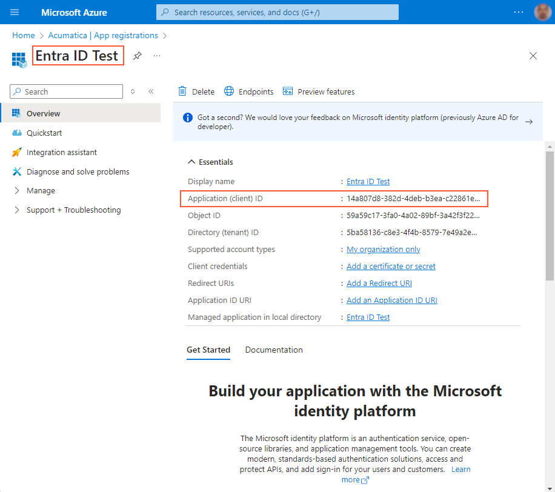

6.  Copy the value in the **Application \(Client\) ID** column.
7.  Switch to your Microsoft Entra ID instance by clicking its name in the navigation bar in upper left corner of the screen.
8.  Click **Overview** in the left menu, and copy the following parameter values for further use in your `web.config` file \(see the following screenshot\):

    -   The tenant identifier of your Azure instance
    -   The domain name in Microsoft Entra ID
    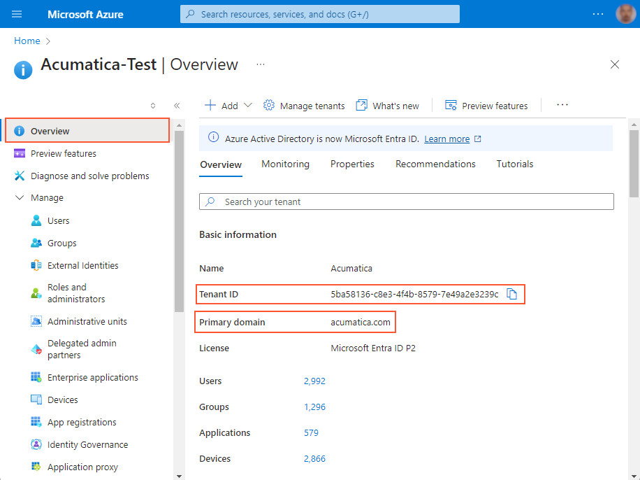

## Step 2: To Obtain the Client Secret { .section}

To obtain the client secret for further use in the `web.config` file, perform the following instructions:

1.  In the left pane, click **App registrations**, and select the needed application.
2.  In the left pane, expand the **Manage** node, and click **Certificates &amp; secrets**.
3.  On the **Client secrets** tab , click **New client secret** in the bottom part of the screen \(see the following screenshot\).

    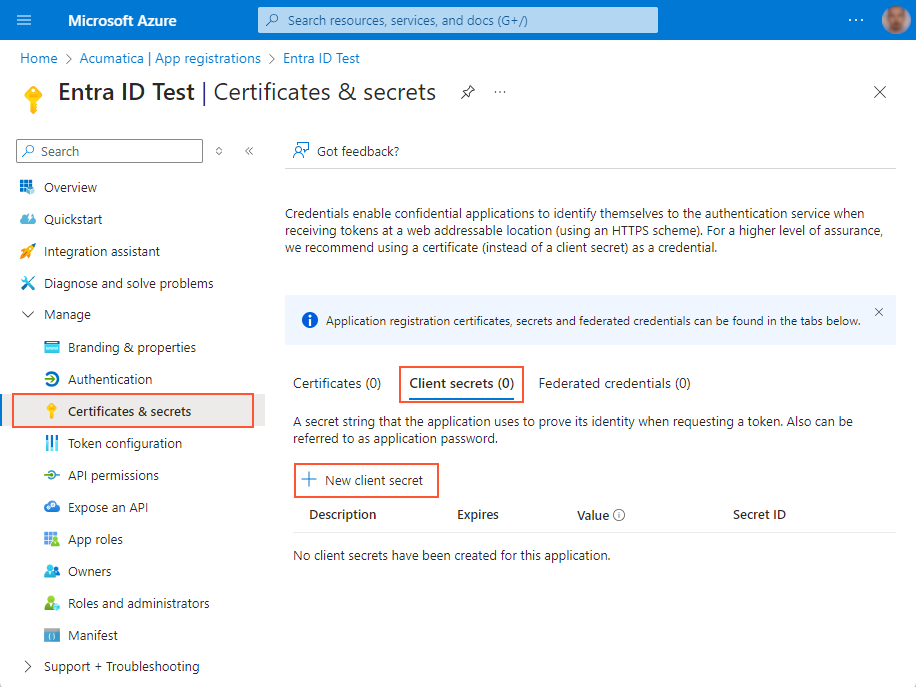

4.  In the **Description** box of the **Add a client secret** pane, type a description of the client secret.
5.  In the **Expires** box, select the secret’s duration \(see the following screenshot\).

    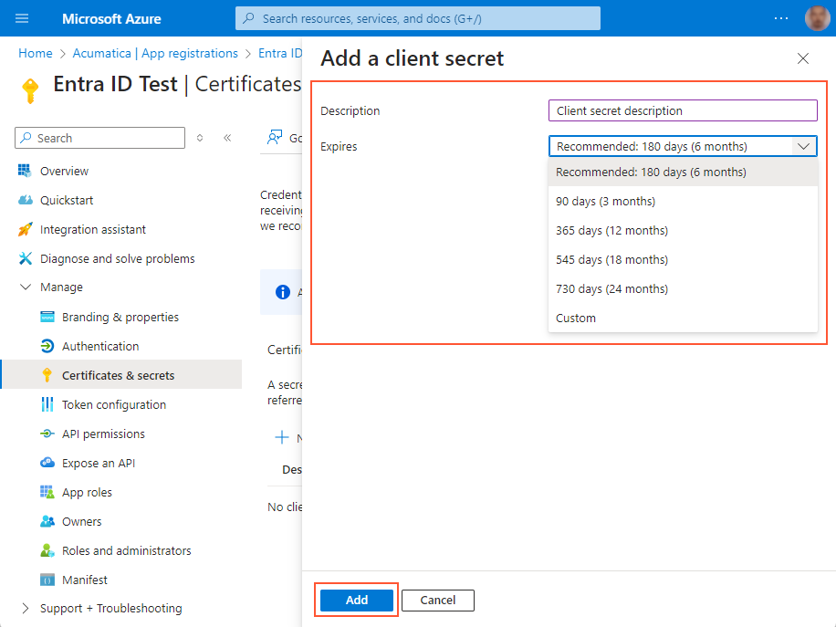

6.  Click **Add**.
7.  Copy the value of the client secret, which appears in the **Value** column of the **Client secrets**pane \(see the screenshot below\), to use it as a client secret in Acumatica ERP.

    **Important:** You must copy the client secret value right after clicking **Add** and before you leave the page. If you leave the page and return to it, the value will be hidden and will not be shown anymore.

    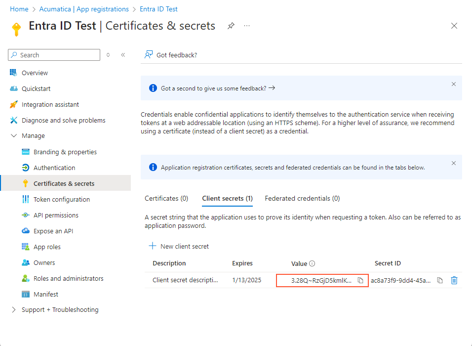

You have obtained the client secret for further use in the `web.config` file.

## Step 3: To Specify API Permissions { .section}

To specify API permissions, perform the following instructions:

1.  In the left pane, expand the **Manage** node, and click **API permissions**.
2.  In the **API permissions** pane, click **Add a permission** \(see the following screenshot\).

    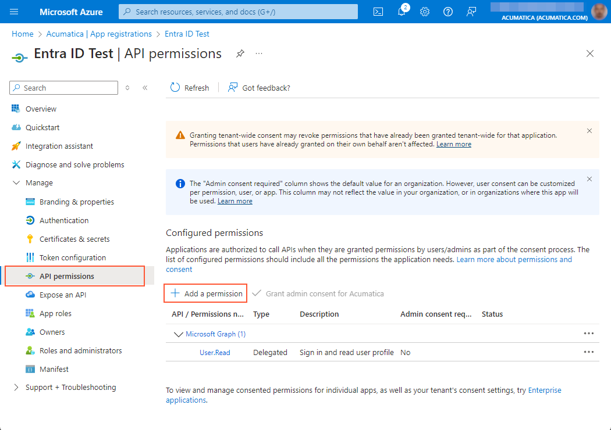

3.  In the **API permissions** pane, select the **Microsoft Graph** API, as shown in the following screenshot.

    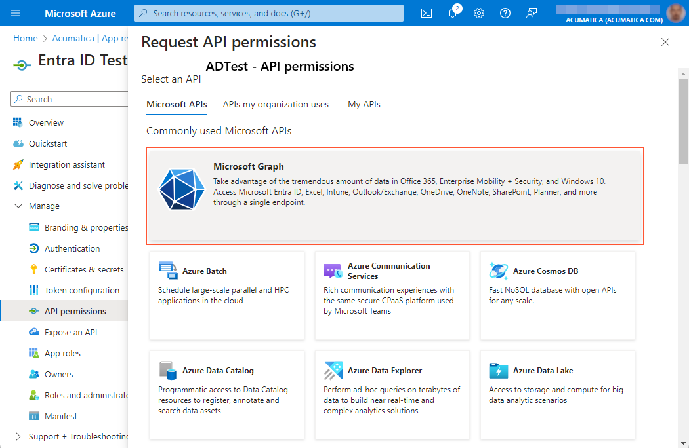

4.  In the **Request API permissions** pane, click **Application permissions**, as shown in the following screenshot.

    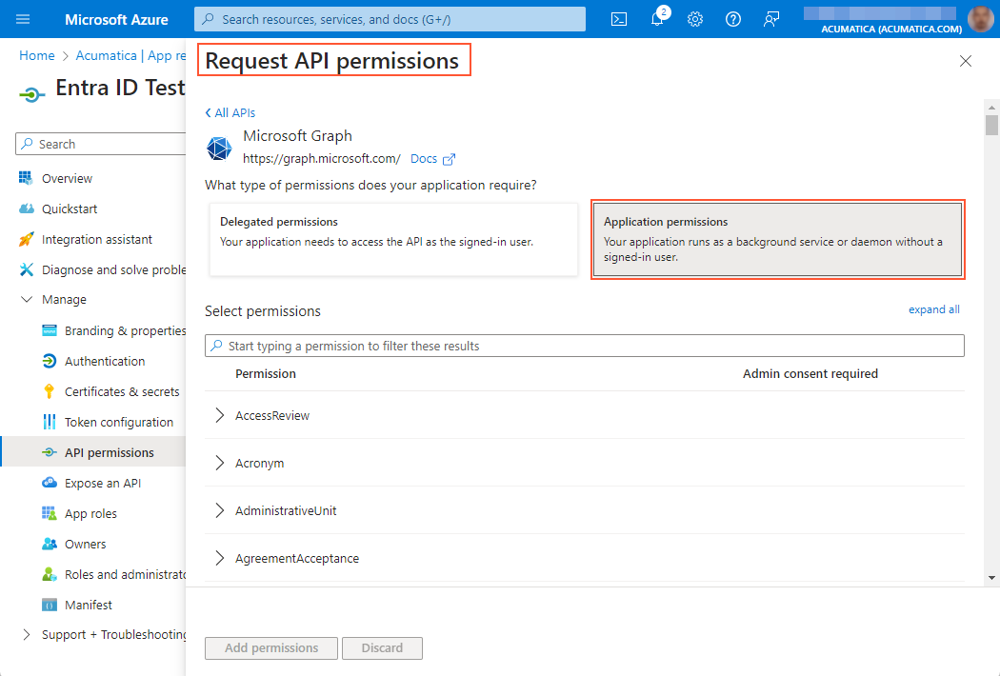

5.  In the **Domain** group, select the **Domain.Read.All** check box to add this permission.
6.  Click **Add permissions**, as shown in the following screenshot.

    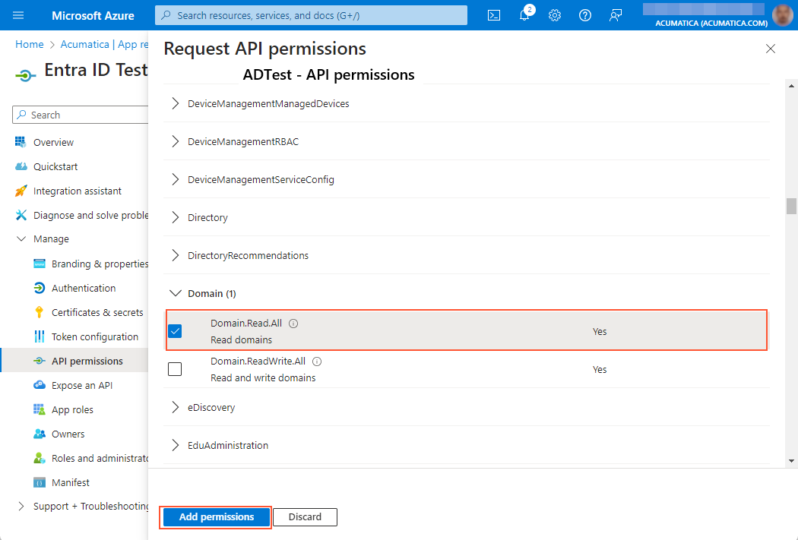

7.  Repeat Instructions 2 through 6 to add the following permissions:

    -   **User.Read.All**
    -   **GroupMember.Read.All**
    **Tip:** If you use the hidden members in Active Directory and would like these members to have access to Acumatica ERP, add the **Member.Read.Hidden** permission as well.

8.  Click **Grant admin consent for &lt;Azure\_Instance\_Name&gt;**.

    **Tip:** You should have administrative access rights to grant consent. If you do not, ask the instance administrator to grant this consent.

9.  Confirm your action by clicking **Yes**. Notice that the status of the permissions has been changed to *Granted for &lt;Azure\_Instance\_Name&gt;* \(see the **Status** column in the following screenshot\).

    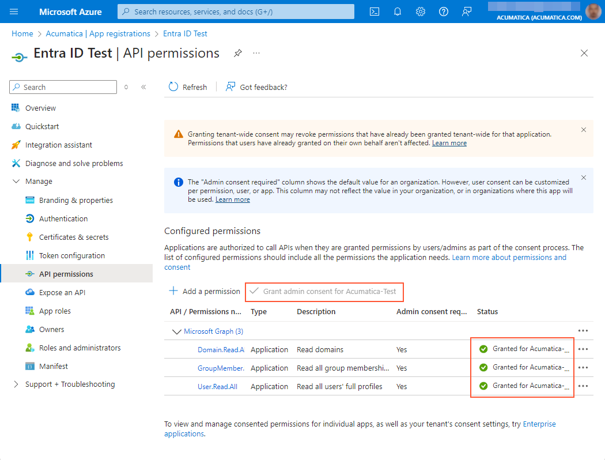

You have configured API permissions.

## Step 4: To Specify Your Application ID URI { .section}

To specify the application ID URI of your Acumatica ERP instance, you perform the following instructions:

1.  Switch to your Microsoft Entra ID instance by clicking its name in the navigation bar in upper left corner of the screen.
2.  In the left pane, expand the **Manage** node, and click **App registrations**.
3.  In the **App registrations** list, click the application name that you have registered.
4.  In the left pane, click **Overview** \(see the following screenshot\).
5.  In the right pane, click *Add an Application ID URI*.

    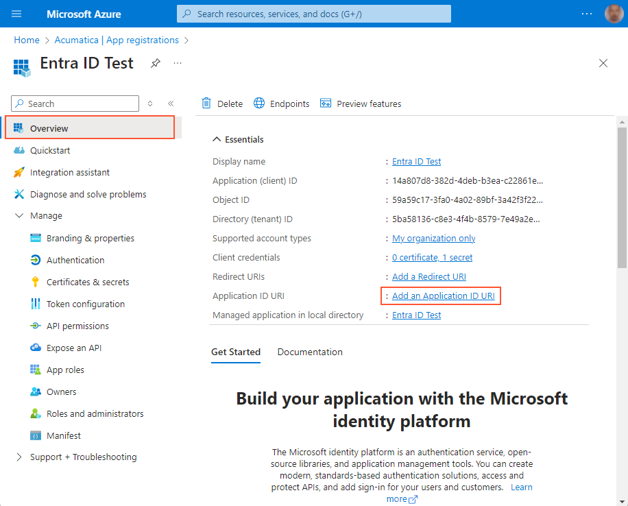

6.  In the **Expose an API** pane, which opens, click *Add* next to **Application ID URI** \(see the following screenshot\).

    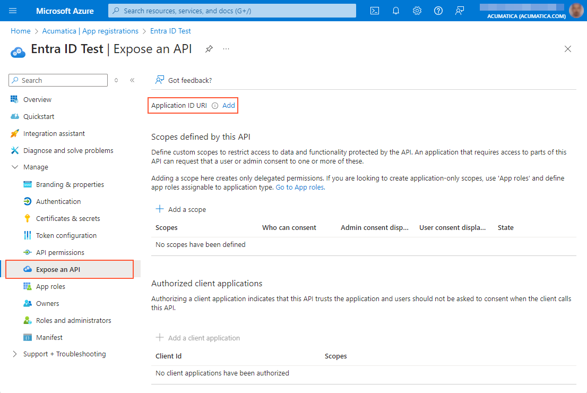

7.  In the **Edit application ID URI** dialog box, confirm the suggested URI of your Acumatica ERP URI or specify a new one.

    In further instructions, the application ID URI will be referred to as `Full_Acumatica_Instance_URL`. For example, it could have the `http://app.site.net/instance_name`, `http://localhost/Acumatica192000078`, or `api://<Application_Client_ID>` format.

    **Attention:** For single-tenant applications, Microsoft Entra ID validates that the domain in the URI is in the verified domain list in the Entra ID tenant. If the specified domain is not verified, you should use the default scheme \(`api://<Application_Client_ID>`\) suggested by Microsoft Entra ID.

8.  Click **Save**.

    You have specified your Acumatica ERP instance ID URI.

## Step 5: To Specify the Redirect URI of Your Application { .section}

After Microsoft Entra ID successfully authenticates users, it uses the redirect URI as the destination when it returns authentication responses \(tokens\). To specify the redirect URI, you perform the following instructions:

1.  In the left pane, click **Overview** \(see the following screenshot\).
2.  In the right pane, click *Add a Redirect URI*.

    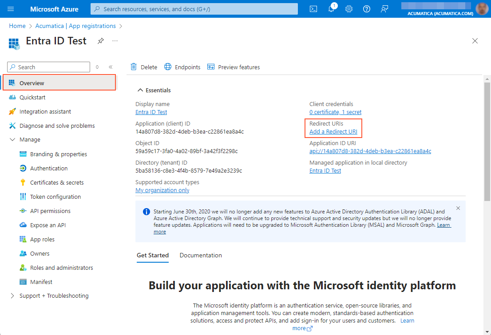

3.  In the **Authentication** pane, click **Add a platform** in the **Platform configurations** section.
4.  In the **Configure platforms** pane, click **Web** \(see the following screenshot\).

    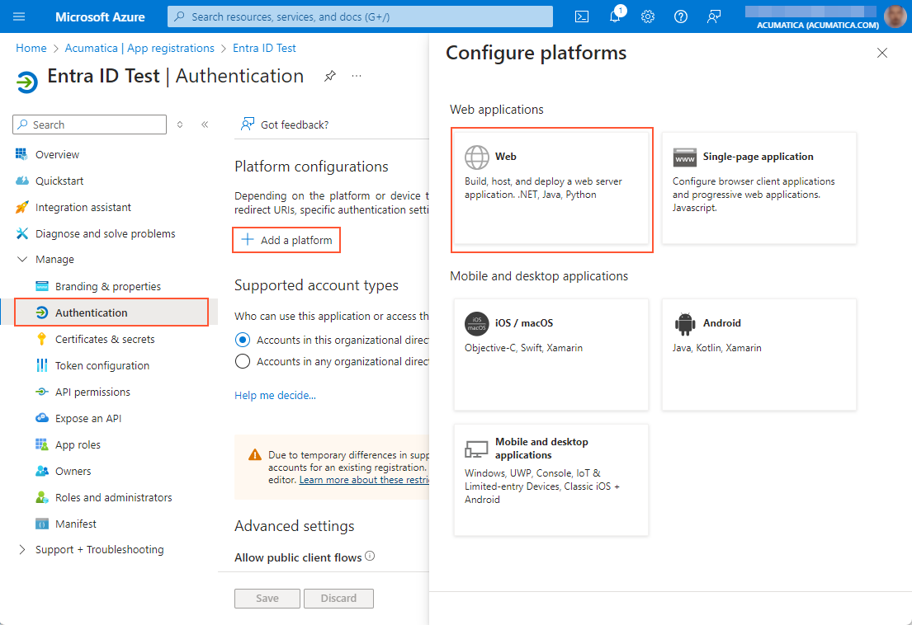

5.  In the **Configure Web** pane, under the **Redirect URIs** section, type the URI of your Acumatica ERP instance—that is, `Full_Acumatica_Instance_URL`. For example, it could have the `http://app.site.net/instance_name`, `http://localhost/Acumatica192000078`, or `api://<Application_Client_ID>` format.

    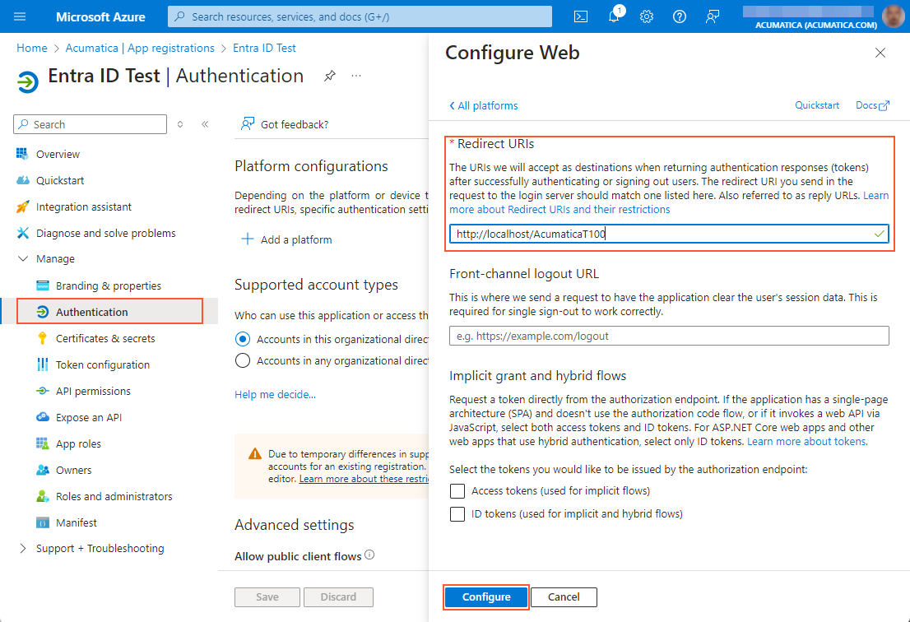

6.  Click **Configure**, as shown in the previous screenshot.

You have specified the redirect URI of your Acumatica ERP instance. The configuration of your Azure instance for integration with your Acumatica ERP instance is complete.

Now you can enable integration with Microsoft Entra ID for your Acumatica ERP instance, as described in [To Configure the Web.Config File for Integration with Microsoft Entra ID](US__how_AzureAD_Enable.md).

**Parent topic:**[Integrating Acumatica ERP with Microsoft Entra ID](../UserGuide/US__mng_AzureAD_Integration.md)

