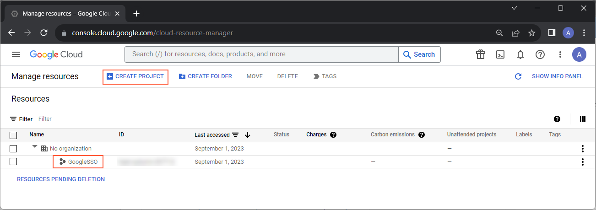
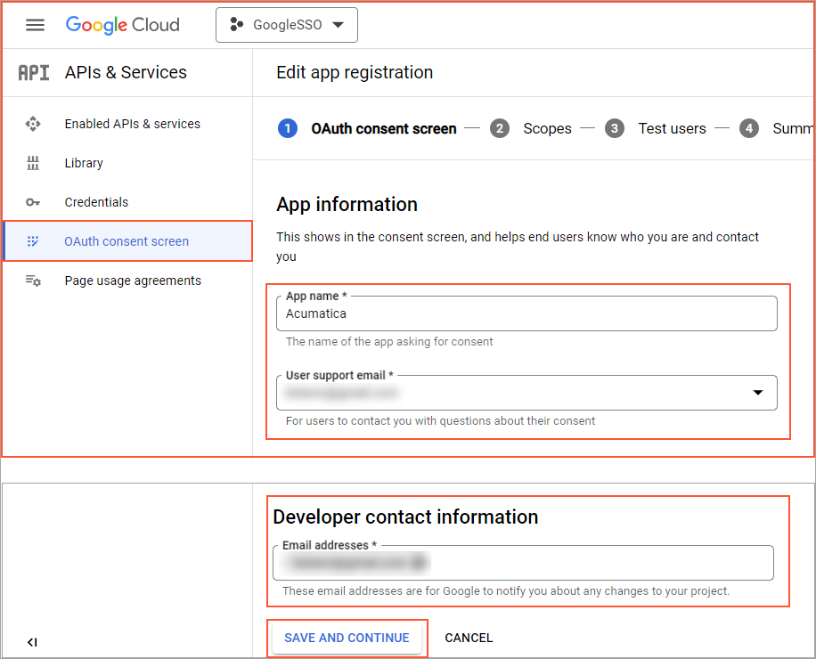
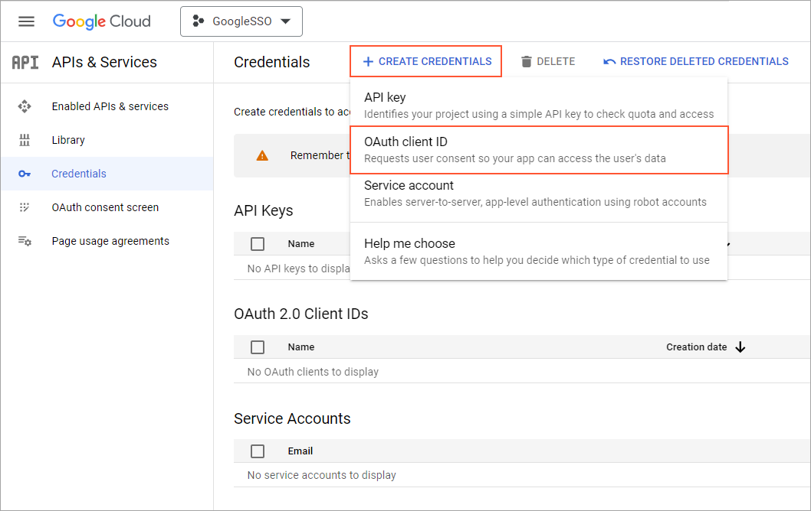
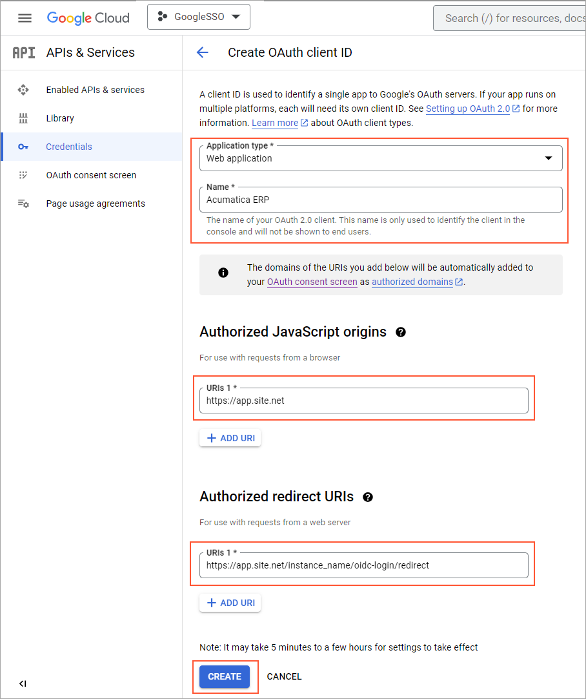
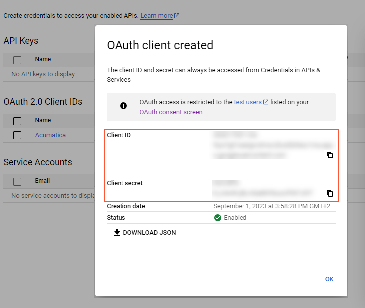

# To Register an Acumatica ERP Instance with Google {#_53f81793-fd88-4375-8db3-d06b73b0b165 .task}

For your users to be able to sign in with their Google accounts, you first have to register your Acumatica ERP instance with Google and obtain credentials for configuring the OpenID provider. This is a necessary step in configuring single sign-on \(SSO\) for your Acumatica ERP instance. For more information about registering applications in Google, see [Google Developers Console Help](https://developers.google.com/accounts/docs/OAuth2Login).

## Before You Begin { .section}

You should have a Google account that you will use to register your Acumatica ERP instance.

**Attention:** Note the following:

-   The procedure below covers the most common usage scenarios. If you’re implementing a more complicated scenario and you encounter difficulties, contact Acumatica ERP technical support.
-   The vendor of the third-party software may change the user interface and settings. The labels you see in the UI may differ from the ones described in the procedure.
-   The procedure will be updated to describe new common scenarios and UI changes arise.

## To Register an Acumatica ERP Instance with Google { .section}

Perform the following steps:

1.  Sign in to the [Google Developers Console](https://console.developers.google.com/).
2.  Optional: If you have not created any projects yet and you see the **Manage resources** page of the Google Developers Console, as shown in the screenshot below, click **Create project**.

    

3.  In the **New Project** box that appears, type the project name and click **Create**.
4.  On the **API &amp; Services** page that opens, click the **Select from** drop-down list at the top of the page. In the **Select from** box that appears, select the project.
5.  On the **API &amp; Services** page, configure the settings of the consent screen as follows:
    1.  In the sidebar on the left, click **OAuth consent screen** tab.
    2.  Select the user type \(**Internal** or **External**\) based on your needs, and click **Create**.
    3.  Enter at least the following settings, as shown in the screenshot below:

        -   **App name** shown to users
        -   **User support email**
        -   **Developer contact information**
        

    4.  Click **Save and Continue**.
6.  Add credentials for the project as follows:
    1.  In the sidebar on the left, click **Credentials**,and then navigate to **Create credentials** &gt; **OAuth client ID**, as shown in the screenshot below.

        

    2.  On the **Create OAuth client ID** page, shown in the screenshot below, enter the information as follows, and then click **Create**:

        -   **Application type**: Select *Web application*.
        -   **Name**: Type your application name.
        -   **Authorized JavaScript origins**: Type the root domain of your application site—for example, *https://app.site.net*.
        -   **Authorized redirect URIs**: Type the redirect URL of your instance.

            **Attention:** The box is case-sensitive.

            This is the full URL of your instance with */oidc-login/redirect* appended onto the end—for example, *https://app.site.net/instance\_name/oidc-login/redirect*

            **Tip:** To get this URL, in your Acumatica ERP instance open the [OpenID Providers](SM_30_30_20.md) \(SM303020\) form and on the form toolbar, click **View Redirect URI**. In the **Redirect URI** dialog box that opens click **Copy**.

        

7.  In the dialog box that opens, copy the client ID and the client secret for later retrieval \(see the screenshot below\). You have to register these credentials in your Acumatica ERP instance.

    

After you have registered your Acumatica ERP instance with Google and obtained credentials, you have to configure OpenID provider in your Acumatica ERP instance using these credentials, as described in [Configuration of an OpenID Identity Provider](US_CON_Configuration_of_Open_ID_Provider.md).

**Parent topic:**[Integrating Acumatica ERP with OpenID Identity Providers](../UserGuide/US__MNG_Integrating_with_Open_ID_Identity_Providers.md)

