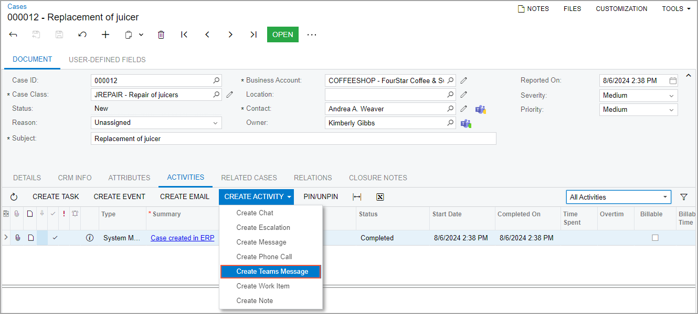
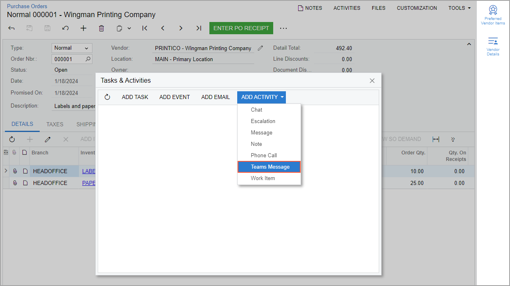
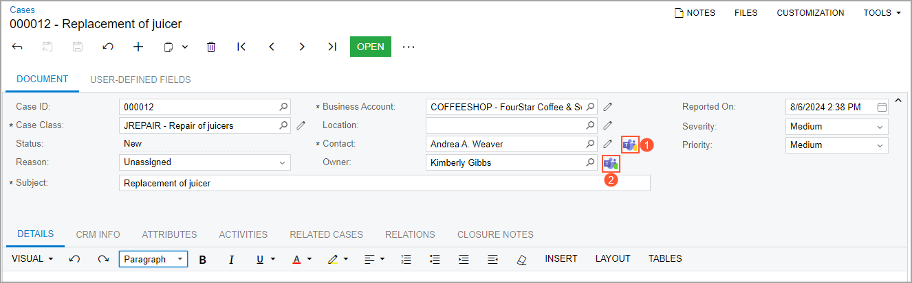

# Integration with Microsoft Teams {#_cae456ae-218d-4359-8752-dc13f3b91dfa .concept}

You integrate Microsoft Teams with Acumatica ERP to enable user collaboration within a single platform and to eliminate the need for users to switch between multiple applications.

**Important:** This functionality is available only if the *Teams Integration* feature is enabled on the [Enable/Disable Features](CS_10_00_00.md) \(CS100000\) form.

## Requirements { .section}

Before you integrate Microsoft Teams with Acumatica ERP, your company must be signed up for a Microsoft cloud service, such as Azure or Office 365, with the Microsoft Entra ID instance configured. For more information, see [Microsoft Entra ID](http://azure.microsoft.com/en-us/services/active-directory/) on the Microsoft Azure Portal and [Integration with Microsoft Entra ID](US__con_AzureAD_Integration.md).

You need to have a Microsoft Teams account, as well as the Teams desktop application or the ability to use Teams on the web. Also, appropriate Microsoft roles need to be assigned to you and to everyone involved in or using the integration. These roles include *Global Administrator*, *Application Administrator*, and *Teams Administrator*. \(For details on roles, see [Azure RBAC documentation](https://learn.microsoft.com/en-us/azure/role-based-access-control/).\)

To configure the Microsoft Teams integration in Acumatica ERP, you must be signed in to a user account with one of the following roles *Acumatica Support*, *Administrator*, *CR Sales &amp; Marketing Admin*, or *CR Support Admin*. \(For details on Acumatica ERP roles, see [Configuring User Roles](User_Roles_Mapref.md).\) Also, Acumatica ERP administrators must be assigned both the *Teams Administrator* role and the *Global Administrator* role.

## Configuration Steps { .section}

You can configure integration with Teams when you implement Acumatica ERP or at any later time. To integrate an instance of Acumatica ERP with Teams, you perform the following general steps:

1.  You perform the needed configuration actions on the Microsoft Entra ID instance. That is, you register your Acumatica ERP instance with the Microsoft Entra ID instance, and you obtain the needed credentials, as described in [To Configure Microsoft Azure for Teams Integration](US__HOW_Teams_Integration_Configuring_Azure.md).
2.  You configure your Acumatica ERP instance and Teams application, as described in [To Configure Acumatica ERP for Teams Integration](US__HOW_Teams_Integration_Configuring_Teams_Features.md).

## Sharing of Records { .section}

Before you can share Acumatica ERP records through Teams, you need to add a new activity type on the [Activity Types](CR_10_20_00.md) \(CR102000\) form. A user selects this activity type to send a link to a record to a Teams channel or a Teams member. The menu commands that correspond to the created activity type then appear on the appropriate parts of the forms as follows:

-   For forms that have the **Activities** tab: The **Create Teams** command on the **Create Activity** menu \(see the following screenshot\).

    

-   For forms that do not have the **Activities** tab: The **Teams** command on the **Add Activity** menu of the **Tasks &amp; Activities** dialog box \(see the following screenshot\). This dialog box opens when you click **Activities** on the form title bar.

    

## Channel Synchronization { .section}

To be able to receive messages from Acumatica ERP in Microsoft Teams channels, you need to configure each of the channels to which you want to send messages. As a system administrator, you perform this activity once for the entire company.

Before you start the configuration of the channels, you need to synchronize them. You perform the synchronization of channels and members on the [Teams Channels](SM_30_50_00.md) \(SM305000\) form. During this process, the system also maps the contacts in Acumatica ERP with the members of the Teams channels. The system does that by comparing the email addresses in the Teams accounts with users' email addresses specified on the **Contact Info** section of the **General** tab of the [Employees](EP_20_30_00.md) \(EP203000\) form and in the **Contact** section of the **General** tab of the [Contacts](CR_30_20_00.md) \(CR302000\) form. If an email address on one of these forms is the same as the email address in a Teams account, the system maps the user in Teams with the employee or contact in Acumatica ERP.

**Tip:** We recommend that users enter their employee or contact email addresses before the synchronization. Alternatively, a user can enter their email address in the **Override Teams ID** box on the **Teams Settings** tab of the [User Profile](SM_20_30_10.md) \(SM203010\) form.

If for a Teams member, no employee or contact has been found in Acumatica ERP, you can specify it manually on the [Teams Members](SM_30_50_30.md) \(SM305030\) form. On this form, you can also run the mapping again by clicking **Map Contacts &amp; Employees** on the form toolbar. \(You might need to do this if the email addresses of any users have changed.\)

For each Teams channel to which you want to send messages, you need to add a webhook. To generate the webhook URL, you create a flow by using [Microsoft Power Automate](https://make.powerautomate.com/). You then specify the generated URL on the **Channels** pane of the [Teams Channels](SM_30_50_00.md) form.

## Status of Teams Contacts { .section}

If a contact or employee that is selected in one of the applicable boxes on a supported form is a member of a Teams channel, Acumatica ERP displays the Teams icon to the right of this box. The following screenshot shows the [Cases](CR_30_60_00.md) \(CR306000\) form with the Teams icons to the right of the **Contact** box \(see Item 1 in the screenshot\) and the **Owner** box \(Item 2\).

The Teams icon contains a dot of one of the following colors that indicates the status of the user as follows:

-   Green: *Available*
-   Yellow: *Away*
-   Red: *Busy*, *In a call*, or *In a meeting*
-   Gray: *Unavailable*

The following table lists the forms and boxes on these forms for which the Teams icons are displayed.

|Form|Location|Box|
|----|--------|---|
|[Cases](CR_30_60_00.md) \(CR306000\)|Summary area|**Contact** \(a contact of the customer\)**Owner** \(an employee of the company who owns the case\)

|
|[Leads](CR_30_10_00.md) \(CR301000\)|Summary area|**Contact** \(a contact that the lead is associated with\)**Owner** \(an employee of the company who owns the lead\)

|
|[Opportunities](CR_30_40_00.md) \(CR304000\)|Summary area|**Contact** \(a representative to be contacted about the opportunity\)**Owner** \(an employee assigned to the opportunity\)

|
|[Business Accounts](CR_30_30_00.md) \(CR303000\)|Summary area|**Owner** \(a person assigned to work with the business account\)|
|**General** &gt; **Primary Contact**|**Name** \(the full name of the primary contact associated with the business account\)|
|[Contacts](CR_30_20_00.md) \(CR302000\)|Summary area|**Owner** \(an owner of the contact\)**Contact ID** \(the unique identifier of the contact\)

|
|[Customers](AR_30_30_00.md) \(AR303000\)|**General** &gt; **Primary Contact**|**Name** \(the full name of the primary contact associated with the customer\)|
|[Vendors](AP_30_30_00.md) \(AP303000\)|**General** &gt; **Primary Contact**|**Name** \(the full name of the primary contact associated with the vendor\)|

**Parent topic:**[Integrating Acumatica ERP with Microsoft Teams](../UserGuide/US_mng_Teams_Integration.md)

